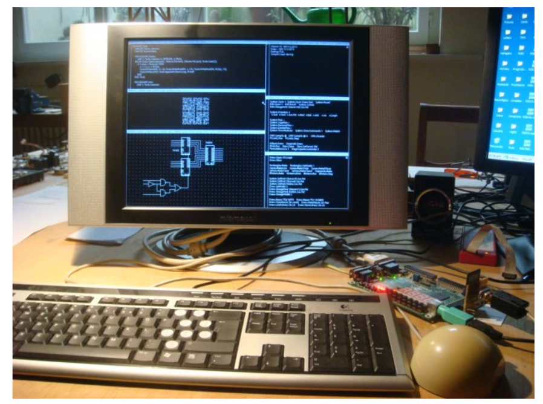

## 3 The tasking system

Eventually, it is the generic ability to perform every conceivable task that turns a computing device into a versatile universal tool. Consequently, the issues of modeling and orchestrating of tasks are fundamental in the design of any operating system. Of course, we cannot expect a single fixed tasking metaphor to be the ideal solution for all possible kinds of systems and modes of use. For example, different metaphors are probably appropriate in the cases of a closed mainframe system serving a large set of users in time-sharing mode on the one hand, and of a personal workstation that is operated by a single user at a high degree of interactivity on the other hand.

最終，將計算設備變成多功能通用工具的是執行所有可以想像到的任務的通用能力。 因此，任務的建模和編排問題是任何操作系統設計的基礎。 當然，我們不能期望一個單一的固定任務隱喻是所有可能類型的系統和使用模式的理想解決方案。 例如，在封閉的大型機系統一方面以分時模式為大量用戶提供服務的情況下，以及在高度交互性下由單個用戶操作的個人工作站的情況下，不同的隱喻可能是合適的 另一方面。

In the case of Oberon, we have consciously concentrated on the domain of personal workstations. More precisely, we have directed Oberon's tasking facilities towards a single-user interactive personal workstation that is possibly integrated into a local area network.

就 Oberon 而言，我們有意識地專注於個人工作站領域。 更準確地說，我們已將 Oberon 的任務處理設施指向可能集成到局域網中的單用戶交互式個人工作站。

We start the presentation in Section 3.1 with a clarification of the technical notion of task. In Section 3.2, we continue with a detailed explanation of the scheduling strategy. Then, in Section 3.3, we introduce the concept of command. And finally, Section 3.4 provides an overview of predefined system-oriented toolboxes, i. e. coherent collections of commands devoted to some specific topic. Example topics are system control and diagnosis, display management, and file management.

我們在第 3.1 節的介紹開始時澄清了任務的技術概念。 在 3.2 節中，我們繼續詳細解釋調度策略。 然後，在 3.3 節中，我們介紹了命令的概念。 最後，第 3.4 節概述了預定義的面向系統的工具箱，即專門用於某個特定主題的連貫命令集合。 示例主題包括系統控制和診斷、顯示管理和文件管理。

### 3.1. The concept of Task

In principle, we distinguish two categories of tasks in Oberon: Interactive tasks and background tasks. Loosely speaking, interactive tasks are bound to local regions on the display screen and to interactions with their contents while, in contrast, background tasks are system-wide and not necessarily related to any specific displayed entity.

原則上，我們將 Oberon 中的任務分為兩類：交互任務和後台任務。 鬆散地說，交互任務綁定到顯示屏上的局部區域並與其內容進行交互，而相反，後台任務是系統範圍的，不一定與任何特定的顯示實體相關。

#### 3.1.1. Interactive tasks

Every interactive task is represented by a so-called viewer. Viewers constitute the interface to Oberon's display-system. They embody a variety of roles that are collected in an abstract data type Viewer. We shall give a deeper insight into the display system in Chapter 4. For the moment it suffices to know that viewers are represented graphically as rectangles on the display screen and that they are implicit carriers of interactive tasks. Figure 3.1 shows a typical Oberon display screen that is divided up into seven viewers corresponding to seven simultaneously active interactive tasks.

每個交互式任務都由一個所謂的查看器表示。 查看器構成了 Oberon 顯示系統的接口。 它們體現了收集在抽象數據類型 Viewer 中的各種角色。 我們將在第 4 章對顯示系統進行更深入的了解。目前，只要知道查看器在顯示屏上以圖形方式表示為矩形，並且他們是交互任務的隱含載體就足夠了。 圖 3.1 顯示了一個典型的 Oberon 顯示屏，該顯示屏分為七個查看器，對應七個同時活動的交互任務。

In order to get firmer ground under our feet, we now present the programmed declaration of type Viewer in a slightly abstracted form:

為了在我們腳下站穩腳跟，我們現在以稍微抽象的形式呈現類型 Viewer 的程序聲明：

    Viewer = POINTER TO ViewerDesc;
    ViewerDesc = RECORD
		X, Y, W, H: INTEGER;
        handle: Handler;
        state: INTEGER
    END;

X, Y, W, H define the viewer's rectangle on the screen, i.e. location X, Y of the lower left corner relative to the display origin, width W and height H. The variable state informs about the current state of visibility (visible, closed, covered), while handle represents the functional interface of viewers. The type of the handler is

X, Y, W, H 定義屏幕上觀察者的矩形，即左下角相對於顯示原點的位置 X，Y，寬度 W 和高度 H。變量 state 通知當前可見狀態（可見， closed, covered), handle代表瀏覽器的功能界面。 處理程序的類型是

        Handler = PROCEDURE (V: Viewer; VAR M: ViewerMsg);

where ViewerMsg is some base type of messages whose exact declaration is of minor importance for the moment:        

其中 ViewerMsg 是一些基本類型的消息，其確切聲明目前並不重要

        ViewerMsg = RECORD ... (*basic parameter fields*) END;

However, we should point out the use of object-oriented terminology. It is justified because handle is a procedure variable (a handler) whose identity depends on the specific viewer. A call V.handle(V, M) can therefore be interpreted as the sending of a message M to be handled by the method of the receiving viewer V.

然而，我們應該指出面向對象術語的使用。 這是有道理的，因為 handle 是一個過程變量（處理程序），其身份取決於特定的查看器。 因此，調用 V.handle(V, M) 可以解釋為消息 M 的發送，該消息 M 將由接收查看器 V 的方法處理。

We recognize an important difference between the standard object-oriented model and our handler paradigm. The standard model is closed in the sense that only a fixed set of messages is understood by a given class of objects. In contrast, the handler paradigm is open because it defines just the root (ViewerMsg) of a potentially unlimited tree of extending message types. For example, a concrete handler might be able to handle messages of type MyViewerMsg, where is an extended type of ViewerMsg.

我們認識到標準的面向對像模型和我們的處理程序範例之間的重要區別。 標準模型是封閉的，因為給定的對像類只能理解一組固定的消息。 相比之下，處理程序範例是開放的，因為它只定義了一個可能無限的擴展消息類型樹的根 (ViewerMsg)。 例如，具體處理程序可能能夠處理 MyViewerMsg 類型的消息，其中 是 ViewerMsg 的擴展類型。

        MyViewerMsg = RECORD (ViewerMsg)
            mypar: MyParameters
        END;

It is worth noting that our open object-oriented model is extremely flexible. Notably, extending the set of message types that are handled by an object is a mere implementation issue, that is, it has no effect at all on the object’s compile-time interface and on the system integrity. It is fair to mention though that such a high degree of extensibility does not come for free. The price to pay is the obligation of explicit message dispatching at runtime. The following Chapters will capitalize on this property.

值得注意的是，我們開放的面向對像模型非常靈活。 值得注意的是，擴展對象處理的消息類型集只是一個實現問題，也就是說，它對對象的編譯時接口和系統完整性沒有任何影響。 值得一提的是，如此高的可擴展性並不是免費的。 付出的代價是在運行時顯式消息調度的義務。 以下章節將利用此屬性。

Coming back to the perspective of tasks, we note that each sending of a message to a viewer corresponds to an activation or reactivation of the interactive task that it represents.

回到任務的角度，我們注意到每次向查看者發送消息都對應於它所代表的交互式任務的激活或重新激活。

#### 3.1.2. Background Tasks

Oberon background tasks are not connected a priori with any specific aggregate in the system. Seen technically, they are instances of an abstract data type consisting of type declarations Task and TaskDesc together with intrinsic operations NewTask, Install and Remove:

Oberon 後台任務與系統中的任何特定聚合沒有先驗關聯。 從技術上看，它們是抽象數據類型的實例，由類型聲明 Task 和 TaskDesc 以及內部操作 NewTask、Install 和 Remove 組成：

        Task = POINTER TO TaskDesc;
        TaskDesc = RECORD state: INTEGER; handle: PROCEDURE END;

        PROCEDURE NewTask(h: PROCEDURE; period: INTEGER): Task;
        PROCEDURE Install (T: Task);
        PROCEDURE Remove (T: Task);

The procedures Install and Remove are called explicitly in order to transfer the state of the specified task from offline to idle and from idle to offline respectively. Installed tasks take their turns in becoming active, that is, in being executed. The installed handlers are simple, parameterless procedures specifying their own actions and conditions for execution, with one exception: Resumption may be delayed until a certain period of time has elapsed. This period is specified in milliseconds when a task is created.

Install 和 Remove 過程被顯式調用，以便分別將指定任務的狀態從離線轉移到空閒和從空閒轉移到離線。 安裝的任務輪流變為活動狀態，即被執行。 安裝的處理程序是簡單的、無參數的過程，指定它們自己的操作和執行條件，但有一個例外：恢復可能會延遲到特定時間段過去。 這個週期是在創建任務時以毫秒為單位指定的。

The following two examples of concrete background tasks may serve a better understanding of our explanations. The first one is a system-wide garbage collector collecting unused memory. The second example is a network monitor accepting incoming data on a local area network. In both examples the state of the task is captured entirely by global system variables. We shall come back to these topics in Chapters 8 and 10 respectively.

以下兩個具體背景任務示例可能有助於更好地理解我們的解釋。 第一個是系統範圍的垃圾收集器，收集未使用的內存。 第二個例子是網絡監控器接受局域網上的傳入數據。 在這兩個示例中，任務的狀態完全由全局系統變量捕獲。 我們將在第 8 章和第 10 章分別回到這些主題。

We should not end this Section without drawing an important conclusion. Transfers of control between tasks are implemented in Oberon as ordinary calls and returns of ordinary procedures (procedure variables, actually). Preemption is not possible. From that we conclude that active periods of tasks are sequentially ordered and can be controlled by a single thread of control. This simplification pays well: Locks of common resources are completely dispensable and deadlocks are not a topic.

我們不應該在得出重要結論之前結束本節。 任務之間的控制轉移在 Oberon 中作為普通過程（實際上是過程變量）的普通調用和返回來實現。 搶占是不可能的。 由此我們得出結論，任務的活動週期是按順序排列的，並且可以由單個控制線程控制。 這種簡化得到了很好的回報：公共資源的鎖是完全可有可無的，死鎖不是主題。

### 3.2. The task scheduler

We start from the general assumption that, at any given time, a number of well-determined tasks are ready in the system to be serviced. Remember that two categories of tasks exist: Interactive tasks and background tasks. They differ substantially in the criteria of activation or reactivation and in the priority of dispatching. Interactive tasks are (re)activated exclusively upon interactions by the user and are dispatched with high priority. In contrast, background tasks are polled with low priority.

我們從一般假設開始，即在任何給定時間，系統中都準備好一些確定好的任務以供服務。 請記住，存在兩類任務：交互式任務和後台任務。 它們在激活或重新激活的標準以及調度的優先級方面有很大不同。 交互式任務僅在用戶交互時（重新）激活，並以高優先級調度。 相反，後台任務的輪詢優先級較低。

We already know that interactive tasks are activated by sending messages. The types of messages used for this purpose are InputMsg and ControlMsg reporting keyboard events and mouse events respectively. Slightly simplified, they are declared as

我們已經知道交互任務是通過發送消息來激活的。 用於此目的的消息類型是分別報告鍵盤事件和滑鼠事件的 InputMsg 和 ControlMsg。 稍微簡化一下，它們被聲明為

	InputMsg = RECORD (ViewerMsg)
	id: INTEGER;
	X, Y: INTEGER;
	keys: SET;
	ch: CHAR
	END;
	ControlMsg = RECORD (ViewerMsg)
	id: INTEGER;
	X, Y: INTEGER
	END;

The field id specifies the exact request transmitted with this specific reactivation. In the case of InputMsg the possible requests are consume (the character specified by field ch) and track (mouse, starting from state given by keys and X, Y). In case of ControlMsg the choice is mark (the viewer at position X, Y) or neutralize. Mark means moving the global system pointer (typically represented as a star-shaped mark) to the current position of the mouse. Neutralizing a viewer is equivalent to removing all marks and graphical attributes from this viewer.

字段 id 指定與此特定重新激活一起傳輸的確切請求。 在 InputMsg 的情況下，可能的請求是消耗（字段 ch 指定的字符）和跟踪（滑鼠，從鍵和 X、Y 給定的狀態開始）。 在 ControlMsg 的情況下，選擇是標記（位於 X、Y 位置的查看器）或中和。 標記表示將全局系統指針（通常表示為星形標記）移動到滑鼠當前位置。 中和查看器相當於從該查看器中刪除所有標記和圖形屬性。

All tasking facilities are collected in one program module, called Oberon. In particular, the module's definition exposes the declarations of the abstract data type Task and of the message types InputMsg and ControlMsg. The module's most important contribution, however, is the task scheduler (often referred to as “Oberon loop”) that can be regarded as the system's dynamic center.

所有任務處理設施都集中在一個名為 Oberon 的程序模塊中。 特別是，模塊的定義公開了抽像數據類型 Task 和消息類型 InputMsg 和 ControlMsg 的聲明。 然而，該模塊最重要的貢獻是任務調度程序（通常稱為“Oberon 循環”），它可以被視為系統的動態中心。

Before studying the scheduler in detail we need some more preparation. We start with the institution of the focus viewer. By definition, this is a distinguished viewer that by convention consumes subsequent keyboard input. Note that we identify the focus viewer with the focus task, hereby making use of the one-to-one correspondence between viewers and tasks.

在詳細研究調度程序之前，我們需要做一些準備工作。 我們從焦點觀眾的製度開始。 根據定義，這是一個傑出的查看器，按照慣例會使用後續的鍵盤輸入。 請注意，我們使用焦點任務來識別焦點查看器，從而利用查看器和任務之間的一對一對應關係。

Module Oberon provides the following facilities in connection with the focus viewer: A global variable FocusViewer, a procedure PassFocus for transferring the role of focus to a new viewer, and a defocus variant of ControlMsg for notifying the old focus viewer of such a transfer.

Module Oberon 提供以下與焦點查看器相關的功能：全局變量 FocusViewer、用於將焦點角色轉移到新查看器的過程 PassFocus 以及用於通知舊焦點查看器此類轉移的 ControlMsg 的散焦變體。

The implementation details of the abstract data type Task are hidden from the clients. It is sufficient to know that all task descriptors are organized in a ring and that a pointer points to the previously activated task. The ring is guaranteed never to be empty because the above mentioned garbage collector is installed as a permanent sentinel task at system loading time.

抽像數據類型 Task 的實現細節對客戶端是隱藏的。 知道所有任務描述符都組織成一個環並且指針指向先前激活的任務就足夠了。 保證環永遠不會為空，因為上面提到的垃圾收集器在系統加載時作為永久哨兵任務安裝。

The following is a slightly abstracted version of the actual scheduler code operating on the task ring. It should be associated with procedure Loop in the module Oberon.

以下是在任務環上運行的實際調度程序代碼的一個稍微抽象的版本。 它應該與模塊 Oberon 中的過程 Loop 相關聯。

	get mouse position and state of keys;
	REPEAT
	IF keyboard input available THEN read character
		IF character is escape THEN
		broadcast neutralize message to viewers
		ELSIF character is mark THEN
		send mark message to viewer containing mouse
		ELSE send consume message to focus viewer
		END;
		get mouse position and state of keys
	ELSIF at least one key pressed THEN
		REPEAT
		send track message to viewer containing mouse;
		get mouse position and state of keys
		UNTIL all keys released
	ELSE (*no key pressed*)
		send track message to viewer containing mouse;
		take next task in ring as current task;
		call its handler (if specified time period has elapsed)
		get mouse position and state of keys
	END
	UNTIL FALSE
	
The system executes a sequence of uninterrupted procedures (tasks). Interactive tasks are triggered by input data being present, either from the keyboard, the mouse, or other input sources. Background tasks are taken up in a round-robin manner. Interactive tasks have priority.

系統執行一系列不間斷的過程（任務）。 交互式任務由來自鍵盤、滑鼠或其他輸入源的輸入數據觸發。 後台任務以循環方式進行。 交互式任務具有優先權。

Having consciously excluded exceptional program behavior in our explanations so far, some comments about the way of runtime continuation in the case of a failing task or, in other words, in the case of a trap are in order here. On the (abstract) level of tasks, we can identify three sequential actions of recovery taken after a program failure:

到目前為止，在我們的解釋中有意識地排除了異常的程序行為，這裡有一些關於在任務失敗的情況下運行時繼續運行的方式的評論，換句話說，在陷阱的情況下。 在（抽象）任務級別上，我們可以確定程序失敗後採取的三個連續恢復操作：

	recovery after program failure =
	BEGIN save current system state;
	call installed trap handler;
	roll back to start of task scheduler
	END
	
Essentially, the system state is determined by the values of all global and local variables at a given time. The trap handler typically opens an extra viewer displaying the cause of the trap and the saved system state. Notice in the program fragment above that background tasks are removed from the ring after failing. This is an effective precaution against cascades of repeated failures. Obviously, no such precaution is necessary in the case of interactive tasks because their reactivation is under control of the user of the system.

本質上，系統狀態由給定時間的所有全局和局部變量的值決定。 陷阱處理程序通常會打開一個額外的查看器，顯示陷阱的原因和保存的系統狀態。 請注意，在上面的程序片段中，後台任務在失敗後會從環中移除。 這是防止重複故障級聯的有效預防措施。 顯然，在交互式任務的情況下不需要這樣的預防措施，因為它們的重新激活在系統用戶的控制之下。

Summarizing the essence of the tasking system: Oberon is a multitasking system based on a twocategory model. Interactive tasks are interfacing with the display system and are scheduled with high priority upon user interactions. Background tasks are stand-alone and are scheduled with low priority. Task activations are modeled as message passing and eventually as calls of procedures assigned to variables. They are sequentially ordered and controlled by a single thread of control.

總結任務系統的本質： Oberon是一個基於雙類模型的多任務系統。 交互式任務與顯示系統交互，並在用戶交互時以高優先級進行調度。 後台任務是獨立的，並以低優先級安排。 任務激活被建模為消息傳遞，並最終被建模為調用分配給變量的過程。 它們由單個控制線程按順序排序和控制。

### 3.3. The concept of command

An operating system constitutes a general purpose platform on which application software packages can build upon. To software designers the platform appears as interface to "the system" and (in particular) to the underlying hardware. Unfortunately, interfaces defined by conventional operating systems often suffer from an all too primitive access mechanism that is based solely on the concept of "software interrupt" or "supervisor call" and on files taking the role of “connecting pipes". The situation is especially ironic when compared with the development of high-level programming languages towards extreme abstraction.

操作系統構成了一個通用平台，應用程序軟件包可以在該平台上構建。 對於軟件設計者來說，平台表現為“系統”和（特別是）底層硬件的接口。 不幸的是，傳統操作系統定義的接口常常受到過於原始的訪問機制的影響，該機制僅基於“軟件中斷”或“管理程序調用”的概念以及扮演“連接管道”角色的文件。這種情況尤其嚴重 與高級編程語言向極端抽象的發展相比，具有諷刺意味。

We have put greatest emphasis in Oberon on closing the semantic gap between application software packages and the system platform. The result of our efforts is a highly expressive and consistent application programming interface (API) in the form of an explicit hierarchy of module definitions. Perhaps the most significant and most notable outcome of this approach is a collection of very powerful and system-wide abstract data types like Task, Frame, Viewer, File, Font, Text, Module, Reader, Scanner, Writer etc..

我們在 Oberon 中非常強調縮小應用軟件包和系統平台之間的語義鴻溝。 我們努力的結果是以模塊定義的顯式層次結構形式出現的高度表達和一致的應用程序編程接口 (API)。 也許這種方法最重要和最顯著的成果是收集了非常強大和系統範圍的抽像數據類型，如任務、框架、查看器、文件、字體、文本、模塊、閱讀器、掃描儀、寫入器等。

#### 3.3.1. Atomic actions

The most important generic function of any operating system is executing programs. A clarification of the term program as it is used in Oberon comprises two views: a static one and a dynamic one. Statically, an Oberon program is simply a package of software together with an entry point. More formally, an Oberon program is a pair (M*, P), where M is an arbitrary module, P is an exported parameterless procedure of M, and M* denotes the hierarchy consisting of M itself and of all directly and indirectly imported modules. Note that two hierarchies M* and N* are not generally disjoint, even if M and N are different modules. Rather, their intersection is a superset of the operating system.

任何操作系統最重要的通用功能是執行程序。 對 Oberon 中使用的術語程序的澄清包括兩個視圖：靜態視圖和動態視圖。 從靜態上講，Oberon 程序只是一個帶有入口點的軟件包。 更正式地說，Oberon 程序是一對 (M*, P)，其中 M 是任意模塊，P 是 M 的導出無參數過程，M* 表示由 M 本身以及所有直接和間接導入的模塊組成的層次結構 . 請注意，兩個層次結構 M* 和 N* 通常不相交，即使 M 和 N 是不同的模塊。 相反，它們的交集是操作系統的超集。

Viewed dynamically, an Oberon program is defined as an atomic action (often called command) operating on the global system state, where atomic means "without user interaction". This definition is just a necessary consequence of our model of non-preemptive task scheduling with the benefit of a single carrier thread. We can argue like this: When a traditional interactive program requires input from the user, , the current task is normally preempted in favor of another task that produces the required input data. Therefore, a traditional interactive program can be viewed as a sequence of atomic actions interrupted by actions that possibly belong to other programs. Whereas in traditional systems these interruptions may occur at any time, in Oberon they can occur only after the completion of a task, of a command.

從動態的角度來看，Oberon 程序被定義為對全局系統狀態進行操作的原子操作（通常稱為命令），其中原子的意思是“無需用戶交互”。 這個定義只是我們的非搶占式任務調度模型的必然結果，它具有單載體線程的優勢。 我們可以這樣論證：當傳統的交互式程序需要用戶輸入時，當前任務通常會被另一個產生所需輸入數據的任務搶占。 因此，傳統的交互式程序可以被視為一系列原子操作，這些操作被可能屬於其他程序的操作打斷。 在傳統系統中，這些中斷可能隨時發生，而在 Oberon 中，它們只能在任務或命令完成後發生。

Quintessentially, Oberon programs are represented in the form of commands that are in the form of exported parameterless procedures that do not interact with the user of the system.

本質上，Oberon 程序以命令的形式表示，這些命令以導出的無參數過程的形式出現，不與系統用戶交互。

Returning to the calling and execution of programs we now arrive at the following refined code version:

回到程序的調用和執行，我們現在得到以下改進的代碼版本：

	call program (M*, P) = BEGIN
	  load module hierarchy M*; call command P
	END

The system interface to the command mechanism itself is again provided by module Oberon. Its primary operation can be paraphrased as "call a command by its name and pass a list of actual parameters":

命令機製本身的系統接口再次由模塊 Oberon 提供。 它的主要操作可以解釋為“通過名稱調用命令並傳遞實際參數列表”：

    PROCEDURE Call (name: ARRAY OF CHAR; par: ParList; VAR res: INTEGER);

name is the name of the desired command in the form M.P, par is the list of actual parameters, and res is a result code. But in fact we have separated the setting of parameters from the actual call. Parameters are set by calling

name 是所需命令的名稱，格式為 M.P，par 是實際參數列表，res 是結果代碼。 但實際上我們已經把參數的設置和實際的調用分開了。 參數通過調用設置

	PROCEDURE SetPar (F: Display.Frame; T: Texts.Text; pos: INTEGER);

and the actual call is achieved by calling

而實際的調用是通過調用來實現的
	
	PROCEDURE Call (name: ARRAY OF CHAR; VAR res: INTEGER);

The pair (T, pos) specifies the starting position of a textual parameter list. F indicates the calling viewer. Notice the occurrence of yet another abstract data type of name Text that is exported by module Texts. We shall devote Chapter 5 to a thorough discussion of Oberon's text system. For the moment we can simply look at a text as a sequence of characters.

(T, pos) 對指定文本參數列表的起始位置。 F 表示調用查看器。 請注意另一個抽像數據類型名稱 Text 的出現，它由模塊 Texts 導出。 我們將在第 5 章詳細討論 Oberon 的文本系統。 目前，我們可以簡單地將文本視為字符序列。

The list of actual parameters is handed over to the called command by module Oberon in the form of an exported global variable Par:

實際參數列表由模塊 Oberon 以導出的全局變量 Par 的形式交給調用的命令：

	Par: RECORD vwr: Viewers.Viewer;
	frame: Display.Frame;
	text: Texts.Text;
	pos: INTEGER
	END

In principle, commands operate on the entire system and can access the current global state via the system's powerful abstract modular interface, of which the list of actual parameters is just one component. Another one is the so-called system log which is a system-wide protocol reporting on the progress of command execution and on exceptional events in chronological order. The log is represented as a global variable of type Text:

原則上，命令對整個系統進行操作，可以通過系統強大的抽像模塊化接口訪問當前的全局狀態，實際參數列表只是其中的一個組成部分。 另一個是所謂的系統日誌，它是一種系統範圍的協議，按時間順序報告命令執行的進度和異常事件。 日誌表示為文本類型的全局變量：

	Log: Texts.Text;
	
It should have become clear by now that implementers of commands may rely on a rich arsenal of abstract global facilities that reflect the current system state and make it accessible. In other words, they may rely on a high degree of system integration. Therefore, Oberon features an extraordinarily broad spectrum of mutually integrated facilities. For example, the system distinguishes itself by a complete integration of the abstract data types Viewer and Text that we encountered above. They will be the subject of Chapters 4 and 5.

現在應該清楚的是，命令的實施者可能依賴於反映當前系統狀態並使其可訪問的豐富的抽象全局設施庫。 換句話說，它們可能依賴於高度的系統集成。 因此，Oberon 擁有極其廣泛的相互集成的設施。 例如，系統通過完全集成我們上面遇到的抽像數據類型 Viewer 和 Text 而與眾不同。 它們將是第 4 章和第 5 章的主題。

Module Oberon assists the integration of these types with the following conceptual features, of which the first two are familiar to us already: Standard parameter list for commands, system log, generic text selection, and generic copy viewer. At this point we should add a word of clarification to our use of the term "generic". It is synonymous with "interpretable individually by any viewer (interactive task)" and is typically used in connection with messages or orders whose receiver's exact identity is unknown.

Module Oberon 通過以下概念特徵協助這些類型的集成，其中前兩個我們已經很熟悉了：命令的標準參數列表、系統日誌、通用文本選擇和通用複制查看器。 在這一點上，我們應該對術語“通用”的使用添加一個詞來澄清。 它是“可由任何查看者單獨解釋（交互式任務）”的同義詞，通常用於接收者確切身份未知的消息或命令。

Let us now go into a brief discussion of the generic facilities without, however, leaving the level of our current abstraction and understanding.

現在讓我們在不離開我們當前的抽象和理解級別的情況下簡要討論通用設施。

#### 3.3.2. Generic text selection

Textual selections are characterized by a text, a stretch of characters within that text, and a time stamp. Without further qualification "the text selection" always means "the most recent text selection". It can be obtained programmatically by calling procedure GetSelection:

文本選擇的特徵在於文本、文本中的一段字符和時間戳。 沒有進一步的限制，“文本選擇”始終表示“最近的文本選擇”。 它可以通過調用過程 GetSelection 以編程方式獲得：

	PROCEDURE GetSelection (VAR text: Texts.Text; VAR beg, end, time: LONGINT);

The parameters specify the desired stretch of text starting at position beg and ending at end - 1 as well as the associated time stamp. The procedure is implemented in form of a broadcast of a socalled selection message to all viewers. The declaration of this message is

這些參數指定所需的文本段，從位置 beg 開始到 end - 1 結束，以及相關的時間戳。 該過程以向所有觀眾廣播所謂的選擇消息的形式實現。 這條消息的聲明是

	SelectionMsg = RECORD (ViewerMsg)
	time: INTEGER;
	text: Texts.Text;
	beg, end: INTEGER
	END;

#### 3.3.3. Generic copy viewer

Generic copying is synonymous with reproducing and cloning. It is the most elementary generic operation possible. Again, a variant of type ViewerMsg is used for the purpose of transmitting requests of the desired type:

通用複制是複制和克隆的同義詞。 這是最基本的通用操作。 同樣，ViewerMsg 類型的變體用於傳輸所需類型的請求：

	CopyMsg = RECORD (ViewerMsg) vwr: Viewers.Viewer END

Receivers of a copy message typically generate a clone of themselves and return it to the sender via field *vwr*.

複製消息的接收者通常會生成自己的克隆，並通過字段 *vwr* 將其返回給發送者。

Let us now summarize this Section:. Oberon is an operating system that presents itself to its clients in the form of a highly expressive abstract modular interface that exports many powerful abstract data types like, for example, Viewer and Text. A rich arsenal of global data types and generic facilities serve the purpose of system integration at a high degree. Programs in Oberon are modeled as so-called commands, i.e. as exported parameterless procedures that do not interact with the user. The collection of commands provided by a module appears as its user interface. Parameters are passed to commands via a global parameter list, registered by the calling task in the central module Oberon. Commands operate on the global state of the system.

現在讓我們總結一下這一部分： Oberon 是一種操作系統，它以高度表現力的抽像模塊化接口的形式向其客戶展示自身，該接口導出許多強大的抽像數據類型，例如 Viewer 和 Text。 豐富的全球數據類型和通用設施在很大程度上服務於系統集成的目的。 Oberon 中的程序被建模為所謂的命令，即不與用戶交互的導出的無參數過程。 模塊提供的命令集合顯示為它的用戶界面。 參數通過全局參數列表傳遞給命令，由中央模塊 Oberon 中的調用任務註冊。 命令對系統的全局狀態進行操作。

#### 3.4. Toolboxes

Modules typically appear in three different forms. The first is a module that encapsulates some data, letting them be accessed only through exported procedures and functions. A good example is Module FileDir, encapsulating the file directory and protecting it from disruptive access. A second kind is the module representing an abstract data type, exporting a type and its associated operators. Typical examples are modules Files, Modules, Viewers, and Texts. A third kind is the collection of procedures pertaining to the same topic, such as module RS-232 handling communication over a serial line.

模塊通常以三種不同的形式出現。 第一個是封裝一些數據的模塊，只允許通過導出的過程和函數訪問它們。 一個很好的例子是 Module FileDir，封裝文件目錄並保護它免受中斷訪問。 第二種是表示抽像數據類型的模塊，導出類型及其關聯的運算符。 典型示例是模塊文件、模塊、查看器和文本。 第三種是屬於同一主題的程序集合，例如模塊 RS-232 處理串行線路上的通信。

Oberon adds a fourth form: the toolbox. By definition, this is a pure collection of commands in the sense of the previous section. Toolboxes distinguish themselves principally from the other forms of modules by the fact that they lie on top of the modular hierarchy. Toolbox modules are "imported" by system users at run-time. In other words, their definitions define the user interface. Typical examples are modules System and Edit. As a rule of thumb there exists a toolbox for every topic or application.

Oberon 添加了第四種形式：工具箱。 根據定義，這是上一節意義上的純命令集合。 工具箱主要區別於其他形式的模塊，因為它們位於模塊化層次結構的頂部。 工具箱模塊由系統用戶在運行時“導入”。 換句話說，它們的定義定義了用戶界面。 典型的例子是模塊系統和編輯。 根據經驗，每個主題或應用程序都有一個工具箱。

As an example of a toolbox definition we quote an annotated version of module System:

作為工具箱定義的示例，我們引用了模塊系統的註釋版本：

	DEFINITION System;
	(*System management, Chapters 3 and 8*)
	PROCEDURE SetUser; (*identification*)
	PROCEDURE SetFont; (*for typed text*)
	PROCEDURE SetColor; (*for typed text and graphics*)
	PROCEDURE SetOffset; (*for typed text*)
	PROCEDURE Date; (*set or display time and date*)
	PROCEDURE Collect; (*garbage*)
	
	(*Display management, Chapter 4*)
	PROCEDURE Open; (*viewer*)
	PROCEDURE Close; (*viewer*)
	PROCEDURE CloseTrack;
	PROCEDURE Recall; (*most recently closed viewer*)
	PROCEDURE Copy; (*viewer*)
	PROCEDURE Grow; (*viewer*)
	PROCEDURE Clear; (*clear log*)
	
	(*Module management, Chapter 6*)
	PROCEDURE Free; (*specified modules*)
	PROCEDURE ShowCommands; (*of specified module*)
	PROCEDURE ShowModules; (*list loaded modules*)
	
	(*File management, Chapter 7*)
	PROCEDURE Directory;
	PROCEDURE CopyFiles;
	PROCEDURE RenameFiles;
	PROCEDURE DeleteFiles;)
	
	(*System inspection, Chapter 8*)
	PROCEDURE Watch; (*tasks, memory and disk storage*)
	END System;

An important consequence of our integrated systems approach is the possibility of constructing a universal, interactive command interpreter bound to viewers of textual contents. If the text obeys the following syntax (specified in Extended Backus-Naur Form EBNF), we call it command tool:

我們的集成系統方法的一個重要結果是有可能構建一個通用的、交互式的命令解釋器，綁定到文本內容的查看者。 如果文本遵循以下語法（在擴展巴科斯範式 EBNF 中指定），我們將其稱為命令工具：	

	CommandTool = { [Comment] CommandName [ParameterList] }.

If present, the parameter list is made available to the called command via fields text and pos in the global variable Par that is exported from module Oberon. Because this parameter list is interpreted individually by each command, its format is completely open. However, we postulate some conventions and rules for the purpose of a standardized user interface:

如果存在，則參數列表可通過從模塊 Oberon 導出的全局變量 Par 中的字段 text 和 pos 提供給調用的命令。 因為這個參數列表是由每個命令單獨解釋的，所以它的格式是完全開放的。 但是，為了標準化用戶界面，我們假設了一些約定和規則：

1.) The elements of a textual parameter list are universal syntactical tokens like name, literal string, integer, real number, and special character.

2.) An arrow "^" in the textual parameter list refers to the current text selection for continuation. In the special case of the arrow following the command name immediately, the entire parameter list is represented by the text selection.

3.) An asterisk "*" in the textual parameter list refers to the currently marked viewer. Typically, the asterisk replaces the name of a file. In such a case the contents of the viewer marked by the system pointer (star) is processed by the command interpreter instead of the contents of a file.

4.) An at-character "@" in the textual parameter list indicates that the selection marks the (beginning of the) text which is taken as operand.

5.) A terminator-character "~" terminates the textual parameter list in case of a variable number of parameters.

1.) 文本參數列表的元素是通用語法標記，如名稱、文字字符串、整數、實數和特殊字符。

2.) 文本參數列表中的箭頭“^”指的是要繼續的當前文本選擇。 在箭頭緊跟在命令名稱之後的特殊情況下，整個參數列表由文本選擇表示。

3.) 文本參數列表中的星號“*”表示當前標記的查看器。 通常，星號會替換文件名。 在這種情況下，由系統指針（星號）標記的查看器的內容由命令解釋器處理，而不是文件的內容。

4.) 文本參數列表中的 at 字符“@”表示選擇標記了作為操作數的文本（的開頭）。

5.) 在參數數量可變的情況下，終止符“~”終止文本參數列表。

Because command tools are ordinary, editable texts (in contrast to menus in conventional systems) they can be customized "on the fly", which makes the system highly flexible. We refer again to Figure 3.1 that shows a typical Oberon screen layout consisting of two vertical tracks, a wider user track on the left and a narrow system track on the right. Three documents are displayed in the user track: A text, a graphic, and a picture. In the system track we find one logviewer displaying the system log, two tool-viewers making available the standard system tool and a customized private tool respectively.

因為命令工具是普通的、可編輯的文本（與傳統系統中的菜單不同），所以它們可以“即時”定制，這使得系統非常靈活。 我們再次參考圖 3.1，它顯示了一個典型的 Oberon 屏幕佈局，由兩個垂直軌道組成，左側是較寬的用戶軌道，右側是較窄的系統軌道。 用戶軌道中顯示了三個文檔：文本、圖形和圖片。 在系統軌道中，我們找到一個顯示系統日誌的日誌查看器，兩個工具查看器，分別提供標準系統工具和自定義私有工具。

In concluding this Chapter, let us exemplify the concepts of command and tool by the system control section of the System toolbox. Consisting of the commands SetUser, Date, SetFont, SetColor, and Collect it is used to control system-wide facilities. In detail, their function is installing the user's identification, displaying or setting the system date and time, presetting the system type-font for typed text, setting the system color, and activating the garbage collector.

在結束本章時，讓我們通過系統工具箱的系統控制部分來舉例說明命令和工具的概念。 它由命令 SetUser、Date、SetFont、SetColor 和 Collect 組成，用於控制系統範圍的設施。 具體來說，它們的功能是安裝用戶標識、顯示或設置系統日期和時間、為鍵入的文本預設系統類型字體、設置系統顏色以及激活垃圾收集器。

In summary, a toolbox is a special form of an Oberon module. It is defined as a collection of commands. Appearing at the top of the modular hierarchy the toolboxes in their entirety fix the system’s user interface. Command tools are sequences of textually represented command calls. They are editable and customizable. In a typical Oberon screen layout the tools are displayed in viewers within the system track.

總之，工具箱是 Oberon 模塊的一種特殊形式。 它被定義為命令的集合。 出現在模塊化層次結構頂部的工具箱整體修復了系統的用戶界面。 命令工具是文本表示的命令調用序列。 它們是可編輯和可定制的。 在典型的 Oberon 屏幕佈局中，工具顯示在系統軌道內的查看器中。

