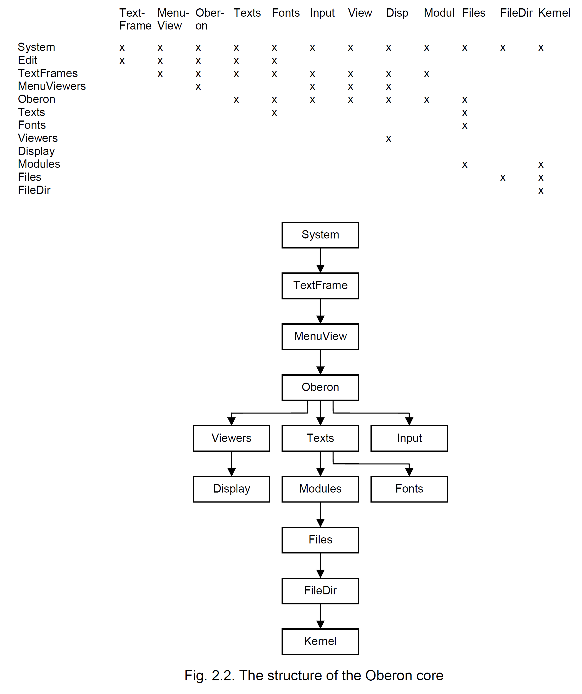
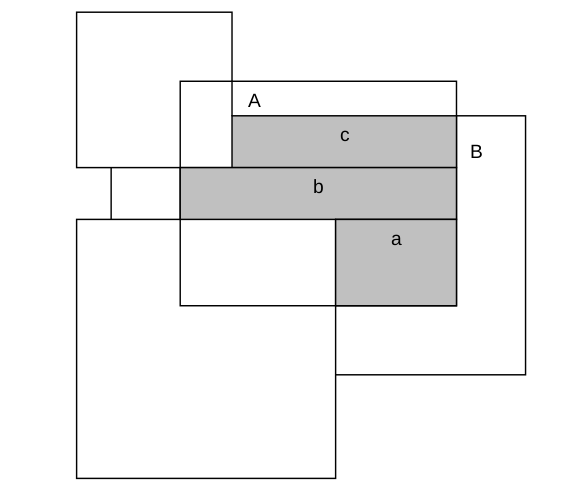
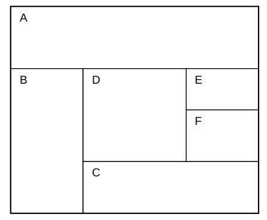
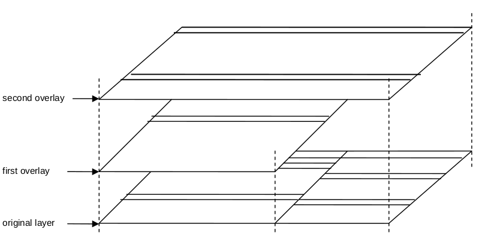

# Project Oberon

## The Design of an Operating System, a Compiler, and a Computer 

## Revised Edition 2013 

Niklaus Wirth 
Jürg Gutknecht 

ISBN 0-201-54428-8 

## Preface

This  book  presents  the  results  of  Project  Oberon,  namely  an  entire  software  environment  for  a  modern  workstation.  The  project  was  undertaken  by  the  authors  in  the  years  1986-89,  and  its  primary  goal  was  to  design  and  implement  an  entire  system  from  scratch,  and  to  structure  it  in  such  a  way  that  it  can  be described,  explained,  and understood  as  a  whole.  In  order  to  become  confronted with all aspects, problems, design decisions and details, the authors not only conceived but also programmed the entire system described in this book, and more. 

本書介紹了 Project Oberon 的成果，即一個完整的軟件環境現代工作站。該項目由作者於 1986-89 年承擔，其主要目標是從頭開始設計和實施整個系統，並將其構建為可以作為一個整體來描述、解釋和理解的方式。為了成為面對方方面面、問題、設計決策和細節，作者不僅構思並編寫了本書中描述的整個系統，等等。

Although  there  exist  numerous  books  explaining  principles  and  structures  of  operating  systems,  there is a lack of descriptions of systems actually implemented and used. We wished not only to give  advice  on  how  a  system  might  be  built,  but  to  demonstrate  how  one  was  built.  Program listings therefore play a key role in this text, because they alone contain the ultimate explanations. The  choice  of  a  suitable  formalism  therefore  assumed  great  importance,  and  we  designed  the  language  Oberon  as  not  only  an  effective  vehicle  for  implementation,  but  also  as  a  publication  medium  for  algorithms  in  the  spirit  in  which  Algol  60  had  been  created  three  decades  ago.  Because  of  its  structure,  the  language  Oberon  is  equally  well  suited  to  exhibit  global,  modular  structures of programmed systems. 

儘管有許多解釋操作系統原理和結構的書籍，缺乏對實際實施和使用的系統的描述。我們不僅希望就如何構建系統提供建議，但要演示系統是如何構建的。程序因此，列表在本文中起著關鍵作用，因為它們本身就包含了最終的解釋。因此，選擇合適的形式主義非常重要，我們設計了Oberon 語言不僅是實施的有效工具，而且還是出版物算法的媒介本著三十年前創建 Algol 60 的精神。由於其結構，Oberon 語言同樣非常適合展示全局的、模塊化的程序化系統的結構。

In spite of the small number of man-years spent on realizing the Oberon System, and in spite of its compactness letting its description fit a single book, it is not an academic toy, but rather a versatile workstation  system  that  has  found  many  satisfied  and  even  enthusiastic  users  in  academia  and  industry.  The  core  system  described  here,  consisting  of  storage,  file,  display,  text,  and  viewer  managers,  of  program  loader  and  device  drivers,  draws  its  major  power  from  a  suitably  chosen,  flexible  set  of  basic  facilities  and,  most  importantly,  of  their  effective  extensibility  in  many  directions  and  for  many  applications.  The  extensibility  is  particularly  enhanced  by  the  language  Oberon  on  the  one,  and  by  the  efficiency  of  the  basic  core  on  the  other  hand.  It  is  rooted  in  the  application  of  the  object-oriented  paradigm  which  is  employed  wherever  extensibility  appears  advantageous. 

儘管花在實現 Oberon 系統上的人年數很少，儘管它的緊湊性讓它的描述適合一本書，它不是學術玩具，而是多才多藝的工作站系統，在學術界和行業。這裡描述的核心系統，由存儲、文件、顯示、文本和查看器組成程序加載器和設備驅動程序的管理器從適當選擇的、一套靈活的基本設施，最重要的是，它們在許多方面的有效擴展性方向和許多應用程序。語言特別增強了可擴展性一方面是 Oberon，另一方面是基本核心的效率。它植根於在可擴展性出現的任何地方都採用面向對象範例的應用有利。

In addition to the core system, we describe in full detail the compiler for the language Oberon and a  graphics  system,  which  both  may  be  regarded  as  applications.  The  former  reveals  how  a  compact  compiler  is  designed  to  achieve  both  fast  compilation  and  efficient,  dense  code.  The  latter  stands  as  an  example  of  extensible  design  based  on  object-oriented  techniques,  and  it  shows  how  a  proper  integration  with  an  existing  text  system  is  possible.  Another  addition  to  the  core system is a network module allowing many workstations to be interconnected. We also show how the Oberon System serves conveniently as the basis for a multi-server station, accommodating a file distribution, a printing, and an electronic-mail facility. 

除了核心系統，我們還詳細描述了 Oberon 語言的編譯器和一個圖形系統，這兩者都可以看作是應用程序。前者揭示瞭如何緊湊型編譯器旨在實現快速編譯和高效、密集的代碼。這後者是基於面向對象技術的可擴展設計的一個例子，它展示了與現有文本系統的正確集成是如何成為可能的。的另一個補充核心系統是一個網絡模塊，允許許多工作站互連。我們還展示Oberon 系統如何方便地作為多服務器站的基礎，提供文件分發、打印和電子郵件功能。

Compactness  and  regular  structure,  and  due  attention  to  efficient  implementation  of  important  details  appear  to  be  the  key  to  economical  software  engineering.  With  the  Oberon  System,  we  wish to refute Reiser's Law, which has been confirmed by virtually all recent releases of operating systems: In spite of great leaps forward, hardware is becoming faster more slowly than software is becoming slower. The Oberon System has required a tiny fraction of the manpower demanded for the  construction  of  widely-used  commercial  operating  systems,  and  a  small  fraction  of  their  demands on computing power and storage capacity, while providing equal power and flexibility to the  user,  albeit  without  certain  bells  and  whistles.  The  reader  is  invited  to  study  how  this  was  possible. 

緊湊和規則的結構，並適當注意重要的有效實施細節似乎是經濟軟件工程的關鍵。有了 Oberon 系統，我們希望反駁 Reiser 定律，幾乎所有最近發布的操作系統都證實了這一點系統：儘管有了很大的飛躍，但硬件的速度比軟件的速度要慢得多變慢。 Oberon 系統只需要一小部分人力廣泛使用的商業操作系統的構建，以及它們的一小部分對計算能力和存儲容量的要求，同時提供同等的能力和靈活性用戶，儘管沒有某些附加功能。請讀者研究這是怎麼回事可能的。

But  most  importantly,  we  hope  to  present  a  worth-while  case  study  of  a  substantial  piece  of  programming in the large for the benefit of all those who are eager to learn from the experiences of others. 

但最重要的是，我們希望提出一個有價值的案例研究為了所有渴望從經驗中學習的人的利益而進行大規模編程別人的。

We wish to thank the many anonymous contributors of suggestions, advice, and encouragement. In particular we wish to thank our colleagues H. Mössenböck and B. Sanders and our associates at the Institut für Computersysteme for reading all or parts of the draft of this book. We are grateful to  M.  Brandis,  R.  Crelier,  A.  Disteli,  M.  Franz,  and  J.  Templ  for  their  work  in  porting  the  Oberon  

我們要感謝許多匿名貢獻者的建議、建議和鼓勵。我們要特別感謝我們的同事 H. Mössenböck 和 B. Sanders 以及我們的同事在 Institut für Computersysteme 閱讀本書的全部或部分草稿。我們很感激感謝 M. Brandis、R. Crelier、A. Disteli、M. Franz 和 J. Templ 在移植 Oberon 方面所做的工作
 
System  successfully  to  various  commercially  available  computers,  and  thus  making  the  study  of  this  book  more  worth-while  for  many  readers.  And  we  gratefully  acknowledge  the  contribution  of  our  school,  ETH,  for  providing  the  environment  and  support  which  made  it  possible  for  us  to  pursue and complete this project. 

系統成功地應用於各種商用計算機，從而使研究這本書更值得許多讀者閱讀。我們非常感謝我們的學校 ETH 提供了環境和支持，使我們能夠追求並完成這個項目。

Zürich, February 1992 
N.W. and J.G.

## Preface to the 2013 edition 

Comments about  plans  to  prepare  a second  edition  to  this  book varied widely.  Some  felt  that  this  book  is  outdated,  that  nobody  is  interested  in  a  system  of  this  kind  any  longer.  "Why  bother"?  Others felt that there is an urgent need for this type of text, which explains an entire system in detail rather than merely proposing strategies and approaches. "By all means"!. Very  much  has  changed  in  these  last  30  years.  But  even  without  this  change,  it  would  be  preposterous  to  propose  and  construct  a  system  competing  with  existing,  worldwide  "standards".  Indeed, very few people would be interested in using it. The community at large seems to be stuck with these gigantic software systems, and helpless against their complexity, their peculiarities, and their occasional unreliability.

關於準備本書第二版的計劃的評論五花八門。有人認為這這本書已經過時了，沒人再對這種系統感興趣了。 “何苦”？其他人覺得迫切需要這種類型的文本，它詳細解釋了整個系統而不僅僅是提出戰略和方法。 “無論如何”！在過去的 30 年裡發生了很大的變化。但即使沒有這種變化，它也會提出和構建一個與現有的全球“標準”競爭的系統是荒謬的。事實上，很少有人會對使用它感興趣。整個社區似乎陷入困境面對這些龐大的軟件系統，卻無力應對它們的複雜性、特性和他們偶爾的不可靠性。

But  surely  new  systems  will  emerge,  perhaps  for  different,  limited  purposes,  allowing  for  smaller  systems. One wonders where their designers will study and learn their trade. There is little technical literature,  and  my  conclusion  is  that  understanding  is  generally  gained  by  doing,  that  is,  "on  the  job".  However,  this  is  a  tedious  and  suboptimal  way  to  learn.  Whereas  sciences  are  governed  by  principles  and  laws  to  be  learned  and  understood,  in  engineering  experience  and  practice  are  indispensable. Does Computer Science teach laws that hold for (almost) ever? More than any other field of engineering, it would be predestined to be based on rigorous mathematical principles. Yet, its core hardly is. Instead, one must rely on experience, that is, on studying sound examples.  

但肯定會出現新的系統，也許是為了不同的、有限的目的，允許更小的系統。人們想知道他們的設計師將在哪裡學習和學習他們的行業。技術含量不高文學，我的結論是，理解通常是通過做來獲得的，也就是說，“在工作”。然而，這是一種乏味且次優的學習方式。而科學是由在工程經驗和實踐中需要學習和理解的原理和規律是必不可少。計算機科學是否教授（幾乎）永遠適用的法則？超過任何其他工程領域，它注定要基於嚴格的數學原理。然而，它的核心幾乎不是。相反，必須依靠經驗，即依靠研究可靠的例子。

The main purpose of and the driving force behind this project is to provide a single book that serves as an example of a system that exists, is in actual use, and is explained in all detail. This task drove home the insight that it is hard to design a powerful and reliable system, but even much harder to make  it  so  simple  and  clear  that  it  can  be  studied  and  fully  understood.  Above  everything  else,  it  requires a stern concentration on what is essential, and the will to leave out the rest, all the popular "bells and whistles". 

這個項目的主要目的和背後的驅動力是提供一本書來服務作為一個存在的系統的例子，在實際使用中，並進行了詳細的解釋。這個任務驅使深入了解設計一個強大而可靠的系統是很困難的，但更難的是使它簡單明了，可以研究和充分理解。最重要的是，它需要嚴格專注於最重要的事情，並願意放棄其餘的一切，所有流行的“鐘聲和口哨聲”。

Recently,  a  growing number  of people has  become  interested  in designing  new,  smaller  systems.  The vast complexity of popular operating systems makes them not only obscure, but also provides opportunities for "back doors". They allow external agents to introduce spies and devils unnoticed by the user, making the system attackable and corruptible. The only safe remedy is to build a safe system anew from scratch. 

最近，越來越多的人開始對設計新的、更小的系統感興趣。流行操作系統的巨大復雜性不僅使它們晦澀難懂，而且還提供了“後門”的機會。他們允許外部代理人在不被注意的情況下引入間諜和魔鬼由用戶，使系統易受攻擊和損壞。唯一安全的補救措施是從頭開始建立一個安全的系統

Turning now to a practical aspect: The largest chapter of the 1992 edition of this book dealt with the compiler translating Oberon programs into code for the NS32032 processor. This processor is now neither available nor is its architecture recommendable. Instead of writing a new compiler for some other commercially available architecture, I decided to design my own in order to extend the desire for simplicity and regularity to the hardware. The ultimate benefit of this decision is not only that the software, but also the hardware of the Oberon System is described completely and rigorously. The processor is called RISC. The hardware modules are decribed exclusively in the language Verilog. 

現在轉向實踐方面：本書 1992 年版中最大的一章涉及編譯器將 Oberon 程序翻譯成適用於 NS32032 處理器的代碼。這個處理器現在既不可用也不推薦其架構。而不是為某些人編寫新的編譯器其他商用架構，我決定設計自己的架構以擴展願望為了硬件的簡單性和規律性。這一決定的最終好處不僅在於軟件，以及 Oberon 系統的硬件都得到了完整而嚴格的描述。這處理器稱為 RISC。硬件模塊僅使用 Verilog 語言進行描述。

The decision for a new processor was expedited by the possibility to implement it, that is, to make it concrete and available. This is due to the advent of programmable gate arrays (FPGA), allowing to turn a design into a real, functioning processor on a single chip. As a result, the described system can  be  realized  using  a  low-cost  development  board.  This  board,  Xilinx  Spartan-3  by  Digilent,  features a 1-MByte static memory, which easily accommodates the entire Oberon System, incuding its compiler. It is shown, together with a display, a keyboard and a mouse in the photo below. The board is visible in the lower, right corner. 

實施它的可能性加快了對新處理器的決定，也就是說，使它具體的和可用的。這是由於可編程門陣列 (FPGA) 的出現，允許在單個芯片上將設計轉變為真正的功能處理器。結果，所描述的系統可以使用低成本的開發板來實現。這個板，Digilent 的 Xilinx Spartan-3，具有 1 兆字節的靜態內存，可輕鬆容納整個 Oberon 系統，包括它的編譯器。它與顯示器、鍵盤和滑鼠一起顯示在下面的照片中。這板在右下角可見。

The  decision  to  develop  our  own  processor  required  that  the  chapters  on  the  compiler  and  the  linking  loader  had  to  be  completely  rewritten.  However,  it  also  provided  the  welcome  chance  to  improve their clarity considerably. The new processor indeed allowed to simplify and straighten out the entire compiler. 

開發我們自己的處理器的決定需要關於編譯器和鏈接加載程序必須完全重寫。然而，它也提供了一個受歡迎的機會大大提高他們的清晰度。新處理器確實允許簡化和理順整個編譯器。

For a description of a system to be comprehensible, the key element is the notation, formalism, or language  in  which  it  is  defined.  Algol  60,  published  50  years  ago,  was  proposed  as  a  publication  language,  as  a  formalism  in  which  algorithms  could  be  defined  without  reference  to  particular  computers,  or  to  any  mechanism  at  all.  This  was  a  great  goal,  but  so  far  it  was  hardly  achieved.  Yet, it emphasized the importance of abstraction to be achieved by a notation with a mathematically rigorous foundation. At least, Algol was the first language based on a formally defined syntax. Algol was the result of the early recognition that programs must never be written just to feed computers, but always to be understood and to be instructive to people. 

為了使系統的描述易於理解，關鍵要素是符號、形式主義或定義它的語言。 50年前出版的Algol 60，被提議作為出版物語言，作為一種形式主義，在這種形式主義中，可以在不參考特定的情況下定義算法計算機，或任何機制。這是一個偉大的目標，但到目前為止還很難實現。然而，它強調了通過具有數學意義的符號來實現抽象的重要性嚴謹的基礎。至少，Algol 是第一種基於正式定義語法的語言。Algol是早期認識到程序絕不能僅僅為了餵養計算機而編寫的結果，但總是要被人們理解和啟發。

In  all  my  past  work,  I  have  tried  to  design  a  successor  to  Algol,  that  improves  its  rigor  and  at  the  same  time  extends  its  applicability  from  numerical  algorithms  to  software  systems.  From  a  long  sequence,  starting  with  Algol,  through  Pascal,  Modula,  and  Oberon,  we  have  come  closer  to  this  goal than ever before, and closer than any other language in existence. The key lay in a continued struggle for sensible simplification. 

在我過去的所有工作中，我都試圖設計一個 Algol 的繼任者，它提高了它的嚴謹性和同時將其適用性從數值算法擴展到軟件系統。從長序列，從 Algol 開始，通過 Pascal、Modula 和 Oberon，我們已經接近這個比以往任何時候都更接近目標，比現有的任何其他語言都更接近目標。關鍵在於持續為合理的簡化而奮鬥。

The  Oberon  language,  defined  in  1988,  underwent  a  revision  in  2007,  mostly  discarding  features  that were either duplications or not essential. Adaptation of the system's source code to the revised language was, besides the change of processor, the second important reason for numerous, local changes in this text. We summarize the various deletions of features: 

1988 年定義的 Oberon 語言在 2007 年進行了一次修訂，主要捨棄了一些特性那要么是重複的，要么不是必需的。使系統的源代碼適應修訂版除了處理器的變化之外，語言是許多地方的第二個重要原因此文本的更改。我們總結了特徵的各種刪除：

1. The data types LONGINT, SHORTINT, and LONGREAL have been discarded, and with them the concept of type inclusion. 
2. The LOOP and EXIT statements (repetitions with multiple exit points) have been discarded. 
3. The WITH statement (regional type guard) has been discarded.
4. The RETURN statement has been discarded and is now syntactically merged with the ending of function procedure declarations. 
5. Objects declared in a procedure P are not accessible within a procedure Q that is itself local to P. That is, objects must be either strictly local or global in order to be accessible. 
6. Assignments to imported variables are not permitted  (read-only export). 
7. Forward procedure declarations have been discarded. 

1. 數據類型 LONGINT、SHORTINT 和 LONGREAL 已被丟棄，並且與它們一起類型包含的概念。
2. LOOP 和 EXIT 語句（具有多個退出點的重複）已被丟棄。
3. WITH 語句（區域類型保護）已被丟棄。
4. RETURN 語句已被丟棄，現在在句法上與結尾合併函數過程聲明。
5. 在過程 P 中聲明的對象在過程 Q 中不可訪問，該過程本身對於 P 是本地的。也就是說，對象必須是嚴格本地的或全局的才能被訪問。
6. 不允許對導入的變量賦值（只讀導出）。
7. 向前過程聲明已被丟棄。

In  contrast  to  these removals,  there  is a  single  addition  (made  in 2012):  The  data  type  BYTE  has  been  added.  Its  values  are  integers  x  satisfying    0  ≤  x  <  256.  This  addition  prevents  the  frequent  abuse of the type CHAR. The type BYTE is mainly used for elements of arrays and records in low-level modules in order to economise the use of memory. 

與這些刪除相比，有一個添加（2012 年製作）：數據類型 BYTE 具有已添加。它的值是滿足 0 ≤ x < 256 的整數 x。這種加法防止了頻繁的濫用 CHAR 類型。 BYTE 類型主要用於數組元素和低級記錄模塊，以節省內存的使用。

In spite of these two reasons for changes -- one at the highest level, the language, the other at the lowest,  the  hardware  --  the  remainder  of  the  book  proved  to  be  pretty  stable  and  still  valid.  It  has  been my desire to present the system essentially as it existed 25 years ago, without embellishments.  The  chapters  3  -  5  on  tasking,  the  display  and  the  text,  originally  written  by  J.  Gutknecht,  have  been  carried  over  virtually  unchanged.  Significant  changes,  however,  were  necessary mainly in the descriptions of device drivers for keyboard and mouse. They now use the PS-2  interface  standard.  The  disk  has  been  replaced  by  a  single  SD-card  (flash  memory)  with  a  standard  SPI  interface.  The  interface  to  the  net  no  longer  uses  the  RS-485  interface,  but  is  also  based on the SPI standard. The chapters on the compiler and the linker are completely new. 

儘管有這兩個改變的原因——一個在最高層，語言，另一個在最低的是硬件——本書的其餘部分被證明是相當穩定且仍然有效的。它有我的願望是從本質上呈現 25 年前存在的系統，而不點綴。關於任務分配、顯示和文本的第 3 - 5 章，最初由 J.Gutknecht，幾乎沒有改變。然而，重大變化是必要的主要是在鍵盤和滑鼠的設備驅動程序的描述中。他們現在使用PS-2接口標準。磁盤已被單個 SD 卡（閃存）取代標準SPI接口。網絡接口不再使用 RS-485 接口，而是基於SPI標準。關於編譯器和鏈接器的章節是全新的。

Mostly thanks to the regularity of the RISC instruction set, the size of the compiler could be reduced significantly.  It  now  measures  less  than  2900  lines  of  program  and  compiles  itself  in  about  3 seconds, which is proof of its efficiency. The entire system compiles itself in less than 10 seconds. 

主要歸功於 RISC 指令集的規律性，可以減少編譯器的大小顯著地。它現在測量不到 2900 行程序並在大約 3 秒鐘內自行編譯，這是其效率的證明。整個系統在不到 10 秒的時間內自行編譯。

Considered  extravagant  and  hardly  necessary  only  years  ago,  run-time  checks  are  generated  automatically. In particular, they cover index range checks and access to NIL-pointers. Due to their efficiency they hardly affect run-time speed, but are a great benefit to programmers. 

僅在幾年前被認為是奢侈且幾乎沒有必要的，生成運行時檢查自動地。特別是，它們涵蓋了索引範圍檢查和對 NIL 指針的訪問。由於他們的efficiency 它們幾乎不影響運行時的速度，但是對程序員有很大的好處。

A  welcome consequence of  the simplifications of  language  and  processor  is  the  fact  that  all  parts that had been written in assembler code in 1992  -- and therefore were not included in the book -- have now been expressed in Oberon as well. Vindicating my perennial efforts to obtain a high-level language which is powerful and flexible, and also efficient enough to express parts such as device drivers and raster operations, this was the necessary and final step to make this book comprehensive and complete. 

語言和處理器簡化的一個受歡迎的結果是所有部分那是在 1992 年用彙編代碼編寫的——因此沒有包含在本書中——現在也已在 Oberon 中表達。證明我為獲得高水平的長期努力強大而靈活的語言，並且足夠高效地表達設備等部件驅動程序和光柵操作，這是製作本書的必要和最後一步全面而完整。

### References 

http://www.inf.ethz.ch/personal/wirth/Oberon/Oberon07.Report.pdf 
http://www.inf.ethz.ch/personal/wirth/FPGA-relatedWork/RISC.Arch.pdf 

## Acknowledgements 

I  gratefully  acknowledge  the  valuable  contributions  of  Paul  Reed.  He  designed  the  interfaces  to various  devices,  such  as  the  PS-2  and  SPI,  including  the  SD-card,  acting  as  disk  store.  He suggested  many  improvements  and  simplifications.  He  originally  decisively  suggested  a  re-edition of this book of 30 year ago, and was the key impetus to do all this work. My thanks go to him. 

Niklaus Wirth,  September 2013 

致謝

我非常感謝 Paul Reed 的寶貴貢獻。他設計的接口是各種設備，如 PS-2 和 SPI，包括 SD 卡，充當磁盤存儲。他建議了許多改進和簡化。他本來就果斷建議重版30 年前的這本書，是完成所有這些工作的主要動力。我要感謝他。

Niklaus Wirth，2013 年 9 月

## 1 History and motivation

How could anyone diligently concentrate on his work on an afternoon with such warmth, splendid sunshine, and blue sky. This rhetorical question was one I asked many times while spending a sabbatical leave in California in 1985. Back home everyone would feel compelled to profit from the sunny spells to enjoy life at leisure in the country-side, wandering or engaging in one's favourite sport. But here, every day was like that, and giving in to such temptations would have meant the end of all work. And, had I not chosen this location in the world because of its inviting, enjoyable climate?

如此溫暖、燦爛的午後，誰能專心致志地工作呢？ 陽光，和藍天。這個反問是我花一個小時問過很多次的問題1985 年在加利福尼亞休假。回到家裡，每個人都會覺得有必要從中獲利陽光燦爛的日子可以在鄉村享受悠閒的生活，流浪或從事自己喜歡的事情運動。但是在這裡，每一天都是這樣，屈服於這樣的誘惑就意味著所有工作結束。而且，如果我沒有選擇世界上的這個地方，是因為它誘人、令人愉快氣候？

Fortunately, my work was also enticing, making it easier to buckle down. I had the privilege of sitting in front of the most advanced and powerful workstation anywhere, learning the secrets of perhaps the newest fad in our fast developing trade, pushing colored rectangles from one place of the screen to another. This all had to happen under strict observance of rules imposed by physical laws and by the newest technology. Fortunately, the advanced computer would complain immediately if such a rule was violated, it was a rule checker and acted like your big brother, preventing you from making steps towards disaster. And it did what would have been impossible for oneself, keeping track of thousands of constraints among the thousands of rectangles laid out. This was called computer-aided design. "Aided" is rather a euphemism, but the computer did not complain about the degradation of its role.

幸運的是，我的工作也很誘人，讓我更容易屈服。我有幸坐在任何地方最先進、最強大的工作站前，學習也許是我們快速發展的行業中的最新時尚，從一個地方推出彩色矩形屏幕到另一個。這一切都必須在嚴格遵守物理規則的情況下發生法律和最新技術。幸運的是，先進的計算機會報錯如果違反了這樣的規則，它會立即成為規則檢查器並像你的大哥一樣行事，阻止你走向災難。它做到了對人來說不可能的事自己，跟踪佈置的數千個矩形中的數千個約束。這個被稱為計算機輔助設計。 “輔助”是一種委婉的說法，但計算機卻沒有抱怨其角色的退化。

While my eyes were glued to the colorful display, and while I was confronted with the evidence of my latest inadequacy, in through the always open door stepped my colleague (JG). He also happened to spend a leave from duties at home at the same laboratory, yet his face did not exactly express happiness, but rather frustration. The chocolate bar in his hand did for him what the coffee cup or the pipe does for others, providing temporary relaxation and distraction. It was not the first time he appeared in this mood, and without words I guessed its cause. And the episode would reoccur many times.

當我的眼睛盯著五顏六色的顯示屏時，當我面對著我最近的不足之處是，我的同事 (JG) 踏進了永遠敞開的大門。他還碰巧在同一個實驗室休假在家，但他的臉並沒有完全表達快樂，而不是沮喪。他手裡的巧克力棒對他來說就像咖啡一樣杯子或煙斗對其他人有用，提供暫時的放鬆和分散注意力。這不是第一個有一次他出現這種情緒，我不用言語就猜到了原因。而這一集會重複多次。

His days were not filled with the great fun of rectangle-pushing; he had an assignment. He was charged with the design of a compiler for the same advanced computer. Therefore, he was forced to deal much more closely, if not intimately, with the underlying software system. Its rather frequent failures had to be understood in his case, for he was programming, whereas I was only using it through an application; in short, I was an end-user! These failures had to be understood not for purposes of correction, but in order to find ways to avoid them. How was the necessary insight to be obtained? I realized at this moment that I had so far avoided this question; I had limited familiarization with this novel system to the bare necessities which sufficed for the task on my mind.

他的日子裡並沒有充滿推矩形的樂趣；他有一項任務。他是負責為同一台高級計算機設計編譯器。因此，他被迫與底層軟件系統更密切地（如果不是親密地）打交道。它相當頻繁必須在他的案例中理解失敗，因為他正在編程，而我只是在使用它通過申請；簡而言之，我是最終用戶！必須理解這些失敗，而不是為了糾正的目的，但為了找到避免它們的方法。必要的洞察力如何獲得？這一刻我意識到我到目前為止一直在迴避這個問題；我有限制熟悉這個新系統到足以完成我心目中的任務的基本必需品。

It soon became clear that a study of the system was nearly impossible. Its dimensions were simply awesome, and documentation accordingly sparse. Answers to questions that were momentarily pressing could best be obtained by interviewing the system's designers, who all were in-house. In doing so, we made the shocking discovery that often we could not understand their language. Explanations were fraught with jargon and references to other parts of the system which had remained equally enigmatic to us.

很快就很清楚，對該系統的研究幾乎是不可能的。它的尺寸很簡單太棒了，因此文檔很少。暫時回答的問題最好通過採訪系統的設計師來獲得壓力，他們都是內部人員。在這樣做之後，我們驚奇地發現，我們常常聽不懂他們的語言。解釋充滿了行話和對系統其他部分的引用對我們來說仍然同樣神秘。

So, our frustration-triggered breaks from compiler construction and chip design became devoted to attempts to identify the essence, the foundations of the system's novel aspects. What made it different from conventional operating systems? Which of these concepts were essential, which ones could be improved, simplified, or even discarded? And where were they rooted? Could the system's essence be distilled and extracted, like in a chemical process?

因此，我們從編譯器構造和芯片設計中因挫折而中斷，轉而專注於試圖確定本質，系統新穎方面的基礎。是什麼造就了它與傳統操作系統不同？這些概念中哪些是必不可少的，哪些可以改進、簡化甚至丟棄嗎？他們在哪里扎根？可以系統的本質被蒸餾和提取，就像在化學過程中一樣？

During the ensuing discussions, the idea emerged slowly to undertake our own design. And suddenly it had become concrete. "Crazy" was my first reaction, and "impossible". The sheer amount of work appeared as overwhelming. After all, we both had to carry our share of teaching duties back home. But the thought was implanted and continued to occupy our minds.

在隨後的討論中，慢慢產生了我們自己設計的想法。和突然間它變得具體了。 “瘋了”是我的第一反應，“不可能”。 純粹的大量的工作似乎是壓倒性的。畢竟，我們都必須承擔自己的教學責任回家的任務。但是這個想法被植入並繼續佔據我們的思想。

Sometime thereafter, events back home suggested that I should take over the important course about System Software. As it was the unwritten rule that it should primarily deal with operating system principles, I hesitated. My scruples were easily justified: After all I had never designed such a system nor a part of it. And how can one teach an engineering subject without first-hand experience?

此後的某個時候，國內發生的事件表明我應該接手重要的課程關於系統軟件。因為這是不成文的規定，它應該主要處理操作系統原理，我猶豫了。我的顧慮很容易被證明：畢竟我從來沒有設計過這樣的一個系統，也不是它的一部分。沒有第一手資料，如何教授工程學科經驗？

Impossible? Had we not designed compilers, operating systems, and document editors in small teams? And had I not repeatedly experienced that an inadequate and frustrating program could be programmed from scratch in a fraction of source code used by the original design? Our brain-storming continued, with many intermissions, over several weeks, and certain shapes of a system structure slowly emerged through the haze. After some time, the preposterous decision was made: we would embark on the design of an operating system for our workstation (which happened to be much less powerful than the one used for my rectangle-pushing) from scratch.

不可能的？如果我們沒有設計小型的編譯器、操作系統和文檔編輯器團隊？如果我沒有反復經歷過一個不充分和令人沮喪的程序可能會使用原始設計使用的一小部分源代碼從頭開始編程？我們的大腦——暴風雨持續，有許多間歇，持續數週，並且系統的某些形狀結構在陰霾中緩緩出現。一段時間後，做出了荒謬的決定：我們將著手為我們的工作站設計一個操作系統（碰巧是比用於我的矩形推的那個）從頭開始強大得多。

The primary goal, to personally obtain first-hand experience, and to reach full understanding of every detail, inherently determined our manpower: two part-time programmers. We tentatively set our time-limit for completion to three years. As it later turned out, this had been a good estimate; programming was begun in early 1986, and a first version of the system was released in the fall of 1988.

主要目標，親自獲得第一手經驗，並充分了解每一個細節，都從本質上決定了我們的人手：兩個兼職程序員。我們暫定我們的完成時限為三年。後來證明，這是一個很好的估計。編程於 1986 年初開始，該系統的第一個版本於 2018 年秋季發布1988.

Although the search for an appropriate name for a project is usually a minor problem and often left to chance and whim of the designers, this may be the place to recount how Oberon entered the picture in our case. It happened that around the time of the beginning of our effort, the space probe Voyager made headlines with a series of spectacular pictures taken of the planet Uranus and of its moons, the largest of which is named Oberon. Since its launch I had considered the Voyager project as a singularly well-planned and successful endeavor, and as a small tribute to it I picked the name of its latest object of investigation. There are indeed very few engineering projects whose products perform way beyond expectations and beyond their anticipated lifetime; mostly they fail much earlier, particularly in the domain of software. And, last but not least, we recall that Oberon is famous as the king of elfs.

雖然為項目尋找合適的名稱通常是一個小問題，而且經常被遺忘出於偶然和設計師的心血來潮，這可能是講述 Oberon 如何進入我們案例中的圖片。碰巧在我們開始努力的時候，太空探測器航海者號拍攝了一系列天王星及其周圍壯觀的照片，成為頭條新聞衛星，其中最大的一顆被命名為 Oberon。自推出以來，我一直在考慮 Voyager項目作為一個精心策劃和成功的努力，作為對它的一個小小的致敬，我選擇了其最新調查對象的名稱。確實很少有工程項目產品的性能超出預期並超出其預期壽命；他們大多失敗了更早，特別是在軟件領域。最後但同樣重要的是，我們記得 Oberon 是有名的精靈之王。

The consciously planned shortage of manpower enforced a single, but healthy, guideline: Concentrate on essential functions and omit embellishments that merely cater to established conventions and passing tastes. Of course, the essential core had first to be recognized and crystallized. But the basis had been laid. The ground rule became even more crucial when we decided that the result should be able to be used as teaching material. I remembered C.A.R. Hoare's plea that books should be written presenting actually operational systems rather than half-baked, abstract principles. He had complained in the early 1970s that in our field engineers were told to constantly create new artifacts without being given the chance to study previous works that had proven their worth in the field. How right was he, even to the present day!

有意識地計劃的人力短缺強制執行了一個單一但健康的指導方針：專注於基本功能並省略僅迎合既定功能的裝飾慣例和過時的口味。當然，本質核心必須首先被認可和結晶。但基礎已經奠定。當我們決定結果應該可以用作教材。我記得 C.A.R.Hoare 的請求是，應該編寫書籍來展示實際可操作的系統，而不是半烘焙的抽象原則。他在 20 世紀 70 年代初曾抱怨說，我們的現場工程師被告知要不斷創造新的人工製品，而沒有機會研究以前的作品已經在戰場上證明了自己的價值。直到今天，他是多麼正確！

The emerging goal to publish the result with all its details let the choice of programming language appear in a new light: it became crucial. Modula-2 which we had planned to use, appeared as not quite satisfactory. Firstly, it lacked a facility to express extensibility in an adequate way. And we had put extensibility among the principal properties of the new system. By "adequate" we include machine-independence. Our programs should be expressed in a manner that makes no reference to machine peculiarities and low-level programming facilities, perhaps with the exception of device interfaces, where dependence is inherent.

發布結果及其所有細節的新興目標讓編程語言的選擇以新的眼光出現：它變得至關重要。我們計劃使用的 Modula-2 似乎不是比較滿意。首先，它缺乏以適當方式表達可擴展性的工具。我們有將可擴展性列為新系統的主要屬性。通過“足夠”，我們包括機器獨立性。我們的節目應該以一種沒有參考的方式表達機器特性和低級編程設施，也許除了設備接口，其中依賴是固有的。

Hence, Modula-2 was extended with a feature that is now known as type extension. We also recognized that Modula-2 contained several facilities that we would not need, that do not genuinely contribute to its power of expression, but at the same time increase the complexity of the compiler. But the compiler would not only have to be implemented, but also to be described, studied, and understood. This led to the decision to start from a clean slate also in the domain of language design, and to apply the same principle to it: concentrate on the essential, purge the rest. The new language, which still bears much resemblance to Modula-2, was given the same name as the system: Oberon [1, 2]. In contrast to its ancestor it is terser and, above all, a significant step towards expressing programs on a high level of abstraction without reference to machine-specific features.

因此，Modula-2 被擴展了一個現在稱為類型擴展的特性。我們也認識到 Modula-2 包含一些我們不需要的設施，它們並不真正有助於其表達能力，但同時增加了編譯器的複雜度。但是編譯器不僅要被實現，還要被描述、研究和使用。明白了。這導致決定在語言領域也從頭開始設計，並對其應用相同的原則：專注於本質，清除其餘部分。新的仍然與 Modula-2 非常相似的語言被賦予了與 Modula-2 相同的名稱系統：Oberon [1, 2]。與它的祖先相比，它更簡潔，最重要的是，這是一個重要的步驟在不參考特定於機器的情況下在高抽象層次上表達程序特徵。

We started designing the system in late fall 1985, and programming in early 1986. As a vehicle we used our workstation Lilith and its language Modula-2. First, a cross-compiler was developed, then followed the modules of the inner core together with the necessary testing and down-loading facilities. The development of the display and the text system proceeded simultaneously, without the possibility of testing, of course. We learned how the absence of a debugger, and even more so the absence of a compiler, can contribute to careful programming.

我們於 1985 年秋末開始設計系統，並於 1986 年初開始編程。作為一個載體，我們使用我們的工作站 Lilith 及其語言 Modula-2。首先，開發了一個交叉編譯器，然後遵循內核的模塊以及必要的測試和下載設施。顯示和文本系統的開發同時進行，沒有當然，測試的可能性。我們了解瞭如何缺少調試器，甚至更多沒有編譯器，有助於仔細編程。

Thereafter followed the translation of the compiler into Oberon. This was swiftly done, because the original had been written with anticipation of the later translation. After its availability on the target computer Ceres, together with the operability of the text editing facility, the umbilical cord to Lilith could be cut off. The Oberon System had become real, at least its draft version. This happened around the middle of 1987; its description was published thereafter [3], and a manual and guide followed in 1991 [5].

此後，編譯器將其翻譯成 Oberon。這很快就完成了，因為原文是在期待後來的翻譯的情況下寫的。在目標上可用之後計算機 Ceres，連同文本編輯工具的可操作性，是 Lilith 的臍帶可以被切斷。 Oberon 系統已經成為現實，至少是它的草稿版本。這發生過大約在 1987 年中期；隨後出版了它的描述 [3]，以及一本手冊和指南隨後於1991年[5]。

The system's completion took another year and concentrated on connecting the workstations in a network for file transfer [4], on a central printing facility, and on maintenance tools. The goal of completing the system within three years had been met. The system was introduced in the middle of 1988 to a wider user community, and work on applications could start. A service for electronic mail was developed, a graphics system was added, and various efforts for general document preparation systems proceeded. The display facility was extended to accommodate two screens, including color. At the same time, feedback from experience in its use was incorporated by improving existing parts. Since 1989, Oberon has replaced Modula-2 in our introductory programming courses.

該系統的完成又花了一年時間，並專注於將工作站連接成一個用於文件傳輸 [4] 的網絡、中央打印設施和維護工具。三年內完成該系統已達標。中間介紹了系統1988 年到更廣泛的用戶社區，應用程序的工作可以開始。電子服務開發了郵件，添加了圖形系統，並為通用文檔做出了各種努力準備系統進行。顯示設施被擴展以容納兩個屏幕，包括顏色。同時，其使用經驗的反饋被納入改進現有零件。自 1989 年以來，Oberon 在我們的介紹性產品中取代了 Modula-2編程課程。

### References

1. N. Wirth. The programming language Oberon. Software - Practice and Experience 18, 7, (July 1988) 671-690.
2. M. Reiser and N. Wirth. Programming in Oberon - Steps beyond Pascal and Modula. Addison-Wesley, 1992.
3. N. Wirth and J. Gutknecht. The Oberon System. Software - Practice and Experience, 19, 9 (Sept. 1989), 857-893.
4. N. Wirth. Ceres-Net: A low-cost computer network. Software - Practice and Experience, 20, 1 (Jan. 1990), 13-24.
5. M. Reiser. The Oberon System - User Guide and Programmer's Manual. Addison-Wesley, 1991.

## 2 Basic concepts and structure of the system

### 2.1. Introduction

In order to warrant the sizeable effort of designing and constructing an entire operating system from scratch, a number of basic concepts need to be novel. We start this chapter with a discussion of the principal concepts underlying the Oberon System and of the dominant design decisions. On this basis, a presentation of the system's structure follows. It will be restricted to its coarsest level, namely the composition and interdependence of the largest building blocks, the modules. The chapter ends with an overview of the remainder of the book. It should help the reader to understand the role, place, and significance of the parts described in the individual chapters.

為了保證從頭開始設計和構建整個操作系統的巨大努力，許多基本概念是需要長篇敘述的。 我們從本章開始討論 Oberon 系統的主要概念和主要設計決策。 在此基礎上，系統結構介紹如下。 它將被限制在最粗略的層面，即最大構建塊模塊的組成和相互依賴性。 本章最後概述了本書的其餘部分。 它應該有助於讀者理解各個章節中描述的部分的作用、位置和意義。

The fundamental objective of an operating system is to present the computer to the user and to the programmer at a certain level of abstraction. For example, the store is presented in terms of requestable pieces or variables of a specified data type, the disk is presented in terms of sequences of characters (or bytes) called files, the display is presented as rectangular areas called viewers, the keyboard is presented as an input stream of characters, and the mouse appears as a pair of coordinates and a set of key states. Every abstraction is characterized by certain properties and governed by a set of operations. It is the task of the system to implement these operations and to manage them, constrained by the available resources of the underlying computer. This is commonly called resource management.

操作系統的基本目標是將計算機上的某種抽象層次呈現給用戶和程序員。例如，存儲是以指定可請求片段或變量的數據類型方式呈現，磁盤以字符（或字節）序列呈現稱為文件，顯示為矩形區域呈現稱為查看器，鍵盤為字符輸入流呈現，滑鼠為一對坐標和一組關鍵狀態呈現。每個抽象都具有某些屬性並由一組操作管理。執行這些操作是系統的任務，並且管理它們，受底層計算機可用資源的限制。這是通常稱為資源管理。

Every abstraction inherently hides details, namely those from which it abstracts. Hiding may occur at different levels. For example, the computer may allow certain parts of the store, or certain devices to be made inaccessible according to its mode of operation (user/supervisor mode), or the programming language may make certain parts inaccessible through a hiding facility inherent in its visibility rules. The latter is of course much more flexible and powerful, and the former indeed plays an almost negligible role in our system. Hiding is important because it allows maintenance of certain properties (called invariants) of an abstraction to be guaranteed. Abstraction is indeed the key of any modularization, and without modularization every hope of being able to guarantee reliability and correctness vanishes. Clearly, the Oberon System was designed with the goal of establishing a modular structure on the basis of purpose-oriented abstractions. The availability of an appropriate programming language is an indispensable prerequisite, and the importance of its choice cannot be over-emphasized.

每個抽象本質上都隱藏了細節，即它從中抽象出來的細節。隱藏可能發生在不同的層面。例如，計算機可能依其可見性規則允許存儲的某些部分，或某些根據其操作模式（用戶/管理員模式）或可能通過編程語言使其固有的設施隱藏某些部分不可訪問。後者當然更加靈活和強大，前者確實在我們的系統中擔任幾乎可以忽略不計的腳色。隱藏很重要，因為它允許維護要保證的抽象的某些屬性（稱為不變量）。抽象確實是任何模塊化的關鍵，沒有模塊化的每一個希望都能夠保證可靠性和正確性消失了。顯然，Oberon 系統的設計目標是在面向目的的抽象的基礎上建立模塊化結構。的可用性合適的編程語言是必不可少的先決條件，其重要性選擇不能過分強調。

### 2.2. Concepts

#### 2.2.1. Viewers

Whereas the abstractions of individual variables representing parts of the primary store, and of files representing  parts  of  the  disk  store  are  well  established  notions  and  have  significance  in  every  computer  system,  abstractions  regarding  input  and  output  devices  became  important  with  the  advent of high interactivity between user and computer. High interactivity requires high bandwidth, and the only channel of human users with high bandwidth is the eye. Consequently, the computer's visual output unit must be properly matched with the human eye. This occurred with the advent of the  high-resolution  display  in  the  mid 1970s,  which  in  turn had  become  feasible  due  to  faster  and  cheaper  electronic  memory  components.  The  high-resolution  display  marked  one  of  the  few  very  significant  break-throughs  in  the  history  of  computer  development.  The  typical  bandwidth  of  a  modern display is in the order of 100 MHz. Primarily the high-resolution display made visual output a subject of abstraction and resource management. In the Oberon System, the display is partitioned into  viewers,  also  called  windows,  or  more  precisely,  into  frames,  rectangular  areas  of  the  screen(s).  A  viewer  typically  consists  of  two  frames,  a  title  bar  containing  a  subject  name  and  a  menu  of  commands,  and  a  main  frame  containing  some  text,  graphic,  picture,  or  other  object.  A  viewer itself is a frame; frames can be nested, in principle to any depth. 

而代表主要存儲部分和文件的各個變量的抽象表示磁盤存儲的部分是公認的概念並且在每個方面都具有重要意義計算機系統，關於輸入和輸出設備的抽象變得重要用戶和計算機之間的高交互性的出現。高交互性需要高帶寬，人類用戶唯一具有高帶寬的渠道是眼睛。因此，計算機的視覺輸出單元必須與人眼正確匹配。這發生在20 世紀 70 年代中期的高分辨率顯示器，由於速度更快、速度更快而變得可行更便宜的電子存儲元件。高分辨率顯示器是為數不多的顯示器之一計算機發展史上的重大突破。的典型帶寬現代顯示器的頻率約為 100 MHz。主要是高分辨率顯示器做視覺輸出抽象和資源管理的主題。在 Oberon 系統中，顯示器是分區的進入觀眾，也稱為窗口，或更準確地說，進入框架，屏幕。查看器通常由兩個框架組成，一個包含主題名稱的標題欄和一個命令菜單，以及包含一些文本、圖形、圖片或其他對象的主框架。一種查看器本身就是一個框架；框架可以嵌套，原則上可以嵌套到任意深度。

The  System  provides  routines  for  generating  a  frame  (viewer),  for  moving  and  for  closing  it.  It  allocates  a  new  viewer  at  a  specified  place,  and  upon  request  delivers  hints  as  to  where  it  might  best  be  placed.  It  keeps  track  of  the  set  of  opened  viewers.  This  is  what  is  called  viewer management, in contrast to the handling of their displayed contents. 

該系統提供用於生成框架（查看器）、移動和關閉框架的例程。它在指定位置分配一個新的查看器，並根據請求提供有關它可能在哪裡的提示最好放置。它跟踪打開的查看器集。這就是所謂的查看器管理，而不是處理它們顯示的內容。

But high interactivity requires not only a high bandwidth for visual output, it demands also flexibility of  input.  Surely,  there  is  no  need  for  an  equally  large  bandwidth,  but  a  keyboard  limited  by  the  speed of typing to about 100 Hz is not good enough. The break-through on this front was achieved by  the  so-called  mouse,  a  pointing  device  which  appeared  roughly  at  the  same  time  as  the  high-resolution display.

但高交互性不僅需要用於視覺輸出的高帶寬，還需要靈活性輸入。當然，不需要同樣大的帶寬，但鍵盤受限於大約 100 Hz 的打字速度不夠好。實現了這方面的突破所謂的滑鼠，一種指點設備，大致與高端設備同時出現分辨率顯示。

This  was  by  no  means  just  a  lucky  coincidence.  The  mouse  comes  to  fruition  only  through  appropriate  software  and  the  high-resolution  display.  It  is  itself  a  conceptually  very  simple  device  delivering  signals  when  moved  on  the  table.  These  signals  allow  the  computer  to  update  the  position of a mark - the cursor - on the display. Since feedback occurs through the human eye, no great precision is required from the mouse. For example, when the user wishes to identify a certain object on the screen, such as a letter, he moves the mouse as long as required until the mapped cursor reaches the object. This stands in marked contrast to a digitizer which is supposed to deliver exact coordinates. The Oberon System relies very much on the availability of a mouse. 

這絕不只是一個幸運的巧合。滑鼠只有通過適當的軟件和高分辨率顯示器。它本身就是一個概念上非常簡單的設備在桌子上移動時傳遞信號。這些信號允許計算機更新標記（光標）在顯示屏上的位置。由於反饋是通過人眼發生的，所以不滑鼠需要很高的精度。例如，當用戶希望識別某個屏幕上的物體，比如一個字母，他只要移動滑鼠，直到映射到光標到達對象。這與應該提供的數字化儀形成鮮明對比精確坐標。 Oberon 系統非常依賴滑鼠的可用性。

Perhaps the cleverest idea was to equip mice with buttons. By being able to signal a request with the same hand that determines the cursor position, the user obtains the direct impression of issuing position-dependent requests. Position-dependence is realized in software by delegating interpretation of the signal to a procedure - a so-called handler or interpreter -which is local to the viewer in whose area the cursor momentarily appears. A surprising flexibility of command activation can be achieved in this manner by appropriate software. Various techniques have emerged in this connection, e.g. pop-up menus, pull-down-menus, etc. which are powerful even under the presence of  a  single  button  only.  For  many  applications,  a  mouse  with  several  keys  is far  superior, and  the  Oberon  System  basically  assumes  three  buttons  to  be  available.  The  assignment  of  different  functions  to  the  keys  may  of  course  easily  lead  to  confusion  when  every  application  prescribes  different  key  assignment.  This  is,  however,  easily  avoided  by  the  adherence  to  certain  "global"  conventions. In the Oberon System, the left button is primarily used for marking a position (setting a caret),  the  middle  button  for  issuing  general  commands  (see  below),  and  the  right  button  for  selecting displayed objects.

也許最聰明的想法是為滑鼠配備按鈕。通過能夠發出請求信號確定光標位置的同一隻手，用戶獲得發布的直接印象位置相關的請求。位置依賴是通過委託在軟件中實現的將信號解釋為過程 - 所謂的處理程序或解釋器 - 它是本地的光標瞬間出現在其區域中的查看器。命令激活的驚人靈活性可以通過適當的軟件以這種方式實現。在這方面出現了各種技術連接，例如彈出式菜單、下拉菜單等，即使在現場也很強大只有一個按鈕。對於許多應用程序，具有多個鍵的滑鼠要好得多，而且Oberon System 基本上假定三個按鈕可用。賦值不同當每個應用程序規定時，鍵的功能當然很容易導致混淆不同的鍵分配。然而，這很容易通過堅持某些“全域”慣例。在 Oberon 系統中，滑鼠左鍵主要用於標記位置（設置插入符號），中間按鍵用於發出通用命令的（見下文），以及右鍵用於選擇顯示的對象。

Recently, it has become fashionable to use overlapping windows mirroring documents being piled up  on  one's desk.  We  have  found  this  metaphor  not  entirely  convincing.  Partially  hidden  windows  are  typically  brought  to  the  top  and  made  fully  visible  before  any  operation  is  applied  to  their  contents.  In  contrast  to  the  insignificant  advantage  stands  the  substantial  effort  necessary  to  implement  this  scheme.  It  is  a  good  example  of  a  case  where  the  benefit  of  a  complication  is  incommensurate with its cost. Therefore, we have chosen a solution that is much simpler to realize, yet  has  no  genuine  disadvantages  compared  to  overlapping  windows:  tiled  viewers  as  shown  in  Fig. 2.1.

最近流行用重疊窗口鏡像文件堆積在一個人的辦公桌上。我們發現這個比喻並不完全令人信服。部分隱藏的窗口通常會被帶到頂部並在對其應用任何操作之前完全可見內容。與微不足道的優勢相反，需要付出巨大的努力實施該方案。這是一個很好的例子，說明並發症的好處是與其成本不相稱。因此，我們選擇了一個更容易實現的解決方案，但與重疊窗口相比沒有真正的缺點：平鋪查看器，如圖 2.1所示。

#### 2.2.2. Commands

Position-dependent commands with fixed meaning (fixed for each type of viewer) must be supplemented  by  general  commands.  Conventionally,  such  commands  are  issued  through  the  keyboard by typing the program's name that is to be executed into a special command text. In this respect,  the  Oberon  System  offers  a  novel  and  much  more  flexible  solution  which  is  presented  in  the following paragraphs. 

具有固定含義的位置相關命令（對於每種類型的查看器viewer都是固定的）必須是以一般命令為補充。按照慣例，此類命令是通過通過將要執行的程序名稱鍵入特殊命令文本來使用鍵盤。在這個在這方面，Oberon 系統提供了一種新穎且更加靈活的解決方案，該解決方案在以下段落。

First of all we remark that a program in the common sense of a text compiled as a unit is mostly a far too large unit of action to serve as a command. Compare it, for example, with the insertion of a piece of text through a mouse command. In Oberon, the notion of a unit of action is separated from the notion of unit of compilation. The former is a command represented by a (exported) procedure, the  latter  is  a  module.  Hence,  a  module  may,  and  typically  does,  define  several,  even  many  commands. Such a (general) command may be invoked at any time by pointing at its name in any text  visible  in  any  viewer  on  the  display,  and  by  clicking  the  middle  mouse  button.  The  command  name has the form M.P, where P is the procedure's identifier and M that of the module in which P is declared. As a consequence, any command click may cause the loading of one or several modules, if M is not already present in main store. The next invocation of M.P occurs instantaneously, since M  is  already  loaded.  A  further  consequence  is  that  modules  are  never  (automatically)  removed,  because a next command may well refer to the same module.

首先，我們要指出的是，作為一個單元編譯的文本常識中的程序主要是一個太大的行動單位無法作為命令。比較一下，例如，插入一個通過滑鼠命令的一段文本。在 Oberon 中，行動單元的概念與編譯單元的概念。前者是由（導出的）過程表示的命令，後者是一個模塊。因此，一個模塊可以而且通常確實定義了幾個，甚至很多命令。這樣的（通用）命令可以在任何時候通過指向它的名稱在任何時候被調用文本在顯示器上的任何查看器中可見，並通過單擊滑鼠中鍵。命令名稱的格式為 M.P，其中 P 是過程的標識符，M 是模塊的標識符，其中 P宣布。因此，任何命令點擊都可能導致加載一個或多個模塊，如果 M 還沒有出現在 main store 中。 M.P 的下一次調用瞬間發生，因為M 已經加載。進一步的結果是模塊永遠不會（自動）刪除，因為下一個命令很可能引用同一個模塊。

Every command has the purpose to alter the state of some operands. Typically, they are denoted by text following the command identification, and Oberon follows this convention. Strictly speaking, commands  are  denoted  as  parameterless  procedures;  but  the  system  provides  a  way  for  the  procedure to identify the text position of its origin, and hence to read and interpret the text following the  command,  i.e.  the  actual  parameters.  Both  reading  and  interpretation  must,  however,  be  programmed explicitly.

每個命令都有改變某些操作數狀態的目的。 通常，它們表示為通過命令標識後的文本，Oberon 遵循此約定。 嚴格來講，命令被表示為無參數過程； 但系統提供了一種方法程序識別其來源的文本位置，從而閱讀和解釋以下文本命令，即實際參數。 然而，閱讀和解釋都必須是明確編程。

The parameter text must refer to objects that exist before command execution starts and are quite likely the result of a previous command interpretation. In most operating systems, these objects are files registered in the directory, and they act as interfaces between commands. The Oberon System broadens  this  notion;  the  links  between  consecutive  commands  are  not  restricted  to  files,  but  can  be any global variable, because modules do not disappear from storage after command termination, as mentioned above. 

參數文本必須引用命令執行開始之前存在的對象，並且相當可能是先前命令解釋的結果。 在大多數操作系統中，這些對象是目錄中註冊的文件，它們充當命令之間的接口。 Oberon系統拓寬了這個概念； 連續命令之間的鏈接不限於文件，但可以是任何全局變量，因為模塊不會在命令後從存儲中消失終止，如上所述。

This  tremendous  flexibility  seems  to  open  Pandora's  box,  and  indeed  it  does  when  misused.  The  reason is that global variables' states may completely determine and alter the effect of a command. The  variables  represent  hidden states,  hidden  in  the  sense  that  the  user  is  in general  unaware  of  them and has no easy way to determine their value. The positive aspect of using global variables as  interfaces  between  commands  is  that  some  of  them  may  well  be  visible  on  the  display.  All  viewers  -  and  with  them  also  their  contents  -  are  organized  in  a  data  structure  that  is  rooted  in  a  global variable (in module Viewers). Parts of this variable therefore constitute visible states, and it is highly appropriate to refer to them as command parameters. 

這種巨大的靈活性似乎打開了潘多拉魔盒，如果使用不當，確實如此。 這原因是全局變量的狀態可能完全決定和改變命令的效果。變量表示隱藏狀態，隱藏在用戶通常不知道的意義上他們並沒有簡單的方法來確定他們的價值。 使用全局變量的積極方面作為命令之間的接口，其中一些很可能在顯示器上可見。 全部查看器——以及它們的內容——被組織在一個數據結構中，該結構植根於全局變量（在模塊 Viewers 中）。 因此，這個變量的一部分構成可見狀態，並且它是將它們稱為命令參數非常合適。

One of the rules of what may be called the Oberon Programming Style is therefore to avoid hidden states, and to reduce the introduction of global variables. We do not, however, raise this rule to the rank  of  a  dogma.  There  exist  genuinely  useful  exceptions,  even  if  the  variables  have  no  visible  parts.

因此，所謂的 Oberon 編程風格的規則之一是避免隱藏狀態，減少全局變量的引入。 但是，我們不會將此規則提高到教條的等級。 存在真正有用的例外，即使變量沒有可見的部分。

There remains the question of how to denote visible objects as command parameters. An obvious case is the use of the most recent selection as parameter. A procedure for locating that selection is provided by module Oberon. (It is restricted to text selections).  Another possibility is the use of the caret position in a text. This is used in the case of inserting new text; the pressing of a key on the keyboard is also considered to be a command, and it causes the character's insertion at the caret position. 

仍然存在如何將可見對象表示為命令參數的問題。 一個明顯的例子是使用最近的選擇作為參數。 用於定位該選擇的過程由模塊 Oberon 提供。 （僅限於文本選擇）。 另一種可能性是在文本中使用插入符位置。 這用於插入新文本的情況； 在鍵盤上按下一個鍵也被認為是一個命令，它會導致字符插入到插入符號位置。

A special facility is introduced for designating viewers as operands: the star marker. It is placed at the cursor position when the keyboard's mark key (SETUP) is pressed. The procedure Oberon.MarkedViewer identifies the viewer in whose area the star lies. Commands which take it as their parameter are typically followed by an asterisk in the text. Whether the text contained in a text viewer, or a graph contained in a graphic viewer, or any other part of the marked viewer is taken as the actual parameter depends on how the command procedure is programmed. 

引入了一種特殊設施，用於將觀眾指定為操作對象：星標。 當按下鍵盤的標記鍵 (SETUP) 時，它位於光標位置。 過程 Oberon.MarkedViewer 識別星星所在區域的觀察者。 將它作為參數的命令通常在文本中後跟一個星號。 文本查看器中包含的文本，圖形查看器中包含的圖形，或標記查看器的任何其他部分是否被視為實際參數取決於命令過程的編程方式。

Finally,  a  most  welcome  property  of  the  system  should  not  remain  unmentioned.  It  is  a  direct  consequence of the persistent nature of global variables and becomes manifest when a command fails. Detected failures result in a trap. Such a trap should be regarded as an abnormal command termination. In the worst case, global data may be left in an inconsistent state, but they are not lost, and a next command can be initiated based on their current state. A trap opens a small viewer and lists  the  sequence  of  invoked  procedures  with  their  local  variables  and  current  values.  This  information helps a programmer to identify the cause of the trap.

最後，系統的一個最受歡迎的特性不應被提及。 它是全局變量持久性的直接結果，並在命令失敗時變得明顯。 檢測到的故障會導致陷阱。 這樣的陷阱應該被視為命令異常終止。 在最壞的情況下，全局數據可能處於不一致的狀態，但它們並沒有丟失，並且可以根據它們的當前狀態啟動下一個命令。 陷阱打開一個小查看器並列出調用過程的序列及其局部變量和當前值。 此信息有助於程序員識別陷阱的原因。

#### 2.2.3. Tasks 

From the presentations above it follows that the Oberon System is distinguished by a highly flexible scheme  of  command  activation.  The  notion  of  a  command  extends  from  the  insertion  of  a  single  character and the setting of a marker to computations that may take hours or days. It is moreover distinguished  by  a  highly  flexible  notion  of  operand  selection  not  restricted  to  registered,  named  files.  And  most  importantly,  by  the  virtual  absence  of  hidden  states.  The  state  of  the  system  is  practically determined by what is visible to the user. 

從上面的介紹可以看出，Oberon 系統以高度靈活的命令激活方案而著稱。 命令的概念從單個字符的插入和標記的設置擴展到可能需要數小時或數天的計算。 此外，它的特點是高度靈活的操作數選擇概念，不限於已註冊的命名文件。 最重要的是，實際上沒有隱藏狀態。 系統的狀態實際上由用戶可見的內容決定。

This  makes  it  unnecessary  to  remember  a  long  history  of  previously  activated commands, started  programs,  entered  modes,  etc.  Modes  are  in  our  view  the  hallmark  of  user-unfriendly  systems.  It  should at this point have become obvious that the system allows a user to pursue several different tasks  concurrently.  They  are  manifest  in  the  form  of  viewers  containing  texts,  graphics,  or  other  displayable objects. The user switches between tasks implicitly when choosing a different viewer as operand  for  the  next  command.  The  characteristic  of  this  concept  is  that  task  switching  is  under  explicit control of the user, and the atomic units of action are the commands. 

這使得不必記住以前激活的命令、啟動的程序、進入的模式等的長期歷史記錄。在我們看來，模式是用戶不友好系統的標誌。 在這一點上，系統允許用戶同時執行多個不同的任務應該已經很明顯了。 它們以包含文本、圖形或其他可顯示對象的查看器的形式出現。 當選擇不同的查看器作為下一個命令的操作對象時，用戶會隱式地在任務之間切換。 這個概念的特點是任務切換在用戶的明確控制下，而原子操作單元是命令。

At  the  same  time,  we  classify  Oberon  as  a  single-process  (or  single-thread)  system.  How  is  this  apparent paradox to be understood?  Perhaps it is best explained by considering the basic mode of operation. Unless engaged in the interpretation of a command, the processor is engaged in a loop continuously  polling  event  sources.  This  loop  is  called  the  central  loop;  it  is  contained  in  module  Oberon which may be regarded as the system's heart. The two fixed event sources are the mouse and the keyboard. If a keyboard event is sensed, control is dispatched to the handler installed in the so-called focus viewer, designated as the one holding the caret. If a mouse event (key) is sensed, control is dispatched to the handler in which the cursor currently lies. This is all possible under the paradigm of a single, uninterruptible process.

同時，我們將 Oberon 歸類為單進程（或單線程）系統。 如何理解這個明顯的悖論？ 也許最好通過考慮基本操作模式來解釋。 除非參與命令的解釋，否則處理器將參與一個循環，不斷輪詢事件源。 這個循環稱為中央循環； 它包含在模塊 Oberon 中，可以被視為系統的核心。 兩個固定的事件源是滑鼠和鍵盤。 如果檢測到鍵盤事件，控制將被分派到安裝在所謂的焦點查看器中的處理程序，指定為持有插入符的那個。 如果感測到滑鼠事件（鍵），則將控制分派給光標當前所在的處理程序。 在單一的、不間斷的進程的範例下，這一切都是可能的。

The  notion  of  a  single  process  implies  non-interruptability,  and  therefore  also  that  commands  cannot  interact  with  the  user.  Interaction  is  confined  to  the  selection  of  commands  before  their  execution. Hence, there exists no input statement in typical Oberon programs. Inputs are given by parameters supplied and designated before command invocation. 

單個進程的概念意味著不可中斷性，因此命令也不能與用戶交互。 交互僅限於在執行之前選擇命令。 因此，典型的 Oberon 程序中不存在輸入語句。 輸入由命令調用前提供和指定的參數給出。

This scheme at first appears as gravely restrictive. In practice it is not, if one considers single-user operation.  It  is  this  single  user  who  carries  out  a  dialog  with  the  computer.  A  human  might  be  capable of  engaging  in  simultaneous  dialogs  with  several processes  only  if  the  commands  issued are very time-consuming. We suggest that execution of time-consuming computations might better be delegated to loosely coupled compute-servers in a distributed system.

該方案乍一看似乎具有嚴格的限制性。 實際上不是，如果考慮單用戶操作。 正是這個單獨的用戶與計算機進行對話。 僅當發出的命令非常耗時時，人類才可能能夠與多個進程同時進行對話。 我們建議將耗時計算的執行委託給分佈式系統中鬆散耦合的計算服務器會更好。

The  primary  advantage  of  a  system  dealing  with  a  single  process  is  that  task  switches  occur  at  user-defined  points  only,  where  no  local  process  state  has  to  be  preserved  until  resumption.  Furthermore, because the switches are user-chosen, the tasks cannot interfere in unexpected and uncontrollable  ways  by  accessing  common  variables.  The  system  designer  can  therefore  omit  all  kinds of protection mechanisms that exclude such interference. This is a significant simplification. 

處理單個進程的系統的主要優點是任務切換僅發生在用戶定義的點，在恢復之前不必保留本地進程狀態。 此外，由於開關是用戶選擇的，因此任務不會通過訪問公共變量以意想不到和無法控制的方式進行干預。 因此，系統設計人員可以省略各種排除此類干擾的保護機制。 這是一個重要的簡化。

The  essential  difference  between  Oberon  and  multiprocess-systems  is  that  in  the  former  task  switches  occur  between commands only,  whereas  in  the  latter  a switch  may  be  invoked  after  any  single  instruction.  Evidently,  the  difference  is  one  of  granularity  of  action.  Oberon's  granularity  is  coarse, which is entirely acceptable for a single-user system. 

Oberon 和多進程系統之間的本質區別在於，在前者中，任務切換僅發生在命令之間，而在後者中，可以在任何單個指令之後調用切換。 顯然，區別在於行動的粒度之一。 Oberon 的粒度比較粗，對於單用戶系統來說完全可以接受。

The  system  offers  the  possibility  to  insert  further  polling  commands  in  the  central  loop.  This  is  necessary  if  additional  event  sources  are  to  be  introduced.  The  prominent  example  is  a  network,  where  commands  may  be  sent  from  other  workstations.  The  central  loop  scans  a  list  of  so-called  task  descriptors.  Each  descriptor  refers  to  a  command  procedure.  The  two  standard  events  are  selected  only  if  their  guard  permits,  i.e.  if  either  keyboard  input  is  present,  or  if  a  mouse  event  occurs. Inserted tasks must provide their own guard in the beginning of the installed procedure.

該系統提供了在中央迴路中插入更多輪詢命令的可能性。 如果要引入額外的事件源，這是必要的。 突出的例子是網絡，其中可以從其他工作站發送命令。 中央循環掃描所謂的任務描述符列表。 每個描述符都指向一個命令過程。 這兩個標準事件只有在它們的守衛允許時才會被選中，即如果鍵盤輸入存在，或者滑鼠事件發生。 插入的任務必須在安裝過程的開頭提供自己的守衛。

The example of a network inserting commands, called requests, raises a question: what happens if the  processor  is  engaged  in  the  execution  of  another  command  when  the  request  arrives?  Evidently, the request would be lost unless measures are taken. The problem is easily remedied by buffering the input. This is done in every driver of an input device, in the keyboard driver as well as the  network  driver.  The  incoming  signal  triggers  an  interrupt,  and  the  invoked  interrupt  handler  accepts the input and buffers it. We emphasize that such interrupt handling is confined to drivers, system  components  at  the  lowest  level.  An  interrupt  does  not  evoke  a  task  selection  and  a  task  switch. Control simply returns to the point of interruption, and the interrupt remains unnoticeable to programs. There exists, as with every rule, an exception: an interrupt due to keyboard input of the abort character returns control to the central loop. 

網絡插入命令（稱為請求）的示例提出了一個問題：如果處理器在請求到達時正在執行另一個命令，會發生什麼情況？顯然，除非採取措施，否則請求將丟失。 這個問題很容易通過緩衝輸入來解決。 這是在輸入設備的每個驅動程序中完成的，在鍵盤驅動程序和網絡驅動程序中。 傳入信號觸發中斷，調用的中斷處理程序接受輸入並對其進行緩衝。 我們強調這種中斷處理僅限於最低級別的驅動程序和系統組件。 中斷不會引起任務選擇和任務切換。 控制簡單地返回到中斷點，程序不會注意到中斷。 與每條規則一樣，存在一個例外：由於鍵盤輸入中止字符而導致的中斷將控制權返回到中央循環。

#### 2.2.4. Tool Texts as Configurable Menus

Certainly, the concepts of viewers specifying their own interpretation of mouse clicks, of commands invokable  from  any  text  on  the  display,  of  any  displayed  object  being  selectable  as  an  interface  between  commands,  and  of  commands  being  dialog-free,  uninterruptible  units  of  action,  have  considerable  influence  on  the  style  of  programming  in  Oberon,  and  they  thoroughly  change  the  style  of  using  the  computer.  The  ease  and  flexibility  in  the  way  pieces  of  text  can  be  selected,  moved, copied, and designated as command and as command parameters, drastically reduces the need  for  typing.  The  mouse  becomes  the  dominant  input  device:  the  keyboard  merely  serves  to  input textual data. This is accentuated by the use of so-called tool texts, compositions of frequently used commands, which are typically displayed in the narrower system track of viewers. One simply doesn't type commands! They are usually visible somewhere already. Typically, the user composes a tool text for every project pursued. Tool texts can be regarded as individually configurable private menus.

當然，viewers的概念指定了他們自己對滑鼠點擊的解釋，可以從顯示器上的任何文本調用的命令，任何顯示的對像都可以選擇作為命令之間的接口，以及命令是無對話的，不間斷的動作單元，已經 對 Oberon 的編程風格產生了相當大的影響，他們徹底改變了使用計算機的方式。 選擇、移動、複製和指定為命令和命令參數的文本片段的方式的簡便性和靈活性極大地減少了鍵入的需要。 滑鼠成為主要的輸入設備：鍵盤僅用於輸入文本數據。 這通過使用所謂的工具文本、常用命令的組合而得到強調，這些文本通常顯示在觀眾的較窄系統軌道中。 一個人根本不輸入命令！ 它們通常已經在某處可見。 通常，用戶會為每個追求的項目撰寫工具文本。 工具文本可視為可單獨配置的私人菜單。

The rarity of issuing commands by typing them has the most agreeable benefit that their names can be meaningful words. For example, the copy operation is denoted by Copy instead of cp, rename by Rename instead of rn, the call for a file directory excerpt is named Directory instead of ls. The need  for  memorizing  an  infinite  list  of  cryptic  abbreviations,  which  is  another  hallmark  of  user-unfriendly systems, vanishes.

通過鍵入命令來發出命令的罕見之處在於它們的名稱可以是有意義的單詞，這是最令人愉快的好處。 例如，複製操作用Copy而不是cp表示，重命名用Rename而不是rn，對文件目錄摘錄的調用是命名為Directory而不是ls。 記住無窮無盡的神秘縮寫列表的需求消失了，這是用戶不友好系統的另一個標誌。

But the influence of the Oberon concept is not restricted to the style in which the computer is used. It  extends  also  to  the  way  programs  are  designed  to  communicate  with  the  environment.  The  definition of the abstract type Text in the system's core suggests the replacement of files by texts as carrier  of  input  and  output  data  in  very many  cases. The  advantage  to be gained  lies  in  the  text's  immediate  editability.  For  example,  the  output  of  the  command  System.Directory  produces  the  desired excerpt of the file directory in the form of a (displayed) text. Parts of it or the whole may be selected and copied into other texts by regular editing commands (mouse clicks). Or, the compiler accepts  texts  as  input.  It  is  therefore  possible  to  compile  a  text,  execute  the  program,  and  to  recompile  the  re-edited  text  without  storing  it  on  disk  between  compilations  and  tests.  The  ubiquitous  editability  of  text  together  with  the  persistence  of  global  data  (in  particular  viewers)  allows many steps that do not contribute to the progress of the task actually pursued to be avoided.

但 Oberon 概念的影響並不僅限於計算機的使用方式。 它還擴展到程序設計與環境通信的方式。 系統核心中抽象類型Text的定義暗示在很多情況下以文本代替文件作為輸入輸出數據的載體。 獲得的優勢在於文本的即時可編輯性。 例如，命令 System.Directory 的輸出以（顯示的）文本形式生成所需的文件目錄摘錄。 可以通過常規編輯命令（單擊滑鼠）選擇部分或全部內容並將其複製到其他文本中。 或者，編譯器接受文本作為輸入。 因此，可以編譯文本、執行程序並重新編譯重新編輯的文本，而無需在編譯和測試之間將其存儲在磁盤上。 文本無處不在的可編輯性以及全局數據（特別是查看者）的持久性允許避免許多無助於實際追求的任務進展的步驟。

#### 2.2.5. Extensibility

An  important  objective  in  the  design  of  the  Oberon  System  was  extensibility.  It  should  be  easy  to  extend  the  system  with  new  facilities  by  adding  modules  that  make  use  of  the  already  existing  resources. Equally important, it should also reduce the system to those facilities that are currently and actually used. For example, a document editor processing documents free of graphics should not  require  the  loading  of  an  extensive  graphics  editor,  a  workstation  operating  as  a  stand-alone  system should not require the loading of extensive network software, and a system used for clerical purposes  need  include  neither  compiler  nor  assembler.  Also,  a  system  introducing  a  new  kind  of  display frame should not include procedures for managing viewers containing such frames. Instead, it should make use of existing viewer management. The staggering consumption of memory space by  many  widely  used  systems  is  due  to  violation  of  such  fundamental  rules  of  engineering.  The  requirement  of  many  megabytes  of  store  for  an  operating  system  is,  albeit  commonly  tolerated,  absurd  and  another  hallmark  of  user-unfriendliness,  or  perhaps  manufacturer  friendliness.  Its  reason is none other than inadequate extensibility.

Oberon 系統設計的一個重要目標是可擴展性。 通過添加利用現有資源的模塊，使用新設施擴展系統應該很容易。 同樣重要的是，它還應該將系統簡化為那些當前和實際使用的設施。 例如，處理沒有圖形的文檔的文檔編輯器不需要加載大量的圖形編輯器，作為獨立系統運行的工作站不需要加載大量的網絡軟件，用於文書目的的系統需要包括 既不是編譯器也不是彙編器。 此外，引入新型顯示幀的系統不應包括用於管理包含此類幀的查看器的過程。 相反，它應該利用現有的查看器管理。 許多廣泛使用的系統對內存空間的驚人消耗是由於違反了這些基本的工程規則。 儘管通常可以容忍，但對操作系統的許多兆字節存儲的要求是荒謬的，並且是用戶不友好或製造商友好的另一個標誌。 其原因莫過於擴展性不足。

We  do  not  restrict  this  notion  to  procedural  extensibility,  which  is  easy  to  realize.  The  important  point is that extensions may not only add further procedures and functions, but introduce their own data  types  built  on  the  basis  of  those  provided  by  the  system:  data  extensibility.  For  example,  a  graphics  system  should  be  able  to  define  its  graphics  frames  based  on  frames  provided  by  the  basic display module and by extending them with attributes appropriate for graphics. 

我們不將此概念限制為易於實現的過程可擴展性。 重要的一點是，擴展不僅可以添加更多的過程和功能，而且可以在系統提供的數據類型的基礎上引入自己的數據類型：數據可擴展性。 例如，圖形系統應該能夠根據基本顯示模塊提供的框架定義其圖形框架，並通過使用適合圖形的屬性來擴展它們。

This requires an adequate language feature. The language Oberon provides precisely this facility in the  form  of  type  extensions.  The  language  was  designed  for  this  reason;  Modula-2  would  have  been  the  choice,  had  it  not  been  for  the  lack  of  a  type  extension  feature.  Its  influence  on  system  structure  was  profound,  and  the  results  have  been  most  encouraging.  In  the  meantime,  many  additions have been created with surprising ease. One of them is described at the end of this book. The basic system is nevertheless quite modest in its resource requirements (see Table at the end of Section 2.3).

這需要足夠的語言特性。 Oberon 語言以類型擴展的形式提供了這種便利。 該語言就是出於這個原因而設計的； 如果不是因為缺少類型擴展功能，Modula-2 可能是最佳選擇。 它對系統結構的影響是深遠的，結果是最令人鼓舞的。 與此同時，許多新增功能的創建也出人意料地輕鬆。 其中之一在本書末尾進行了描述。 儘管如此，基本系統的資源需求卻相當有限（見第 2.3 節末尾的表格）。

#### 2.2.6. Dynamic Loading

Activation of commands residing in modules that are not present in the store implies the loading of the  modules  and,  of  course,  all  their  imports.  Invoking  the  loader  is,  however,  not  restricted  to  command  activation;  it  may  also  occur  through  programmed  procedure  calls.  This  facility  is  indispensable  for  a  successful  realization  of  genuine  extensibility.  Modules  must  be  loadable  on  demand.  For  example,  a  document  editor  loads  a  graphics  package  when  a  graphic  element  appears in the processed document, but not otherwise.

激活存儲中不存在的模塊中的命令意味著加載模塊，當然還有它們的所有導入。 然而，調用加載器並不局限於命令激活； 它也可能通過程序調用發生。 此功能對於成功實現真正的可擴展性是不可或缺的。 模塊必須可按需加載。 例如，當圖形元素出現在已處理的文檔中時，文檔編輯器加載圖形包，否則不會。

The Oberon System features no separate linker. A module is linked with its imports when it is loaded, and never before. As a consequence, every module is present only once, in main store  (linked) as well as on backing store (unlinked, as file). Avoiding the generation of multiple copies in different, linked object files is the key to storage economy. Prelinked mega-files do not occur in the Oberon System, and every module is freely reusable.

Oberon 系統沒有單獨的鏈接器。 模塊在加載時與其導入鏈接，而之前從未如此。 因此，每個模塊只存在一次，在主存儲（鏈接）和後備存儲（未鏈接，作為文件）中。 避免在不同的、鏈接的目標文件中生成多個副本是存儲經濟的關鍵。 Oberon 系統中不會出現預先鏈接的巨型文件，並且每個模塊都可以自由重複使用。

### 2.3. The system's structure

The largest identifiable units of the system are its modules. It is therefore most appropriate to describe a system's structure in terms of its modules. As their interfaces are explicitly declared, it is also easy to exhibit their interdependence in the form of a directed graph. The edges indicate imports.

系統最大的可識別單元是它的模塊。 因此，用模塊來描述系統的結構是最合適的。 由於它們的接口是明確聲明的，因此也很容易以有向圖的形式展示它們的相互依賴性。 邊緣表示進口。

The module graph of a system programmed in Oberon is hierarchical, i.e. has no cycles. The lowest members of the hierarchy effectively import hardware only. We refer here to modules which contain device drivers. But module Kernel also belongs to this class; it "imports memory" and includes the disk driver. The modules on the top of the hierarchy effectively export to the user. As the user has direct access to command procedures, we call these top members command modules or tool modules.

在 Oberon 中編程的系統模塊圖是分層的，即沒有循環。 層次結構的最低成員僅有效地導入硬件。 我們在這裡指的是包含設備驅動程序的模塊。 但是模塊 Kernel 也屬於這個類； 它“導入內存”並包含磁盤驅動程序。 層次結構頂部的模塊有效地導出給用戶。 由於用戶可以直接訪問命令過程，我們將這些頂級成員稱為命令模塊或工具模塊。

The hierarchy of the basic system is shown in a table of direct imports and as a graph in Figure 2.2. The  picture  is  simplified  by  omitting  direct  import  edges  if  an  indirect  path  also  leads  from  the  source  to  the  destination.  For  example,  Files  imports  Kernel;  the  direct  import  is  not  shown,  because a path from Kernel leads to Files via FileDir.

基本系統的層次結構顯示在直接導入表和圖 2.2 中的圖表中。 如果間接路徑也從源到目的地，則通過省略直接導入邊來簡化圖片。 例如，Files 導入 Kernel； 未顯示直接導入，因為從內核的路徑通過 FileDir 指向文件。

Module  names  in  the  plural  form  typically  indicate  the  definition  of  an  abstract  data  type  in  the  module. The type is exported together with the pertinent operations. Examples are Files, Modules, Fonts, Texts, Viewers, MenuViewers, and TextFrames. Modules whose names are in singular form typically  denote  a  resource  that  the  module  manages,  be  it  a  global  variable  or  a  device.  The  variable or the device is itself hidden (not exported) and becomes accessible through the module's exported  procedures.  Examples  are  all  device  drivers,  Input  for  keyboard  and  mouse,  Kernel  for  memory  and  disk,  and  Display.  Exceptions  are  the  command  modules  whose  name  is  mostly  chosen according to the activity they primarily represent, like System, and Edit

複數形式的模塊名稱通常表示模塊中抽象數據類型的定義。 該類型與相關操作一起導出。 示例包括文件、模塊、字體、文本、查看器、菜單查看器和 TextFrames。 名稱為單數形式的模塊通常表示模塊管理的資源，無論是全局變量還是設備。 變量或設備本身是隱藏的（不導出）並且可以通過模塊的導出過程訪問。 示例是所有設備驅動程序、鍵盤和滑鼠的輸入、內存和磁盤的內核以及顯示。 例外是命令模塊，其名稱主要根據它們主要代表的活動來選擇，例如系統和編輯

Module  Oberon  is,  as  already  mentioned,  the  heart  of  the  system  containing  the  central  loop  to  which  control  returns  after  each  command  interpretation,  independent  of  whether  it  terminates  normally  or  abnormally.  Oberon  exports  several  procedures  of  auxiliary  nature,  but  primarily  also  the  one  allowing  the  invocation  of  commands  (Call) and  access  to  the  command's  parameter  text  through variable Oberon.Par. Furthermore, it contains global, exported variables: the log text. The log  text  typically  serves  to  issue  prompts  and  short  failure  reports  of  commands.  The  text  is  displayed  in  a  log  viewer  that  is  automatically  opened  when  module  System  is  initialized.  Module  Oberon furthermore contains the two markers used globally on the display, the mouse cursor and the  star  pointer.  It  exports  procedures  to  draw  and  to  erase  them,  and  allows  the  installation  of  different patterns for them. 

正如已經提到的，模塊 Oberon 是系統的核心，包含中央循環，控制在每個命令解釋後返回，無論它是正常終止還是異常終止。 Oberon 導出幾個輔助性質的過程，但主要也是允許調用命令 (Call) 和通過變量 Oberon.Par 訪問命令的參數文本的過程。 此外，它還包含全局的、導出的變量：日誌文本。 日誌文本通常用於發出提示和簡短的命令失敗報告。 文本顯示在日誌查看器中，該查看器在初始化模塊系統時自動打開。 Module Oberon 還包含顯示器上全局使用的兩個標記，即滑鼠光標和星形指針。 它導出繪製和擦除它們的程序，並允許為它們安裝不同的圖案。

The system shown in Fig. 2.2. basically contains facilities for generating and editing texts, and for storing them in the file system. All other functions are performed by modules that must be added in the  usual  way  by  module  loading  on  demand.  This  includes,  notably,  the  compiler,  network  communication,  document  editors,  and  all  sorts  of  programs  designed  by  users.  The  high  priority  given in the system's conception to modularity, to avoiding unnecessary frills, and to concentrate on the indispensable in the core, has resulted in a system of remarkable compactness. Although this property  may  be  regarded  as  of  little  importance  in  this  era  of  falling  costs  of large  memories,  we  consider  it  to  be  highly  essential.  We  merely  should  like  to  draw  the  reader's  attention  to  the  correlation  between  a  systems'  size  and  its  reliability.  Also,  we  do  not  consider  it  as  good  engineering  practice  to  consume  a  resource  lavishly  just  because  it  happens  to  be  cheap.  The  following table lists the core's modules and the major application modules, and it indicates the size of code (in words) and static variables (in bytes) and, the number of source program lines.

該系統如圖 2.2 所示。基本上包含用於生成和編輯文本以及將它們存儲在文件系統中的工具。所有其他功能都由模塊執行，這些模塊必須通過按需加載模塊以通常的方式添加。這尤其包括編譯器、網絡通信、文檔編輯器以及用戶設計的各種程序。該系統的概念高度重視模塊化，避免不必要的裝飾，並專注於核心不可或缺的部分，從而形成了一個非常緊湊的系統。雖然在這個大內存成本下降的時代，這個屬性可能被認為不那麼重要，但我們認為它是非常重要的。我們只想提請讀者注意系統規模與其可靠性之間的相關性。此外，我們並不認為僅僅因為資源便宜就大量消耗資源是良好的工程實踐。下表列出了內核的模塊和主要的應用模塊，並指出了代碼（以字為單位）和靜態變量（以字節為單位）的大小以及源程序行數。

### 2.4. A tour through the chapters

Implementation of a system proceeds bottom-up. Naturally, because modules on higher levels are clients of those on the lower levels and cannot function without the availability of their imports. Description of a system, on the other hand, is better ordered in the top-down direction. This is because a system is designed with its expected applications and functions in mind. Decomposition into a hierarchy of modules is justified by the use of auxiliary functions and abstractions and by postponing their more detailed explanation to a later time when their need has been fully motivated. For this reason, we will proceed essentially in the top-down direction.

系統的實施是自下而上進行的。 自然地，因為較高級別的模塊是較低級別的模塊的客戶，並且沒有它們的導入可用性就無法運行。 另一方面，系統的描述最好按自上而下的方向排列。 這是因為系統在設計時考慮了其預期的應用程序和功能。 通過使用輔助功能和抽象以及將它們的更詳細解釋推遲到它們的需求被充分激發時的稍後時間來證明分解為模塊層次結構是合理的。 因此，我們將基本上按照自上而下的方向進行。

Chapters 3 - 5 describe the outer core of the system. Chapter 3 focusses on the dynamic aspects. In  particular,  this  chapter  introduces  the  fundamental  operational  units  of  task  and  command. Oberon's  tasking  model  distinguishes  the  categories  of  interactive  tasks  and  background  tasks. Interactive  tasks  are  represented  on  the  display  screen  by  rectangular  areas,  so-called  viewers. Background tasks need not be connected with any displayed object. They are scheduled with low priority when interactions are absent. A good example of a background task is the memory garbage collector. Both interactive tasks and background tasks are mapped to a single process by the task scheduler.  Commands  in  Oberon  are  explicit,  atomic  units  of  interactive  operations.  They  are  realized in the form of exported parameterless procedures and replace the heavier-weight notion of program known from more conventional operating systems. This chapter continues with a definition of a software toolbox as a logically connected collection of commands. It terminates with an outline of the system control toolbox. 

第 3 至 5 章描述了系統的外核。 第 3 章著重於動態方面。 特別是，本章介紹了任務和指揮的基本操作單元。 Oberon 的任務模型區分了交互任務和後台任務的類別。 交互式任務在顯示屏上由矩形區域（即所謂的查看器）表示。 後台任務不需要與任何顯示的對象相關聯。 當交互不存在時，它們被安排為低優先級。 後台任務的一個很好的例子是內存垃圾收集器。 任務調度程序將交互式任務和後台任務映射到單個進程。 Oberon 中的命令是交互操作的顯式原子單元。 它們以導出的無參數過程的形式實現，並取代了更傳統操作系統中已知的重量級程序概念。 本章繼續將軟件工具箱定義為邏輯上連接的命令集合。 它以系統控制工具箱的概要結束。

Chapter 4 explains Oberon's display system. It starts with a discussion of our choice of a hierarchical tiling strategy for the allocation of viewers. A detailed study of the exact role of Oberon viewers follows. Type Viewer is presented as an object class with an open message interface providing a conceptual basis for far-reaching extensibility. Viewers are then recognized as just a special case of so-called frames that may be nested. A category of standard viewers containing a menu frame and a frame of contents is investigated. The next topic is cursor handling. A cursor in Oberon is a marked path. Both viewer manager and cursor handler operate on an abstract logical display area rather than on individual physical monitors. This allows a unified handling of display requests, independent of number and types of monitors assigned. For example, smooth transitions of the cursor across screen boundaries are conceptually guaranteed. The chapter continues with the presentation of a concise and complete set of raster operations that is used to place textual and graphical elements in the display area. An overview of the system display toolbox concludes the chapter.

第 4 章解釋了 Oberon 的顯示系統。 它首先討論我們為觀眾分配選擇的分層平鋪策略。 下面詳細研究 Oberon 觀眾的確切角色。 Type Viewer 以對像類的形式呈現，帶有開放的消息接口，為廣泛的可擴展性提供了概念基礎。 然後將查看器識別為所謂的可以嵌套的框架的特例。 研究了包含菜單框架和內容框架的標準查看器類別。 下一個主題是游標處理。 Oberon 中的游標是標記的路徑。 查看器管理器和光標處理程序都在抽象的邏輯顯示區域而不是在單獨的物理監視器上運行。 這允許統一處理顯示請求，而與分配的監視器的數量和類型無關。 例如，光標跨屏幕邊界的平滑過渡在概念上是有保證的。 本章繼續介紹一組簡潔而完整的光柵操作，用於將文本和圖形元素放置在顯示區域中。 本章最後概述了系統顯示工具箱。

Chapter 5 introduces text. Oberon distinguishes itself by treating Text as an abstract data type that is integrated in the central  system.  Numerous  fundamental  consequences  are  discussed.  For  example, a text can be produced by one command, edited by a user, and then consumed by a next command.  Commands  themselves  can  be  represented  textually  in  the  form  M.P,  followed  by  a  textual  parameter  list.  Consequently,  any  command  can  be  called  directly  from  within  a  text  (so-called  tool)  simply  by  pointing  at  it  with  the  mouse.  However,  the  core  of  this  chapter  is  a  presentation of Oberon's text system as a case study in program modularization. The concerns of managing a text and displaying it are nicely separated. Both the text manager and the text display feature  an  abstract  public  interface  as  well  as  an  internally  hidden  data  structure.  Finally  in  this  chapter, Oberon's type-font management and the toolbox for editing are discussed.

第5章介紹正文。 Oberon 的與眾不同之處在於將文本視為集成在中央系統中的抽象數據類型。 討論了許多基本後果。 例如，文本可以由一個命令生成，由用戶編輯，然後由下一個命令使用。 命令本身可以以 M.P 的形式以文本形式表示，後跟文本參數列表。 因此，任何命令都可以直接從文本（所謂的工具）中調用，只需用滑鼠指向它即可。 然而，本章的核心是以 Oberon 的文本系統作為程序模塊化案例研究的介紹。 管理文本和顯示文本的關注點很好地分開了。 文本管理器和文本顯示都具有抽象的公共接口以及內部隱藏的數據結構。 本章最後討論了 Oberon 的類型字體管理和編輯工具箱。

Chapters 6 - 9 describe the inner core, still in a top-down path. Chapter 6 explains the loader of program modules and motivates the introduction of the data type Module. The chapter includes the management of the memory part holding program code and defines the format in which compiled modules are stored as object files. Furthermore, it discusses the problems of binding separately compiled modules together and of referencing objects defined in other modules.

第 6 至 9 章描述內核，仍然採用自上而下的路徑。 第 6 章解釋了程序模塊的加載器並引發了數據類型 Module 的引入。 本章包括對保存程序代碼的內存部分的管理，並定義了編譯後的模塊作為目標文件存儲的格式。 此外，它還討論了將單獨編譯的模塊綁定在一起以及引用其他模塊中定義的對象的問題。

Chapter 7 is devoted to the file system, a part of crucial importance, because files are involved in almost every program and computation. The chapter consist of two distinct parts, the first introducing  the  type  File  and  describing  the  structure  of  files,  i.e.  their  representation  on  disk  storage with its sequential characteristics, the second describing the directory of file names and its organisation as a B-tree for obtaining fast searches. 

第 7 章專門討論文件系統，這是一個至關重要的部分，因為文件幾乎涉及到每個程序和計算。 本章由兩個不同的部分組成，第一部分介紹文件類型並描述文件的結構，即它們在磁盤存儲上的表示及其順序特徵，第二部分描述文件名的目錄及其作為 B 樹的組織以獲取 快速搜索。

The management of memory is the subject of Chapter 8. A single, central storage management was one of the key design decisions, guaranteeing an efficient and economical use of storage. The chapter explains the store's partitioning into specific areas. Its central concern, however, is the discussion of dynamic storage management in the partition called the heap. The algorithm for allocation (corresponding to the intrinsic procedure NEW) and for retrieval (called garbage collection) are explained in detail.

內存管理是第 8 章的主題。單一的中央存儲管理是關鍵的設計決策之一，它保證了存儲的高效和經濟使用。 本章解釋了商店劃分為特定區域的情況。 然而，它的核心關注點是對稱為堆的分區中的動態存儲管理的討論。 詳細解釋了用於分配（對應於內部過程 NEW）和用於檢索（稱為垃圾收集）的算法。

At the lowest level of the module hierarchy we find device drivers. They are described in Chapter 9, which  contains  drivers  for  some  widely  accepted  interface  standards.  The  first  is  PS-2,  a  serial  transmission with synchronous clock. This is used for the keyboard and for the Mouse. The second is SPI, a standard for bi-directional, serial transmission with synchronous clock. This is used for the "disk", represented  by  an SDI-card  (flash  memory),  and  for  the  network.  And  the  third  standard  is  RS-232 typically used for simple and slow data links. It is bidirectional and asynchronous.

在模塊層次結構的最低級別，我們找到了設備驅動程序。 它們在第 9 章中描述，其中包含一些廣泛接受的接口標準的驅動程序。 第一種是 PS-2，一種帶有同步時鐘的串行傳輸。 這用於鍵盤和滑鼠。 第二種是 SPI，一種雙向、串行傳輸和同步時鐘的標準。 這用於以 SDI 卡（閃存）為代表的“磁盤”和網絡。 第三個標準是 RS-232，通常用於簡單和慢速的數據鏈接。 它是雙向和異步的。

The second part of the book, consisting of Chapters 10 - 15, is devoted to what may be called first applications of the basic Oberon System. These chapters are therefore independent of each other, making reference to Chapters 3 - 9 only.

本書的第二部分由第 10 章到第 15 章組成，專門介紹基本 Oberon 系統的首次應用。 因此，這些章節相互獨立，僅參考第 3 至 9 章。

Although the Oberon System is well-suited for operating stand-alone workstations, a facility for connecting a set of computers should be considered as fundamental. Module Net, which makes transmission of files among workstations connected by a bus-like network possible, is the subject of Chapter 10. It presents not only the problems of network access, of transmission failures and collisions, but also those of naming partners. The solutions are implemented in a surprisingly compact module which uses a network driver presented in Chapter 9.

雖然 Oberon 系統非常適合操作獨立工作站，但連接一組計算機的設施應該被視為基本設施。 Module Net 使通過類總線網絡連接的工作站之間的文件傳輸成為可能，這是第 10 章的主題。它不僅提出了網絡訪問、傳輸失敗和衝突的問題，而且還提出了命名夥伴的問題。 這些解決方案是在一個非常緊湊的模塊中實現的，該模塊使用第 9 章中介紹的網絡驅動程序。

When a set of workstations is connected in a network, the desire for a central server appears. A central facility serving as a file distribution service, as a printing station, and as a storage for electronic mail is presented in Chapter 11. It emerges by extending the Net module of Chapter 10, and is a convincing application of the tasking facilities explained in Section 2.2. In passing we note that the server operates on a machine that is not under observation by a user. This circumstance requires an increased degree of robustness, not only against transmission failures, but also against data that do not conform to defined formats.

當一組工作站連接在網絡中時，就出現了對中央服務器的需求。 第 11 章介紹了用作文件分發服務、打印站和電子郵件存儲的中央設施。它通過擴展第 10 章的 Net 模塊而出現，並且是任務設施的令人信服的應用 第 2.2 節。 順便提一下，我們注意到服務器在用戶未觀察到的機器上運行。 這種情況需要更高程度的魯棒性，不僅要防止傳輸失敗，還要防止不符合定義格式的數據。

The  presented  system  of  servers  demonstrates  that  Oberon's  single-thread  scheme  need  not  be  restricted  to  single-user  systems.  The  fact  that  every  command  or  request,  once  accepted,  is  processed until completion, is acceptable if the request does not occupy the processor for too long, which  is  mostly  the  case  in  the  presented  server  applications.  Requests  arriving  when  the  processor is engaged are queued. Hence, the processor handles requests one at a time instead of interleaving  them  which,  in  general,  results  in  faster  overall  performance  due  to  the  absence  of  frequent task switching. 

所呈現的服務器系統證明了 Oberon 的單線程方案不必局限於單用戶系統。 事實上，每個命令或請求一旦被接受，就會被處理直到完成，如果請求不會佔用處理器太長時間，這是可以接受的，這在目前的服務器應用程序中是大多數情況。 當處理器被佔用時到達的請求被排隊。 因此，處理器一次處理一個請求，而不是將它們交織在一起，這通常會由於沒有頻繁的任務切換而導致更快的整體性能。

Chapter 12 describes the Oberon compiler. It translates source text in Oberon into target code, i.e. instruction  sequences  of some  target computer.  Its  principles and  techniques are explained  in  [6].  Both, source language and target architecture must be understood before studying a compiler. Both source language and the target computer's RISC architecture are presented in the Appendix.

第 12 章描述了 Oberon 編譯器。 它將 Oberon 中的源文本翻譯成目標代碼，即某個目標計算機的指令序列。 其原理和技術在[6]中進行了解釋。 在學習編譯器之前，必須了解源語言和目標體系結構。 附錄中介紹了源語言和目標計算機的 RISC 體系結構。

Although here the compiler appears as an application module, it naturally plays a distinguished role, because  the  system  (and  the  compiler  itself)  is  formulated  in  the  language  which  the  compiler  translates  into  code.  Together  with  the  text  editor  it  was  the  principal  tool  in  the  system's  development. The use of straight-forward algorithms for parsing and symbol table organization led to  a  reasonably  compact  piece  of  software.  A  main  contributor  to  this  result  is  the  language's  definition: the language is devoid of complicated structures and rarely used embellishments. 

雖然編譯器在這裡作為一個應用程序模塊出現，但它自然發揮著與眾不同的作用，因為系統（和編譯器本身）是用編譯器翻譯成代碼的語言制定的。 與文本編輯器一起，它是系統開發中的主要工具。 使用直接算法進行解析和符號表組織導致了相當緊湊的軟件。 這一結果的一個主要貢獻者是語言的定義：該語言沒有復雜的結構和很少使用的修飾。

The  compiler  and  thereby  the  chapter  is  partitioned  into  two  main  parts.  The  first  is  language-specific,  but  does  not  refer  to  any  particular  target  computer.  It  consist  of  the  scanner  and  the  parser.  This  part  is  therefore  of  most  general  interest  to  the  readership.  The  second  part  is,  essentially,  language-independent,  but  is  specifically  tailored  to  the  instruction  set  of  the  target  computer. It is called the code generator. 

編譯器和本章分為兩個主要部分。 第一個是特定於語言的，但不涉及任何特定的目標計算機。 它由掃描器和解析器組成。 因此，這部分是讀者最感興趣的部分。 第二部分本質上與語言無關，但專門針對目標計算機的指令集量身定制。 它被稱為代碼生成器。

Texts  play  a  predominant  role  in  the  Oberon  System.  Their  preparation  is  supported  by  the  system's major tool, the editor. In Chapter 13 we describe another editor, one that handles graphic objects. At first, only horizontal and vertical lines and short captions are introduced as objects. The major difference to texts lies in the fact that their coordinates in the drawing plane do not follow from those  of  their  predecessor  automatically,  because  they  form  a  set  rather  than  a  sequence.  Each  object  carries  its  own,  independent  coordinates.  The  influence  of  this  seemingly  small  difference  upon an editor are far-reaching and permeate the entire design. There exist hardly any similarities between a text and a graphics editor. Perhaps one should be mentioned: the partitioning into three parts.  The  bottom  module  defines  the  respective  abstract  data  structure  for  texts  or  graphics,  together  with,  of  course,  the  procedures  handling  the  structure,  such  as  searches,  insertions,  and  deletions.  The  middle  module  in  the  hierarchy  defines  a  respective  frame  and  contains  all  procedures  concerned  with  displaying  the  respective  objects  including  the  frame  handler  defining  interpretation  of  mouse  and  keyboard  events.  The  top  modules  are  the  respective  tool  modules  (Edit,  Draw).  The  presented  graphics  editor  is  particularly  interesting  in  so  far  as  it  constitutes  a  convincing  example  of  Oberon's  extensibility.  The  graphics  editor  is  integrated  into  the  entire  system; it embeds its graphic frames into menu-viewers and uses the facilities of the text system for its caption elements. And lastly, new kinds of elements can be incorporated by the mere addition of new  modules,  i.e.  without  expanding,  even  without  recompiling  the  existing  ones.  Two  examples  are shown in Chapter 13 itself: rectangles and circles. 

文本在 Oberon 系統中起著主導作用。 他們的準備得到系統的主要工具編輯器的支持。 在第 13 章中，我們描述了另一個編輯器，一個處理圖形對象的編輯器。 起初，只有橫線和豎線以及短標題作為對像被引入。 與文本的主要區別在於它們在繪圖平面中的坐標不會自動遵循其前身的坐標，因為它們形成一個集合而不是一個序列。 每個對像都有自己的獨立坐標。 這種看似微小的差異對編輯的影響是深遠的，貫穿於整個設計。 文本編輯器和圖形編輯器之間幾乎沒有任何相似之處。 也許應該提到一個：分為三個部分。 底部模塊定義了文本或圖形各自的抽象數據結構，當然還有處理該結構的過程，例如搜索、插入和刪除。 層次結構中的中間模塊定義了相應的框架，並包含與顯示相應對像有關的所有過程，包括定義滑鼠和鍵盤事件解釋的框架處理程序。 頂部模塊是相應的工具模塊（編輯、繪圖）。 所呈現的圖形編輯器特別有趣，因為它構成了 Oberon 可擴展性的一個令人信服的例子。 圖形編輯器集成到整個系統中； 它將其圖形框架嵌入到菜單查看器中，並使用文本系統的功能作為其標題元素。 最後，可以通過僅僅添加新模塊來合併新類型的元素，即無需擴展，甚至無需重新編譯現有模塊。 第 13 章本身展示了兩個示例：矩形和圓形。

The Draw System has been extensively used for the preparation of diagrams of electronic circuits. This  application  suggests  a  concept  that  is  useful  elsewhere  too,  namely  a  recursive  definition  of  the  notion  of  object.  A  set  of  objects  may  be  regarded  as  an  object  itself  and  be  given  a  name.  Such  an  object  is  called  a  macro.  It  is  a  challenge  to  the  designer  to  implement  a  macro  facility  such that it is also extensible, i.e. in no way refers to the type of its elements, not even in its input operations of files on which macros are stored. 

Draw System 已廣泛用於製作電子電路圖。 這個應用程序提出了一個在其他地方也很有用的概念，即對象概念的遞歸定義。 一組對象可以被視為一個對象本身，並被賦予一個名稱。 這樣的對象稱為宏。 實現宏工具使其也是可擴展的對設計者來說是一個挑戰，即決不涉及其元素的類型，甚至不涉及存儲宏的文件的輸入操作。

Chapter 14 presents two other tools, namely one used for installing an Oberon System on a bare machine, and one used to recover from failures of the file store. Although rarely employed, the first was  indispensable  for  the  development  of  the  system.  The  maintenance  or  recovery  tools  are  invaluable  assets  when  failures  occur.  And  they  do!  Chapter  14  covers  material  that  is  rarely  presented in the literature.

第 14 章介紹了另外兩種工具，一種用於在裸機上安裝 Oberon 系統，另一種用於從文件存儲故障中恢復。 儘管很少被雇用，但第一個對於系統的發展是不可或缺的。 發生故障時，維護或恢復工具是寶貴的資產。 他們做到了！ 第 14 章涵蓋了文獻中很少出現的材料。

Chapter 15 is devoted to tools that are not used by the Oberon System presented so far, but may be essential in some applications. The first is a data link with a protocol based on the RS-232 standard shown in Chapter 9. Another is a standard set of basic mathematical functions. And the third is a tool for creating new macros for the Draw System.

第 15 章專門介紹目前介紹的 Oberon 系統未使用的工具，但在某些應用程序中可能是必不可少的。 第一個是基於第 9 章所示的 RS-232 標準的數據鏈路。另一個是一組標準的基本數學函數。 第三個是為繪圖系統創建新宏的工具。

The third part of this book is devoted to a detailed description of the hardware. Chapter 16 defines the processor, for which the compiler generates code. The target computer is a truly simple and regular processor called RISC with only 14 instructions, represented not by a commercial processor, but implemented with an FPGA, a Field Programmable Gate Array. It allows its structure to be described in full detail. It is a straight-forward, von Neumann type device consisting of a register bank, an arithmetic-logic unit, including a floating-point unit. Typical optimization facilities, like pipelining and cache memory, have been omitted for the sake of transparency and simplicity. The processor circuit is described in the language Verilog.

本書的第三部分專門對硬件進行了詳細描述。 第 16 章定義處理器，編譯器為其生成代碼。 目標計算機是一個真正簡單和常規的處理器，稱為 RISC，只有 14 條指令，不是由商業處理器代表，而是用現場可編程門陣列 FPGA 實現。 它允許詳細描述其結構。 它是一種直接的馮·諾依曼型設備，由一個寄存器組、一個算術邏輯單元和一個浮點單元組成。 為了透明和簡單起見，省略了典型的優化工具，如流水線和高速緩存。 處理器電路以 Verilog 語言描述。

Chapter 17 describes the environment in which the processor is embedded. This environment consists of the interfaces to main memory and to all external devices.

第 17 章描述了處理器的嵌入環境。 該環境由主存儲器和所有外部設備的接口組成。

### References

1. N. Wirth. The programming language Oberon. Software - Practice and Experience 18, 7, (July 1988) 671-690.
2. M. Reiser and N. Wirth. Programming in Oberon - Steps beyond Pascal and Modula. Addison-Wesley, 1992. ISBN 0-201-56543-925
3. N. Wirth and J. Gutknecht. The Oberon System. Software - Practice and Experience, 19, 9 (Sept.1989), 857-893.
4. N. Wirth. Ceres-Net: A low-cost computer network. Software - Practice and Experience, 20, 1 (Jan. 1990), 13-24.
5. M. Reiser. The Oberon System - User Guide and Programmer's Manual. Addison-Wesley, 1991. ISBN 0-201-54422-9
6. N. Wirth. Compiler Construction. Addison-Wesley, Reading, 1996. ISBN 0-201-40353-6

## 3 The tasking system

Eventually, it is the generic ability to perform every conceivable task that turns a computing device into a versatile universal tool. Consequently, the issues of modeling and orchestrating of tasks are fundamental in the design of any operating system. Of course, we cannot expect a single fixed tasking metaphor to be the ideal solution for all possible kinds of systems and modes of use. For example, different metaphors are probably appropriate in the cases of a closed mainframe system serving a large set of users in time-sharing mode on the one hand, and of a personal workstation that is operated by a single user at a high degree of interactivity on the other hand.

最終，將計算設備變成多功能通用工具的是執行所有可以想像到的任務的通用能力。 因此，任務的建模和編排問題是任何操作系統設計的基礎。 當然，我們不能期望一個單一的固定任務隱喻是所有可能類型的系統和使用模式的理想解決方案。 例如，在封閉的大型機系統一方面以分時模式為大量用戶提供服務的情況下，以及在高度交互性下由單個用戶操作的個人工作站的情況下，不同的隱喻可能是合適的 另一方面。

In the case of Oberon, we have consciously concentrated on the domain of personal workstations. More precisely, we have directed Oberon's tasking facilities towards a single-user interactive personal workstation that is possibly integrated into a local area network.

就 Oberon 而言，我們有意識地專注於個人工作站領域。 更準確地說，我們已將 Oberon 的任務處理設施指向可能集成到局域網中的單用戶交互式個人工作站。

We start the presentation in Section 3.1 with a clarification of the technical notion of task. In Section 3.2, we continue with a detailed explanation of the scheduling strategy. Then, in Section 3.3, we introduce the concept of command. And finally, Section 3.4 provides an overview of predefined system-oriented toolboxes, i. e. coherent collections of commands devoted to some specific topic. Example topics are system control and diagnosis, display management, and file management.

我們在第 3.1 節的介紹開始時澄清了任務的技術概念。 在 3.2 節中，我們繼續詳細解釋調度策略。 然後，在 3.3 節中，我們介紹了命令的概念。 最後，第 3.4 節概述了預定義的面向系統的工具箱，即專門用於某個特定主題的連貫命令集合。 示例主題包括系統控制和診斷、顯示管理和文件管理。

### 3.1. The concept of Task

In principle, we distinguish two categories of tasks in Oberon: Interactive tasks and background tasks. Loosely speaking, interactive tasks are bound to local regions on the display screen and to interactions with their contents while, in contrast, background tasks are system-wide and not necessarily related to any specific displayed entity.

原則上，我們將 Oberon 中的任務分為兩類：交互任務和後台任務。 鬆散地說，交互任務綁定到顯示屏上的局部區域並與其內容進行交互，而相反，後台任務是系統範圍的，不一定與任何特定的顯示實體相關。

#### 3.1.1. Interactive tasks

Every interactive task is represented by a so-called viewer. Viewers constitute the interface to Oberon's display-system. They embody a variety of roles that are collected in an abstract data type Viewer. We shall give a deeper insight into the display system in Chapter 4. For the moment it suffices to know that viewers are represented graphically as rectangles on the display screen and that they are implicit carriers of interactive tasks. Figure 3.1 shows a typical Oberon display screen that is divided up into seven viewers corresponding to seven simultaneously active interactive tasks.

每個交互式任務都由一個所謂的查看器表示。 查看器構成了 Oberon 顯示系統的接口。 它們體現了收集在抽象數據類型 Viewer 中的各種角色。 我們將在第 4 章對顯示系統進行更深入的了解。目前，只要知道查看器在顯示屏上以圖形方式表示為矩形，並且他們是交互任務的隱含載體就足夠了。 圖 3.1 顯示了一個典型的 Oberon 顯示屏，該顯示屏分為七個查看器，對應七個同時活動的交互任務。

In order to get firmer ground under our feet, we now present the programmed declaration of type Viewer in a slightly abstracted form:

為了在我們腳下站穩腳跟，我們現在以稍微抽象的形式呈現類型 Viewer 的程序聲明：

    Viewer = POINTER TO ViewerDesc;
    ViewerDesc = RECORD
		X, Y, W, H: INTEGER;
        handle: Handler;
        state: INTEGER
    END;

X, Y, W, H define the viewer's rectangle on the screen, i.e. location X, Y of the lower left corner relative to the display origin, width W and height H. The variable state informs about the current state of visibility (visible, closed, covered), while handle represents the functional interface of viewers. The type of the handler is

X, Y, W, H 定義屏幕上觀察者的矩形，即左下角相對於顯示原點的位置 X，Y，寬度 W 和高度 H。變量 state 通知當前可見狀態（可見， closed, covered), handle代表瀏覽器的功能界面。 處理程序的類型是

        Handler = PROCEDURE (V: Viewer; VAR M: ViewerMsg);

where ViewerMsg is some base type of messages whose exact declaration is of minor importance for the moment:        

其中 ViewerMsg 是一些基本類型的消息，其確切聲明目前並不重要

        ViewerMsg = RECORD ... (*basic parameter fields*) END;

However, we should point out the use of object-oriented terminology. It is justified because handle is a procedure variable (a handler) whose identity depends on the specific viewer. A call V.handle(V, M) can therefore be interpreted as the sending of a message M to be handled by the method of the receiving viewer V.

然而，我們應該指出面向對象術語的使用。 這是有道理的，因為 handle 是一個過程變量（處理程序），其身份取決於特定的查看器。 因此，調用 V.handle(V, M) 可以解釋為消息 M 的發送，該消息 M 將由接收查看器 V 的方法處理。

We recognize an important difference between the standard object-oriented model and our handler paradigm. The standard model is closed in the sense that only a fixed set of messages is understood by a given class of objects. In contrast, the handler paradigm is open because it defines just the root (ViewerMsg) of a potentially unlimited tree of extending message types. For example, a concrete handler might be able to handle messages of type MyViewerMsg, where is an extended type of ViewerMsg.

我們認識到標準的面向對像模型和我們的處理程序範例之間的重要區別。 標準模型是封閉的，因為給定的對像類只能理解一組固定的消息。 相比之下，處理程序範例是開放的，因為它只定義了一個可能無限的擴展消息類型樹的根 (ViewerMsg)。 例如，具體處理程序可能能夠處理 MyViewerMsg 類型的消息，其中 是 ViewerMsg 的擴展類型。

        MyViewerMsg = RECORD (ViewerMsg)
            mypar: MyParameters
        END;

It is worth noting that our open object-oriented model is extremely flexible. Notably, extending the set of message types that are handled by an object is a mere implementation issue, that is, it has no effect at all on the object’s compile-time interface and on the system integrity. It is fair to mention though that such a high degree of extensibility does not come for free. The price to pay is the obligation of explicit message dispatching at runtime. The following Chapters will capitalize on this property.

值得注意的是，我們開放的面向對像模型非常靈活。 值得注意的是，擴展對象處理的消息類型集只是一個實現問題，也就是說，它對對象的編譯時接口和系統完整性沒有任何影響。 值得一提的是，如此高的可擴展性並不是免費的。 付出的代價是在運行時顯式消息調度的義務。 以下章節將利用此屬性。

Coming back to the perspective of tasks, we note that each sending of a message to a viewer corresponds to an activation or reactivation of the interactive task that it represents.

回到任務的角度，我們注意到每次向查看者發送消息都對應於它所代表的交互式任務的激活或重新激活。

#### 3.1.2. Background Tasks

Oberon background tasks are not connected a priori with any specific aggregate in the system. Seen technically, they are instances of an abstract data type consisting of type declarations Task and TaskDesc together with intrinsic operations NewTask, Install and Remove:

Oberon 後台任務與系統中的任何特定聚合沒有先驗關聯。 從技術上看，它們是抽象數據類型的實例，由類型聲明 Task 和 TaskDesc 以及內部操作 NewTask、Install 和 Remove 組成：

        Task = POINTER TO TaskDesc;
        TaskDesc = RECORD state: INTEGER; handle: PROCEDURE END;

        PROCEDURE NewTask(h: PROCEDURE; period: INTEGER): Task;
        PROCEDURE Install (T: Task);
        PROCEDURE Remove (T: Task);

The procedures Install and Remove are called explicitly in order to transfer the state of the specified task from offline to idle and from idle to offline respectively. Installed tasks take their turns in becoming active, that is, in being executed. The installed handlers are simple, parameterless procedures specifying their own actions and conditions for execution, with one exception: Resumption may be delayed until a certain period of time has elapsed. This period is specified in milliseconds when a task is created.

Install 和 Remove 過程被顯式調用，以便分別將指定任務的狀態從離線轉移到空閒和從空閒轉移到離線。 安裝的任務輪流變為活動狀態，即被執行。 安裝的處理程序是簡單的、無參數的過程，指定它們自己的操作和執行條件，但有一個例外：恢復可能會延遲到特定時間段過去。 這個週期是在創建任務時以毫秒為單位指定的。

The following two examples of concrete background tasks may serve a better understanding of our explanations. The first one is a system-wide garbage collector collecting unused memory. The second example is a network monitor accepting incoming data on a local area network. In both examples the state of the task is captured entirely by global system variables. We shall come back to these topics in Chapters 8 and 10 respectively.

以下兩個具體背景任務示例可能有助於更好地理解我們的解釋。 第一個是系統範圍的垃圾收集器，收集未使用的內存。 第二個例子是網絡監控器接受局域網上的傳入數據。 在這兩個示例中，任務的狀態完全由全局系統變量捕獲。 我們將在第 8 章和第 10 章分別回到這些主題。

We should not end this Section without drawing an important conclusion. Transfers of control between tasks are implemented in Oberon as ordinary calls and returns of ordinary procedures (procedure variables, actually). Preemption is not possible. From that we conclude that active periods of tasks are sequentially ordered and can be controlled by a single thread of control. This simplification pays well: Locks of common resources are completely dispensable and deadlocks are not a topic.

我們不應該在得出重要結論之前結束本節。 任務之間的控制轉移在 Oberon 中作為普通過程（實際上是過程變量）的普通調用和返回來實現。 搶占是不可能的。 由此我們得出結論，任務的活動週期是按順序排列的，並且可以由單個控制線程控制。 這種簡化得到了很好的回報：公共資源的鎖是完全可有可無的，死鎖不是主題。

### 3.2. The task scheduler

We start from the general assumption that, at any given time, a number of well-determined tasks are ready in the system to be serviced. Remember that two categories of tasks exist: Interactive tasks and background tasks. They differ substantially in the criteria of activation or reactivation and in the priority of dispatching. Interactive tasks are (re)activated exclusively upon interactions by the user and are dispatched with high priority. In contrast, background tasks are polled with low priority.

我們從一般假設開始，即在任何給定時間，系統中都準備好一些確定好的任務以供服務。 請記住，存在兩類任務：交互式任務和後台任務。 它們在激活或重新激活的標準以及調度的優先級方面有很大不同。 交互式任務僅在用戶交互時（重新）激活，並以高優先級調度。 相反，後台任務的輪詢優先級較低。

We already know that interactive tasks are activated by sending messages. The types of messages used for this purpose are InputMsg and ControlMsg reporting keyboard events and mouse events respectively. Slightly simplified, they are declared as

我們已經知道交互任務是通過發送消息來激活的。 用於此目的的消息類型是分別報告鍵盤事件和滑鼠事件的 InputMsg 和 ControlMsg。 稍微簡化一下，它們被聲明為

	InputMsg = RECORD (ViewerMsg)
	id: INTEGER;
	X, Y: INTEGER;
	keys: SET;
	ch: CHAR
	END;
	ControlMsg = RECORD (ViewerMsg)
	id: INTEGER;
	X, Y: INTEGER
	END;

The field id specifies the exact request transmitted with this specific reactivation. In the case of InputMsg the possible requests are consume (the character specified by field ch) and track (mouse, starting from state given by keys and X, Y). In case of ControlMsg the choice is mark (the viewer at position X, Y) or neutralize. Mark means moving the global system pointer (typically represented as a star-shaped mark) to the current position of the mouse. Neutralizing a viewer is equivalent to removing all marks and graphical attributes from this viewer.

字段 id 指定與此特定重新激活一起傳輸的確切請求。 在 InputMsg 的情況下，可能的請求是消耗（字段 ch 指定的字符）和跟踪（滑鼠，從鍵和 X、Y 給定的狀態開始）。 在 ControlMsg 的情況下，選擇是標記（位於 X、Y 位置的查看器）或中和。 標記表示將全局系統指針（通常表示為星形標記）移動到滑鼠當前位置。 中和查看器相當於從該查看器中刪除所有標記和圖形屬性。

All tasking facilities are collected in one program module, called Oberon. In particular, the module's definition exposes the declarations of the abstract data type Task and of the message types InputMsg and ControlMsg. The module's most important contribution, however, is the task scheduler (often referred to as “Oberon loop”) that can be regarded as the system's dynamic center.

所有任務處理設施都集中在一個名為 Oberon 的程序模塊中。 特別是，模塊的定義公開了抽像數據類型 Task 和消息類型 InputMsg 和 ControlMsg 的聲明。 然而，該模塊最重要的貢獻是任務調度程序（通常稱為“Oberon 循環”），它可以被視為系統的動態中心。

Before studying the scheduler in detail we need some more preparation. We start with the institution of the focus viewer. By definition, this is a distinguished viewer that by convention consumes subsequent keyboard input. Note that we identify the focus viewer with the focus task, hereby making use of the one-to-one correspondence between viewers and tasks.

在詳細研究調度程序之前，我們需要做一些準備工作。 我們從焦點觀眾的製度開始。 根據定義，這是一個傑出的查看器，按照慣例會使用後續的鍵盤輸入。 請注意，我們使用焦點任務來識別焦點查看器，從而利用查看器和任務之間的一對一對應關係。

Module Oberon provides the following facilities in connection with the focus viewer: A global variable FocusViewer, a procedure PassFocus for transferring the role of focus to a new viewer, and a defocus variant of ControlMsg for notifying the old focus viewer of such a transfer.

Module Oberon 提供以下與焦點查看器相關的功能：全局變量 FocusViewer、用於將焦點角色轉移到新查看器的過程 PassFocus 以及用於通知舊焦點查看器此類轉移的 ControlMsg 的散焦變體。

The implementation details of the abstract data type Task are hidden from the clients. It is sufficient to know that all task descriptors are organized in a ring and that a pointer points to the previously activated task. The ring is guaranteed never to be empty because the above mentioned garbage collector is installed as a permanent sentinel task at system loading time.

抽像數據類型 Task 的實現細節對客戶端是隱藏的。 知道所有任務描述符都組織成一個環並且指針指向先前激活的任務就足夠了。 保證環永遠不會為空，因為上面提到的垃圾收集器在系統加載時作為永久哨兵任務安裝。

The following is a slightly abstracted version of the actual scheduler code operating on the task ring. It should be associated with procedure Loop in the module Oberon.

以下是在任務環上運行的實際調度程序代碼的一個稍微抽象的版本。 它應該與模塊 Oberon 中的過程 Loop 相關聯。

	get mouse position and state of keys;
	REPEAT
	IF keyboard input available THEN read character
		IF character is escape THEN
		broadcast neutralize message to viewers
		ELSIF character is mark THEN
		send mark message to viewer containing mouse
		ELSE send consume message to focus viewer
		END;
		get mouse position and state of keys
	ELSIF at least one key pressed THEN
		REPEAT
		send track message to viewer containing mouse;
		get mouse position and state of keys
		UNTIL all keys released
	ELSE (*no key pressed*)
		send track message to viewer containing mouse;
		take next task in ring as current task;
		call its handler (if specified time period has elapsed)
		get mouse position and state of keys
	END
	UNTIL FALSE
	
The system executes a sequence of uninterrupted procedures (tasks). Interactive tasks are triggered by input data being present, either from the keyboard, the mouse, or other input sources. Background tasks are taken up in a round-robin manner. Interactive tasks have priority.

系統執行一系列不間斷的過程（任務）。 交互式任務由來自鍵盤、滑鼠或其他輸入源的輸入數據觸發。 後台任務以循環方式進行。 交互式任務具有優先權。

Having consciously excluded exceptional program behavior in our explanations so far, some comments about the way of runtime continuation in the case of a failing task or, in other words, in the case of a trap are in order here. On the (abstract) level of tasks, we can identify three sequential actions of recovery taken after a program failure:

到目前為止，在我們的解釋中有意識地排除了異常的程序行為，這裡有一些關於在任務失敗的情況下運行時繼續運行的方式的評論，換句話說，在陷阱的情況下。 在（抽象）任務級別上，我們可以確定程序失敗後採取的三個連續恢復操作：

	recovery after program failure =
	BEGIN save current system state;
	call installed trap handler;
	roll back to start of task scheduler
	END
	
Essentially, the system state is determined by the values of all global and local variables at a given time. The trap handler typically opens an extra viewer displaying the cause of the trap and the saved system state. Notice in the program fragment above that background tasks are removed from the ring after failing. This is an effective precaution against cascades of repeated failures. Obviously, no such precaution is necessary in the case of interactive tasks because their reactivation is under control of the user of the system.

本質上，系統狀態由給定時間的所有全局和局部變量的值決定。 陷阱處理程序通常會打開一個額外的查看器，顯示陷阱的原因和保存的系統狀態。 請注意，在上面的程序片段中，後台任務在失敗後會從環中移除。 這是防止重複故障級聯的有效預防措施。 顯然，在交互式任務的情況下不需要這樣的預防措施，因為它們的重新激活在系統用戶的控制之下。

Summarizing the essence of the tasking system: Oberon is a multitasking system based on a twocategory model. Interactive tasks are interfacing with the display system and are scheduled with high priority upon user interactions. Background tasks are stand-alone and are scheduled with low priority. Task activations are modeled as message passing and eventually as calls of procedures assigned to variables. They are sequentially ordered and controlled by a single thread of control.

總結任務系統的本質： Oberon是一個基於雙類模型的多任務系統。 交互式任務與顯示系統交互，並在用戶交互時以高優先級進行調度。 後台任務是獨立的，並以低優先級安排。 任務激活被建模為消息傳遞，並最終被建模為調用分配給變量的過程。 它們由單個控制線程按順序排序和控制。

### 3.3. The concept of command

An operating system constitutes a general purpose platform on which application software packages can build upon. To software designers the platform appears as interface to "the system" and (in particular) to the underlying hardware. Unfortunately, interfaces defined by conventional operating systems often suffer from an all too primitive access mechanism that is based solely on the concept of "software interrupt" or "supervisor call" and on files taking the role of “connecting pipes". The situation is especially ironic when compared with the development of high-level programming languages towards extreme abstraction.

操作系統構成了一個通用平台，應用程序軟件包可以在該平台上構建。 對於軟件設計者來說，平台表現為“系統”和（特別是）底層硬件的接口。 不幸的是，傳統操作系統定義的接口常常受到過於原始的訪問機制的影響，該機制僅基於“軟件中斷”或“管理程序調用”的概念以及扮演“連接管道”角色的文件。這種情況尤其嚴重 與高級編程語言向極端抽象的發展相比，具有諷刺意味。

We have put greatest emphasis in Oberon on closing the semantic gap between application software packages and the system platform. The result of our efforts is a highly expressive and consistent application programming interface (API) in the form of an explicit hierarchy of module definitions. Perhaps the most significant and most notable outcome of this approach is a collection of very powerful and system-wide abstract data types like Task, Frame, Viewer, File, Font, Text, Module, Reader, Scanner, Writer etc..

我們在 Oberon 中非常強調縮小應用軟件包和系統平台之間的語義鴻溝。 我們努力的結果是以模塊定義的顯式層次結構形式出現的高度表達和一致的應用程序編程接口 (API)。 也許這種方法最重要和最顯著的成果是收集了非常強大和系統範圍的抽像數據類型，如任務、框架、查看器、文件、字體、文本、模塊、閱讀器、掃描儀、寫入器等。

#### 3.3.1. Atomic actions

The most important generic function of any operating system is executing programs. A clarification of the term program as it is used in Oberon comprises two views: a static one and a dynamic one. Statically, an Oberon program is simply a package of software together with an entry point. More formally, an Oberon program is a pair (M*, P), where M is an arbitrary module, P is an exported parameterless procedure of M, and M* denotes the hierarchy consisting of M itself and of all directly and indirectly imported modules. Note that two hierarchies M* and N* are not generally disjoint, even if M and N are different modules. Rather, their intersection is a superset of the operating system.

任何操作系統最重要的通用功能是執行程序。 對 Oberon 中使用的術語程序的澄清包括兩個視圖：靜態視圖和動態視圖。 從靜態上講，Oberon 程序只是一個帶有入口點的軟件包。 更正式地說，Oberon 程序是一對 (M*, P)，其中 M 是任意模塊，P 是 M 的導出無參數過程，M* 表示由 M 本身以及所有直接和間接導入的模塊組成的層次結構 . 請注意，兩個層次結構 M* 和 N* 通常不相交，即使 M 和 N 是不同的模塊。 相反，它們的交集是操作系統的超集。

Viewed dynamically, an Oberon program is defined as an atomic action (often called command) operating on the global system state, where atomic means "without user interaction". This definition is just a necessary consequence of our model of non-preemptive task scheduling with the benefit of a single carrier thread. We can argue like this: When a traditional interactive program requires input from the user, , the current task is normally preempted in favor of another task that produces the required input data. Therefore, a traditional interactive program can be viewed as a sequence of atomic actions interrupted by actions that possibly belong to other programs. Whereas in traditional systems these interruptions may occur at any time, in Oberon they can occur only after the completion of a task, of a command.

從動態的角度來看，Oberon 程序被定義為對全局系統狀態進行操作的原子操作（通常稱為命令），其中原子的意思是“無需用戶交互”。 這個定義只是我們的非搶占式任務調度模型的必然結果，它具有單載體線程的優勢。 我們可以這樣論證：當傳統的交互式程序需要用戶輸入時，當前任務通常會被另一個產生所需輸入數據的任務搶占。 因此，傳統的交互式程序可以被視為一系列原子操作，這些操作被可能屬於其他程序的操作打斷。 在傳統系統中，這些中斷可能隨時發生，而在 Oberon 中，它們只能在任務或命令完成後發生。

Quintessentially, Oberon programs are represented in the form of commands that are in the form of exported parameterless procedures that do not interact with the user of the system.

本質上，Oberon 程序以命令的形式表示，這些命令以導出的無參數過程的形式出現，不與系統用戶交互。

Returning to the calling and execution of programs we now arrive at the following refined code version:

回到程序的調用和執行，我們現在得到以下改進的代碼版本：

	call program (M*, P) = BEGIN
	  load module hierarchy M*; call command P
	END

The system interface to the command mechanism itself is again provided by module Oberon. Its primary operation can be paraphrased as "call a command by its name and pass a list of actual parameters":

命令機製本身的系統接口再次由模塊 Oberon 提供。 它的主要操作可以解釋為“通過名稱調用命令並傳遞實際參數列表”：

    PROCEDURE Call (name: ARRAY OF CHAR; par: ParList; VAR res: INTEGER);

name is the name of the desired command in the form M.P, par is the list of actual parameters, and res is a result code. But in fact we have separated the setting of parameters from the actual call. Parameters are set by calling

name 是所需命令的名稱，格式為 M.P，par 是實際參數列表，res 是結果代碼。 但實際上我們已經把參數的設置和實際的調用分開了。 參數通過調用設置

	PROCEDURE SetPar (F: Display.Frame; T: Texts.Text; pos: INTEGER);

and the actual call is achieved by calling

而實際的調用是通過調用來實現的
	
	PROCEDURE Call (name: ARRAY OF CHAR; VAR res: INTEGER);

The pair (T, pos) specifies the starting position of a textual parameter list. F indicates the calling viewer. Notice the occurrence of yet another abstract data type of name Text that is exported by module Texts. We shall devote Chapter 5 to a thorough discussion of Oberon's text system. For the moment we can simply look at a text as a sequence of characters.

(T, pos) 對指定文本參數列表的起始位置。 F 表示調用查看器。 請注意另一個抽像數據類型名稱 Text 的出現，它由模塊 Texts 導出。 我們將在第 5 章詳細討論 Oberon 的文本系統。 目前，我們可以簡單地將文本視為字符序列。

The list of actual parameters is handed over to the called command by module Oberon in the form of an exported global variable Par:

實際參數列表由模塊 Oberon 以導出的全局變量 Par 的形式交給調用的命令：

	Par: RECORD vwr: Viewers.Viewer;
	frame: Display.Frame;
	text: Texts.Text;
	pos: INTEGER
	END

In principle, commands operate on the entire system and can access the current global state via the system's powerful abstract modular interface, of which the list of actual parameters is just one component. Another one is the so-called system log which is a system-wide protocol reporting on the progress of command execution and on exceptional events in chronological order. The log is represented as a global variable of type Text:

原則上，命令對整個系統進行操作，可以通過系統強大的抽像模塊化接口訪問當前的全局狀態，實際參數列表只是其中的一個組成部分。 另一個是所謂的系統日誌，它是一種系統範圍的協議，按時間順序報告命令執行的進度和異常事件。 日誌表示為文本類型的全局變量：

	Log: Texts.Text;
	
It should have become clear by now that implementers of commands may rely on a rich arsenal of abstract global facilities that reflect the current system state and make it accessible. In other words, they may rely on a high degree of system integration. Therefore, Oberon features an extraordinarily broad spectrum of mutually integrated facilities. For example, the system distinguishes itself by a complete integration of the abstract data types Viewer and Text that we encountered above. They will be the subject of Chapters 4 and 5.

現在應該清楚的是，命令的實施者可能依賴於反映當前系統狀態並使其可訪問的豐富的抽象全局設施庫。 換句話說，它們可能依賴於高度的系統集成。 因此，Oberon 擁有極其廣泛的相互集成的設施。 例如，系統通過完全集成我們上面遇到的抽像數據類型 Viewer 和 Text 而與眾不同。 它們將是第 4 章和第 5 章的主題。

Module Oberon assists the integration of these types with the following conceptual features, of which the first two are familiar to us already: Standard parameter list for commands, system log, generic text selection, and generic copy viewer. At this point we should add a word of clarification to our use of the term "generic". It is synonymous with "interpretable individually by any viewer (interactive task)" and is typically used in connection with messages or orders whose receiver's exact identity is unknown.

Module Oberon 通過以下概念特徵協助這些類型的集成，其中前兩個我們已經很熟悉了：命令的標準參數列表、系統日誌、通用文本選擇和通用複制查看器。 在這一點上，我們應該對術語“通用”的使用添加一個詞來澄清。 它是“可由任何查看者單獨解釋（交互式任務）”的同義詞，通常用於接收者確切身份未知的消息或命令。

Let us now go into a brief discussion of the generic facilities without, however, leaving the level of our current abstraction and understanding.

現在讓我們在不離開我們當前的抽象和理解級別的情況下簡要討論通用設施。

#### 3.3.2. Generic text selection

Textual selections are characterized by a text, a stretch of characters within that text, and a time stamp. Without further qualification "the text selection" always means "the most recent text selection". It can be obtained programmatically by calling procedure GetSelection:

文本選擇的特徵在於文本、文本中的一段字符和時間戳。 沒有進一步的限制，“文本選擇”始終表示“最近的文本選擇”。 它可以通過調用過程 GetSelection 以編程方式獲得：

	PROCEDURE GetSelection (VAR text: Texts.Text; VAR beg, end, time: LONGINT);

The parameters specify the desired stretch of text starting at position beg and ending at end - 1 as well as the associated time stamp. The procedure is implemented in form of a broadcast of a socalled selection message to all viewers. The declaration of this message is

這些參數指定所需的文本段，從位置 beg 開始到 end - 1 結束，以及相關的時間戳。 該過程以向所有觀眾廣播所謂的選擇消息的形式實現。 這條消息的聲明是

	SelectionMsg = RECORD (ViewerMsg)
	time: INTEGER;
	text: Texts.Text;
	beg, end: INTEGER
	END;

#### 3.3.3. Generic copy viewer

Generic copying is synonymous with reproducing and cloning. It is the most elementary generic operation possible. Again, a variant of type ViewerMsg is used for the purpose of transmitting requests of the desired type:

通用複制是複制和克隆的同義詞。 這是最基本的通用操作。 同樣，ViewerMsg 類型的變體用於傳輸所需類型的請求：

	CopyMsg = RECORD (ViewerMsg) vwr: Viewers.Viewer END

Receivers of a copy message typically generate a clone of themselves and return it to the sender via field *vwr*.

複製消息的接收者通常會生成自己的克隆，並通過字段 *vwr* 將其返回給發送者。

Let us now summarize this Section:. Oberon is an operating system that presents itself to its clients in the form of a highly expressive abstract modular interface that exports many powerful abstract data types like, for example, Viewer and Text. A rich arsenal of global data types and generic facilities serve the purpose of system integration at a high degree. Programs in Oberon are modeled as so-called commands, i.e. as exported parameterless procedures that do not interact with the user. The collection of commands provided by a module appears as its user interface. Parameters are passed to commands via a global parameter list, registered by the calling task in the central module Oberon. Commands operate on the global state of the system.

現在讓我們總結一下這一部分： Oberon 是一種操作系統，它以高度表現力的抽像模塊化接口的形式向其客戶展示自身，該接口導出許多強大的抽像數據類型，例如 Viewer 和 Text。 豐富的全球數據類型和通用設施在很大程度上服務於系統集成的目的。 Oberon 中的程序被建模為所謂的命令，即不與用戶交互的導出的無參數過程。 模塊提供的命令集合顯示為它的用戶界面。 參數通過全局參數列表傳遞給命令，由中央模塊 Oberon 中的調用任務註冊。 命令對系統的全局狀態進行操作。

#### 3.4. Toolboxes

Modules typically appear in three different forms. The first is a module that encapsulates some data, letting them be accessed only through exported procedures and functions. A good example is Module FileDir, encapsulating the file directory and protecting it from disruptive access. A second kind is the module representing an abstract data type, exporting a type and its associated operators. Typical examples are modules Files, Modules, Viewers, and Texts. A third kind is the collection of procedures pertaining to the same topic, such as module RS-232 handling communication over a serial line.

模塊通常以三種不同的形式出現。 第一個是封裝一些數據的模塊，只允許通過導出的過程和函數訪問它們。 一個很好的例子是 Module FileDir，封裝文件目錄並保護它免受中斷訪問。 第二種是表示抽像數據類型的模塊，導出類型及其關聯的運算符。 典型示例是模塊文件、模塊、查看器和文本。 第三種是屬於同一主題的程序集合，例如模塊 RS-232 處理串行線路上的通信。

Oberon adds a fourth form: the toolbox. By definition, this is a pure collection of commands in the sense of the previous section. Toolboxes distinguish themselves principally from the other forms of modules by the fact that they lie on top of the modular hierarchy. Toolbox modules are "imported" by system users at run-time. In other words, their definitions define the user interface. Typical examples are modules System and Edit. As a rule of thumb there exists a toolbox for every topic or application.

Oberon 添加了第四種形式：工具箱。 根據定義，這是上一節意義上的純命令集合。 工具箱主要區別於其他形式的模塊，因為它們位於模塊化層次結構的頂部。 工具箱模塊由系統用戶在運行時“導入”。 換句話說，它們的定義定義了用戶界面。 典型的例子是模塊系統和編輯。 根據經驗，每個主題或應用程序都有一個工具箱。

As an example of a toolbox definition we quote an annotated version of module System:

作為工具箱定義的示例，我們引用了模塊系統的註釋版本：

	DEFINITION System;
	(*System management, Chapters 3 and 8*)
	PROCEDURE SetUser; (*identification*)
	PROCEDURE SetFont; (*for typed text*)
	PROCEDURE SetColor; (*for typed text and graphics*)
	PROCEDURE SetOffset; (*for typed text*)
	PROCEDURE Date; (*set or display time and date*)
	PROCEDURE Collect; (*garbage*)
	
	(*Display management, Chapter 4*)
	PROCEDURE Open; (*viewer*)
	PROCEDURE Close; (*viewer*)
	PROCEDURE CloseTrack;
	PROCEDURE Recall; (*most recently closed viewer*)
	PROCEDURE Copy; (*viewer*)
	PROCEDURE Grow; (*viewer*)
	PROCEDURE Clear; (*clear log*)
	
	(*Module management, Chapter 6*)
	PROCEDURE Free; (*specified modules*)
	PROCEDURE ShowCommands; (*of specified module*)
	PROCEDURE ShowModules; (*list loaded modules*)
	
	(*File management, Chapter 7*)
	PROCEDURE Directory;
	PROCEDURE CopyFiles;
	PROCEDURE RenameFiles;
	PROCEDURE DeleteFiles;)
	
	(*System inspection, Chapter 8*)
	PROCEDURE Watch; (*tasks, memory and disk storage*)
	END System;

An important consequence of our integrated systems approach is the possibility of constructing a universal, interactive command interpreter bound to viewers of textual contents. If the text obeys the following syntax (specified in Extended Backus-Naur Form EBNF), we call it command tool:

我們的集成系統方法的一個重要結果是有可能構建一個通用的、交互式的命令解釋器，綁定到文本內容的查看者。 如果文本遵循以下語法（在擴展巴科斯範式 EBNF 中指定），我們將其稱為命令工具：	

	CommandTool = { [Comment] CommandName [ParameterList] }.

If present, the parameter list is made available to the called command via fields text and pos in the global variable Par that is exported from module Oberon. Because this parameter list is interpreted individually by each command, its format is completely open. However, we postulate some conventions and rules for the purpose of a standardized user interface:

如果存在，則參數列表可通過從模塊 Oberon 導出的全局變量 Par 中的字段 text 和 pos 提供給調用的命令。 因為這個參數列表是由每個命令單獨解釋的，所以它的格式是完全開放的。 但是，為了標準化用戶界面，我們假設了一些約定和規則：

1.) The elements of a textual parameter list are universal syntactical tokens like name, literal string, integer, real number, and special character.

2.) An arrow "^" in the textual parameter list refers to the current text selection for continuation. In the special case of the arrow following the command name immediately, the entire parameter list is represented by the text selection.

3.) An asterisk "*" in the textual parameter list refers to the currently marked viewer. Typically, the asterisk replaces the name of a file. In such a case the contents of the viewer marked by the system pointer (star) is processed by the command interpreter instead of the contents of a file.

4.) An at-character "@" in the textual parameter list indicates that the selection marks the (beginning of the) text which is taken as operand.

5.) A terminator-character "~" terminates the textual parameter list in case of a variable number of parameters.

1.) 文本參數列表的元素是通用語法標記，如名稱、文字字符串、整數、實數和特殊字符。

2.) 文本參數列表中的箭頭“^”指的是要繼續的當前文本選擇。 在箭頭緊跟在命令名稱之後的特殊情況下，整個參數列表由文本選擇表示。

3.) 文本參數列表中的星號“*”表示當前標記的查看器。 通常，星號會替換文件名。 在這種情況下，由系統指針（星號）標記的查看器的內容由命令解釋器處理，而不是文件的內容。

4.) 文本參數列表中的 at 字符“@”表示選擇標記了作為操作數的文本（的開頭）。

5.) 在參數數量可變的情況下，終止符“~”終止文本參數列表。

Because command tools are ordinary, editable texts (in contrast to menus in conventional systems) they can be customized "on the fly", which makes the system highly flexible. We refer again to Figure 3.1 that shows a typical Oberon screen layout consisting of two vertical tracks, a wider user track on the left and a narrow system track on the right. Three documents are displayed in the user track: A text, a graphic, and a picture. In the system track we find one logviewer displaying the system log, two tool-viewers making available the standard system tool and a customized private tool respectively.

因為命令工具是普通的、可編輯的文本（與傳統系統中的菜單不同），所以它們可以“即時”定制，這使得系統非常靈活。 我們再次參考圖 3.1，它顯示了一個典型的 Oberon 屏幕佈局，由兩個垂直軌道組成，左側是較寬的用戶軌道，右側是較窄的系統軌道。 用戶軌道中顯示了三個文檔：文本、圖形和圖片。 在系統軌道中，我們找到一個顯示系統日誌的日誌查看器，兩個工具查看器，分別提供標準系統工具和自定義私有工具。

In concluding this Chapter, let us exemplify the concepts of command and tool by the system control section of the System toolbox. Consisting of the commands SetUser, Date, SetFont, SetColor, and Collect it is used to control system-wide facilities. In detail, their function is installing the user's identification, displaying or setting the system date and time, presetting the system type-font for typed text, setting the system color, and activating the garbage collector.

在結束本章時，讓我們通過系統工具箱的系統控制部分來舉例說明命令和工具的概念。 它由命令 SetUser、Date、SetFont、SetColor 和 Collect 組成，用於控制系統範圍的設施。 具體來說，它們的功能是安裝用戶標識、顯示或設置系統日期和時間、為鍵入的文本預設系統類型字體、設置系統顏色以及激活垃圾收集器。

In summary, a toolbox is a special form of an Oberon module. It is defined as a collection of commands. Appearing at the top of the modular hierarchy the toolboxes in their entirety fix the system’s user interface. Command tools are sequences of textually represented command calls. They are editable and customizable. In a typical Oberon screen layout the tools are displayed in viewers within the system track.

總之，工具箱是 Oberon 模塊的一種特殊形式。 它被定義為命令的集合。 出現在模塊化層次結構頂部的工具箱整體修復了系統的用戶界面。 命令工具是文本表示的命令調用序列。 它們是可編輯和可定制的。 在典型的 Oberon 屏幕佈局中，工具顯示在系統軌道內的查看器中。

# 4 The Display System

The display screen is the most important part of the interface presented by a personal workstation to its users. At first sight, it simply represents a rectangular output area. However, in combination with the mouse, it quickly develops into a sophisticated interactive input/output platform of almost unlimited flexibility. It is mainly its Janus-faced characteristic that makes the display screen stand out from ordinary external devices to be managed by the operating system. In the current chapter we shall give more detailed insight into the reasons for the central position the display system takes within the operating system, and for its determining influence on the entire system architecture. In particular, we shall show that the display system is a natural basis or anchor for functional extensibility.

顯示屏是個人工作站向其用戶呈現的界面中最重要的部分。 乍一看，它只是代表一個矩形輸出區域。 然而，與鼠標結合後，它迅速發展成為一個複雜的交互式輸入/輸出平台，幾乎具有無限的靈活性。 主要是其劍鋒般的特性，使得顯示屏從普通的外部設備中脫穎而出，由操作系統來管理。 在本章中，我們將更詳細地探討顯示系統在操作系統中佔據中心位置的原因，以及它對整個系統體系結構的決定性影響。 特別是，我們將表明顯示系統是功能可擴展性的天然基礎或錨點。

## 4.1. The screen layout model

In the early seventies, Xerox PARC in California launched the Smalltalk-project with the goal of conceiving and developing new and more natural ways to communicate with personal computers [Goldberg]. Perhaps the most conspicuous among several significant achievements of this endeavor is the idea of applying the desktop metaphor to the display screen. This metaphor comprises a desktop and a collection of possibly mutually overlapping pages of paper that are laid out on the desktop. By projecting such a configuration onto the surface of a screen we get the familiar picture of Figure 4.1 showing a collection of partially or totally visible rectangular areas on a background, so-called windows or viewers.

七十年代初期，加利福尼亞州的 Xerox PARC 啟動了 Smalltalk 項目，其目標是構思和開發新的、更自然的方式來與個人計算機進行通信 [Goldberg]。 在這項努力的幾個重要成就中，最引人注目的可能是將桌面比喻應用於顯示屏的想法。 這個比喻包括一個桌面和一組可能相互重疊的紙頁，這些紙頁放置在桌面上。 通過將這樣的配置投影到屏幕表面，我們得到了熟悉的圖 4.1，顯示了背景上部分或完全可見的矩形區域的集合，即所謂的窗口或查看器。

Figure 4.1 Desktop showing partially overlapping viewers

The desktop metaphor is used by many modern operating systems and user interface shells both as a natural model for the system to separate displayed data belonging to different tasks, and as a powerful tool for users to organize the display screen interactively, according to individual taste and preference. However, there are inherent drawbacks in the metaphor. They are primarily connected with overlapping. Firstly, any efficient management of overlapping viewers must rely on a subordinate management of (arbitrary) sub-rectangles and on sophisticated clipping operations. This is so because partially overlapped viewers must be partially restored under control of the viewer manager. For example, in Figure 4.1, rectangles a, b, and c in viewer B ought to be restored individually after closing of viewer A. Secondly, there is a significant danger of covering viewers completely and losing them forever. And thirdly, no canonical heuristic algorithms exist for automatic allocation of screen space to newly opened viewers.

桌面隱喻被許多現代操作系統和用戶界面外殼使用，既作為系統分離屬於不同任務的顯示數據的自然模型，又作為用戶根據個人喜好和交互方式組織顯示屏幕的強大工具。 偏愛。 然而，隱喻存在固有的缺陷。 它們主要與重疊有關。 首先，重疊觀察者的任何有效管理都必須依賴於（任意）子矩形的從屬管理和復雜的裁剪操作。 這是因為部分重疊的查看器必須在查看器管理器的控制下部分恢復。 例如，在圖 4.1 中，查看器 B 中的矩形 a、b 和 c 應該在關閉查看器 A 後單獨恢復。其次，存在完全覆蓋查看器並永遠丟失它們的重大危險。 第三，不存在用於為新打開的查看器自動分配屏幕空間的規範啟發式算法。

Experience has shown that partial overlapping is desirable and beneficial in rare cases only, and so the additional complexity of its management [Binding, Wille] is hard to justify. Therefore, alternate strategies to structure a display screen have been looked for. An interesting class of established solutions can be titled as tiling. There are several variants of tiling [Cohen]. Perhaps the most obvious one (because the most unconstrained one) is based on iterated horizontal or vertical splitting of existing viewers. Starting with the full screen and successively opening viewers A, B, C, D, E, and F we get to a configuration as in Figure 4.2.

經驗表明，部分重疊僅在極少數情況下是可取和有益的，因此其管理 [Binding, Wille] 的額外複雜性很難證明是合理的。 因此，一直在尋找構建顯示屏的替代策略。 一類有趣的既定解決方案可以稱為平鋪。 平鋪 [Cohen] 有多種變體。 也許最明顯的一個（因為最不受約束的一個）是基於現有觀眾的迭代水平或垂直拆分。 從全屏開始，依次打開查看器 A、B、C、D、E 和 F，我們得到如圖 4.2 所示的配置。

Figure 4.2 Viewer configuration resulting from unconstrained tiling

A second variant is hierarchic tiling. Again, the hierarchy starts with a full screen that is now decomposed into a number of vertical tracks, each of which is further decomposed into a number of horizontal viewers. We decided in favor of this kind of tiling in Oberon, mainly because the algorithm of reusing the area of a closed viewer is simpler and more uniform. For example, assume that in Figure 4.2 viewer F has been closed. Then, it is straightforward to reverse the previous opening operation by extending viewer E at its bottom end. However, if the closed viewer is B, no such simple procedure exists. For example, the freed area can be shared between viewers C and D by making them extend to their left. Clearly, no such complicated situations can occur in the case of hierarchic tiling.

第二種變體是分層平鋪。 同樣，層次結構從全屏開始，現在被分解為多個垂直軌道，每個垂直軌道進一步分解為多個水平查看器。 我們決定在 Oberon 中支持這種平鋪，主要是因為重用封閉查看器區域的算法更簡單、更統一。 例如，假設在圖 4.2 中查看器 F 已關閉。 然後，通過在其底部擴展觀察器 E，可以直接反轉之前的打開操作。 但是，如果關閉的查看器是 B，則不存在這樣的簡單過程。 例如，通過讓觀察者 C 和 D 向左延伸，可以在觀察者 C 和 D 之間共享空閒區域。 顯然，在分層平舖的情況下不會出現這種複雜的情況。

Hierarchic tiling is also used in Xerox PARC's Cedar system [Teitelman]. However, the Oberon variant differs from the Cedar variant in some respects. Firstly, Oberon supports quick temporary context switching by overlaying one track or any contiguous sequence of tracks with new layers. In Figure 4.3 a snapshot of a standard Oberon display screen is graphically represented. It suggests two original tracks and two levels of overlay, where the top layer is screen-filling. Secondly, unlike Cedar display screens, Oberon displays do not provide reserved areas for system-wide facilities, Standard Cedar screens feature a command row at the top and an icon row at the bottom. And thirdly, Oberon is based on a different heuristic strategy for the automatic placement of new viewers. As a Cedar default invariant, the area of every track is divided up evenly among the viewers in this track. When a new viewer is to be placed, the existing viewers in the track are requested to reduce their size and move up appropriately. The newly opened viewer is then allocated in the freed spot at the bottom. In contrast, Oberon normally splits the largest existing viewer in a given track into two halves of equal size. As an advantage of this latter allocation strategy we note that existing contents are kept stable.

分層平鋪也用於 Xerox PARC 的 Cedar 系統 [Teitelman]。 但是，Oberon 變體在某些方面與 Cedar 變體不同。 首先，Oberon 通過用新層覆蓋一個軌道或任何連續的軌道序列來支持快速臨時上下文切換。 在圖 4.3 中，以圖形方式表示了標準 Oberon 顯示屏的快照。 它建議使用兩條原始軌道和兩層疊加層，其中頂層是屏幕填充。 其次，與 Cedar 顯示屏不同，Oberon 顯示屏不為系統範圍的設施提供預留區域，標準 Cedar 屏幕在頂部有一個命令行，在底部有一個圖標行。 第三，Oberon 基於不同的啟發式策略來自動放置新觀眾。 作為 Cedar 默認的不變量，每個軌道的區域在該軌道的觀眾之間平均分配。 當要放置新的viewer時，要求track中已有的viewer縮小尺寸並適當上移。 然後將新打開的查看器分配到底部的空閒位置。 相比之下，Oberon 通常會將給定軌道中最大的現有觀眾分成大小相等的兩半。 作為後一種分配策略的優勢，我們注意到現有內容保持穩定。

Figure 4.3 Overlay of tracks and sequences of tracks

## 4.2. Viewers as objects

Although everybody seems to agree on the meaning of the term viewer, no two different system
designers actually do. The original role of a viewer as merely a separate display area has
meanwhile become heavily overloaded with additional functionality. Depending on the underlying
system are viewers' individual views on a certain configuration of objects, carriers of tasks,
processes, applications, etc. Therefore, we first need to define our own precise understanding of
the concept of viewer.

The best guide to this aim is the abstract data type Viewer that we introduced in Chapter 3. We
recapitulate: Type Viewer serves as a template describing viewers abstractly as “black boxes” in
terms of a state of visibility, a rectangle on the display screen, and a message handler. The exact
functional interface provided by a given variant of viewer is determined by the set of messages
accepted. This set is structured as a customized hierarchy of type extensions.

We can now obtain a more concrete specification of the role of viewer by identifying some basic
categories of universal messages that are expected to be accepted by all variants of viewer. For
example, we know that messages reporting about user interactions as well as messages defining
a generic operation are universal. These two categories of universal messages document the
roles of viewers as interactive tasks and as parts of an integrated system respectively.

In total, there are four such categories. They are here listed together with the corresponding topics
and message dispatchers:

| Dispatcher            | Topic						| Message						|
|-----------------------|---------------------------|-------------------------------|
| Task scheduler        | dispatching of task		| reports user interaction		|
| Command interpreter   | processing of command		| defines generic operation		|
| Viewer manager        | organizing display area	| change of location or size	|
| Document manager      | operating on document		| change of contents or format	|

These topics essentially define the role of Oberon viewers. In short, we may look at an Oberon
viewer as a non-overlapped rectangular box on the screen both acting as an integrated display
area for some objects of a document and representing an interactive task in the form of a sensitive
editing area.

Shifting emphasis a little and regarding the various message dispatchers as subsystems, we
recognize immediately the role of viewers as integrators of the different subsystems via message-
based interfaces. In this light type *Viewer* appears as a common object-oriented basis of Oberon's
subsystems.

The topics listed above constitute some kind of backbone of the contents of the Chapters 3, 4 and
5. Task scheduling and command interpreting are already familiar to us from Sections 3.2 and 3.3.
Viewer management and text management will be the topics of Sections 4.4 and 5.2 respectively.
Thereby, the built-in type *Text* will serve as a prime example of a document type.

The activities that a viewer performs are basically controlled by events or, more precisely, by
messages representing *event notices*. We shall explain this in detail in Sections 4.4 and 5.3 in the
cases of an abstract class of standard viewers and a class of viewers displaying standard text
respectively.

Here is a preliminary overview of some archetypal kinds of message:
• After each key stroke a keyboard message containing the typed character is sent to the
current focus viewer and after each mouse click a mouse message reporting the new
state of the mouse is sent to the viewer containing the current mouse position.
• A message often represents some generic operation that is expected to be interpreted
individually by its recipients. Obvious examples in our context are "return current textual
selection", "copy-over stretch of text", and "produce a copy (clone)". Notice that generic
operations are the key to extensibility.
• In a tiling viewer environment, every opening of a new viewer and every change of size or
location of an existing viewer has an obvious effect on adjacent viewers. The viewer
manager therefore issues a message for every affected viewer requesting it to adjust its
size appropriately.
• Whenever the contents or the format of a document has changed, a message notifying all
visible viewers of the change is broadcast. Notice that broadcasting messages by a model
(document) to the entirety of its potential views (viewers) is an interesting implementation
of the famous MVC (model-view-controller) pattern that dispenses models from “knowing”
(registering) their views.

## 4.3. Frames as Basic Display Entities

When we introduced viewers in Chapter 3 and in the previous section, we simplified with the aim
of abstraction. We know already that viewers appear as elements of second order in the tiling
hierarchy. Having treated them as black boxes so far we have not revealed anything about the
continuation of the hierarchy. As a matter of fact, viewers are neither elementary display entities
nor atoms. They are just a special case of so-called display frames. Display frames or frames in
short are arbitrary rectangles displaying a collection of objects or an excerpt of a document. In
particular, frames may recursively contain other frames, a capability that makes them an
extremely powerful tool for any display organizer.

The type *Frame* is declared as

    Frame = POINTER TO FrameDesc;
    FrameDesc = RECORD
    next, dsc: Frame;
    X, Y, W, H: INTEGER;
    handle: Handler
    END;

The components next and dsc are connections to further frames. Their names suggest a multilevel
recursive hierarchical structure: next points to the next frame on the same level, while dsc
points to the (first) descendant, i.e. to the next lower level of the hierarchy of nested frames. X, Y,
W, H, and the handler handle serve the original purpose to that we introduced them. In particular,
the handler allows frames to react individually on the receipt of messages. Its type is

    Handler = PROCEDURE (F: Frame; VAR M: FrameMsg);

where FrameMsg represents the root of a potentially unlimited tree hierarchy of possible
messages to frames:

    FrameMsg = RECORD END;

Having now introduced the concept of frames, we can reveal the whole truth about viewers. As a
matter of fact, type Viewer is a derived type, it is a type extension of Frame:

    Viewer = POINTER TO ViewerDesc;
    ViewerDesc = RECORD (FrameDesc)
      state: INTEGER
    END;

These declarations formally express the fact that viewers are nothing but a special case (or
variant or subclass) of general frames, additionally featuring a state of visibility. In particular,
viewers inherit the hierarchical structure of frames. This is an extremely useful property
immediately opening an unlimited spectrum of possibilities for designers of a specific subclass of
viewers to organize the representing rectangular area. For example, the area of viewers of, say,
class Desktop may take the role of a background being covered by an arbitrary collection of
possibly mutually overlapping frames. In other words, our decision of using a tiling viewer scheme
globally can easily be overwritten locally.

An even more important example of a predefined structure is provided by the abstract class of socalled
menu viewers whose shape is familiar from most snapshots taken of the standard Oberon
display screen. A menu viewer consists of a thin rectangular boundary line and an interior area
being vertically decomposed into a menu region at the top and a contents region at the bottom
(see Figure 4.4).

    
        Figure 4.4 The compositional structure of a menu viewer

In terms of data structures, the class of menu viewers is defined as a type extension of Viewer
with an additional component menuH specifying the height of the menu frame:

    MenuViewer = POINTER TO MenuViewerDesc;
    MenuViewerDesc = RECORD (ViewerDesc)
    menuH: INTEGER
    END;

Each menu viewer V specifies exactly two descendants: The menu frame V.dsc and the frame of
main contents or main frame V.dsc.next. Absolutely nothing is fixed about the contents of the two
descendant frames. In the standard case, however, the menu frame is a text frame, displaying a
line of commands in inverse video mode. By definition, the nature of the main frame specifies the
type of the viewer. If it is a text frame as well, then we call the viewer a text viewer, if it a graphics
frame, we call it a graphics viewer etc.

## 4.4. Display management

Oberon's display system comprises two main topics: Viewer management and cursor handling.
Let us first turn to the much more involved topic of viewer management and postpone cursor
handling to the end of this Section. Before we can actually begin our explanations we need to
introduce the concept of the logical display area. It is modeled as a two-dimensional Cartesian
plane housing the totality of objects to be displayed. The essential point of this abstraction is a
rigorous decoupling of any aspects of physical display devices. As a matter of fact, any concrete
assignment of display monitors to certain finite regions of the display area is a pure matter of
configuring the system.

Being a subsystem of a system with a well-defined modular structure the display system appears
in the form of a small hierarchy of modules. Its core is a linearly ordered set consisting of three
modules: Display, Viewers, and MenuViewers, the latter building upon the formers. Conceptually,
each module contributes an associated class of display-oriented objects and a collection of related
service routines.

The following is an overview of the subsystem viewer management. Modules on upper lines
import modules on lower lines and types on upper lines extend types on lower lines.

| Module     | Type   | Service                           |
|------------|--------|-----------------------------------|
| MenuViewer | Viewer | Message handling for menu viewers |
| Viewers    | Viewer | Tiling viewer management          |
| Display    | Frame  | Block-oriented raster operations  |

Inspecting the column titled Type we recognize precisely our familiar types Frame, Viewer, and
MenuViewer respectively, where the latter is an abbreviation of MenuViewers.Viewer.

In addition to the core modules of the display system a section in module Oberon provides a
specialized application programming interface (API) that simplifies the use of the viewer
management package by applications in the case of standard Oberon display configurations. We
shall come back to this topic in Section 4.6.

For the moment let us concentrate on the core of the viewer management and in particular on the
modules Viewers and MenuViewers, saving the discussion of the module Display for the next
section. Typically, we start the presentation of a module by listing and commenting its definition,
and we refer to subsequent listings for its implementation.

### 4.4.1. Viewers

Focusing first on module Viewers we can roughly define the domain of its responsibility as
"initializing and maintaining the global layout of the display area". From the previous discussion
we are well acquainted already with the structure of the global display space as well as with its
building blocks: The display area is hierarchically tiled with display frames, where the first two
levels in the frame hierarchy correspond to tracks and viewers respectively.

This is the formal definition:

    DEFINITION Viewers;
      IMPORT Display;
      
      CONST restore = 0; modify = 1; suspend = 2; (*message ids*) 
      
      TYPE Viewer = POINTER TO ViewerDesc;
      
        ViewerDesc = RECORD (Display.FrameDesc)
          state: INTEGER
        END;

      ViewerMsg = RECORD (Display.FrameMsg)
        id: INTEGER;
        X, Y, W, H: INTEGER;
        state: INTEGER
      END;

      VAR curW: INTEGER;
    
      (*track handling*)
      PROCEDURE InitTrack (W, H: INTEGER; Filler: Viewer);
      PROCEDURE OpenTrack (X, W: INTEGER; Filler: Viewer);
      PROCEDURE CloseTrack (X: INTEGER);
    
      (*viewer handling*)
      PROCEDURE Open (V: Viewer; X, Y: INTEGER);
      PROCEDURE Change (V: Viewer; Y: INTEGER);
      PROCEDURE Close (V: Viewer);
    
      (*miscellaneous*)
      PROCEDURE This (X, Y: INTEGER): Viewer;
      PROCEDURE Next (V: Viewer): Viewer;
    
      PROCEDURE Recall (VAR V: Viewer);
      PROCEDURE Locate (X, H: INTEGER; VAR fil, bot, alt, max: Viewer);
    
      PROCEDURE Broadcast (VAR M: Display.FrameMsg);
    END Viewers.

Some comments: A first group of procedures consisting of InitTrack, OpenTrack, and CloseTrack
supports the track structure of the display area. InitTrack creates a new track of width W and
height H by partitioning off a vertical strip of width W from the display area. In addition, InitTrack
initializes the newly created track with a filler viewer that is supplied as a parameter. The filler
viewer essentially serves as background filling up the track at its top end. It reduces to height 0 if
the track is covered completely by productive viewers.

Configuring the display area is part of system initialization after startup. It amounts to executing a
sequence of steps of the form

    NEW(Filler); Filler.handle := HandleFiller; InitTrack(W, H, Filler)

where HandleFiller is supposed to handle messages that require modifications of size and cursor
drawing.

The global variable curW indicates the width of the already configured part of the display area.
Note that configuring starts with x = 0 and is non-reversible in the sense that the grid defined by
the initialized tracks cannot be refined later. However, remember that it can be coarsened at any
time by overlaying a contiguous sequence of existing tracks by a single new track.
Procedure OpenTrack serves exactly this purpose. The track (or sequence of tracks) to be
overlaid in the display-area must be spanned by the segment [X, X + W). Procedure CloseTrack is
inverse to OpenTrack. It is called to close the (topmost) track located at X in the display area, and
to restore the previously covered track (or sequence of tracks).

The next three procedures are used to organize viewers within individual tracks. Procedure Open
allocates a given viewer at a given position. More precisely, Open locates the viewer containing
the point (X, Y), splits it horizontally at height Y, and opens the viewer V in the lower part of the
area. In the special case of Y coinciding with the upper boundary line of the located viewer this is
closed automatically. Procedure Change allows to change the height of a given viewer V by
moving its upper boundary line to a new location Y (within the limits of its neighbors). Procedure
Close removes the given viewer V from the display area. Figure 4.5 makes these operations clear.

    Figure 4.5 Basic operations on viewers

The last group of procedures provides miscellaneous services. Procedure This identifies the
viewer displayed at (X, Y). Procedure Next returns the next upper neighbor of a given displayed
viewer V. Procedure Recall allows recalling and restoring the most recently closed viewer. Locate
is a procedure that assists heuristic allocation of new viewers. For any given track and desired
minimum height, procedure Locate offers a choice of some distinguished viewers in the track: the
filler viewer, the viewer at the bottom, an alternative choice, and the viewer of maximum height.
Finally, procedure Broadcast broadcasts a message to the display area, that is, sends the given
message to all viewers that are currently displayed.

It is now a good time to throw a glance behind the scenes. Let us start with revealing module
Viewer’s internal data structure. Remember that according to the principle of information hiding an
internal data structure is fully private to the containing module and accessible through the
module’s procedural interface only. Figure 4.6 shows a data structure view of the display snapshot
taken in Figure 4.4. Note that the overlaid tracks and viewers are still part of the internal data
structure.

In the data structure we recognize an anchor that represents the display area and points to a list
of tracks, each of them in turn pointing to a list of viewers, each of them in turn pointing to a list of
arbitrary sub-frames. Both the list of tracks and the list of viewers are closed to a ring, where the
filler track (filling up the display area) and the filler viewers (filling up the tracks) act as anchors.
Additionally, each track points to a (possibly empty) list of tracks lying underneath. These frames
are invisible on the display, and shaded in Figure 4.6.

    Figure 4.6 A snapshot of the internal data structure corresponding to Figure 4.3

Technically, the track descriptor type TrackDesc is a private extension of the viewer descriptor
type ViewerDesc. Repeating the declarations of viewer descriptors and frame descriptors, we get
to this hierarchy of types:

    TrackDesc = RECORD (ViewerDesc)
      under: Display.Frame
    END;

    ViewerDesc = RECORD (FrameDesc)
      state: INTEGER
    END;

    FrameDesc = RECORD
      next, dsc: Frame;
      X, Y, W, H: INTEGER;
      handle: Handler
    END;

It is noteworthy that the data structure of the viewer manager is heterogeneous with Frame as
base type. It provides a nice example of a nested hierarchy of frames with the additional property
that the first two levels correspond to the first two levels in the type hierarchy defined by Track,
Viewer, and Frame.

In an object-oriented environment objects are autonomous entities in principle. However, they may
be bound to some higher instance (other than the system) temporarily. For example, we can look
at the objects belonging to a module's private data structure as bound to this module. Deciding if
an object is currently bound is then a fundamental problem. In the case of viewers, this
information is contained in an extra instance variable called state.

As a system invariant, we have for every viewer V

    V is bound to module Viewers ⇔ V.state # 0

If we call visible any displayed viewer and suspended any viewer that is covered by an overlaying
track we can refine this invariant to

    {V is visible ⇔ V.state > 0 } and { V is suspended ⇔ V.state < 0 }

In addition, more detailed information about the kind of viewer V is given by the magnitude
|V.state|:

| V.state | kind of viewer |
|---------|----------------|
| 0       | closed         |
| 1       | filler         |
| -1      | productive     |

The magnitude |V.state| is kept invariant by module Viewers. It could be used, for example, to
distinguish different levels of importance or preference with the aim of supporting a smarter
algorithm for heuristic allocation of new viewers. The variable state is treated as read-only by
every module other than Viewers.

We are now sufficiently prepared to understand how the exported procedures of module Viewers
work behind the scenes. All of them operate on the internal dynamic data structure just explained.
Some use the structure as a reference only or operate on individual elements (procedures This,
Next, Locate, Change), others add new elements to the structure (procedures InitTrack,
OpenTrack, Open), and even others remove elements (procedures CloseTrack, Close). Most
procedures have side-effects on the size or state of existing elements.

Let us now change perspective and look at module Viewers as a general low-level manager of
viewers whose exact contents are unknown to it (and whose controlling software might have been
developed years later). In short, let us look at module Viewers as a manager of black boxes. Such
an abstraction immediately makes it impossible for the implementation to call fixed procedures for,
say, changing a viewer's size or state. The facility needed is a message-oriented interface.

    TYPE ViewerMsg = RECORD (Display.FrameMsg)
      id: INTEGER;
      X, Y, W, H: INTEGER;
      state: INTEGER
    END;

There exist three variants of Viewer messages, discriminated by the field id: Restore contents,
modify height (extend or reduce at bottom), and suspend (close temporarily or permanently). The
additional components of the message inform about the desired new location, size, and state.

The following table lists senders, messages, and recipients of viewer messages.

| Originator    | Message               | Recipients                        |
|---------------|-----------------------|-----------------------------------|
| OpenTrack     | Suspend temporarily   | Viewers covered by opening track  | 
| CloseTrack    | Suspend permanently   | Viewers in closing track          |
| Open          | Modify or suspend     | Upper neighbor of opening viewer  |
| Change        | Modify                | Upper neighbor of changing viewer |
| Close         | Suspend permanently   | Closing viewer                    |

### 4.4.2. Menu Viewers

So far, we have treated viewers abstractly as black boxes. Our next step is now to focus on a
special class of viewers called menu viewers. Remembering the definition given earlier we know
that a menu viewer is characterized by a structure consisting of two vertically tiled “descendant”
frames, a menu frame at the top and a frame of contents at the bottom. Because the nature and
contents of these frames are typically unknown by their “ancestor” (or “parent”) viewer, a collection
of abstract messages is again a postulating form of interface. As net effect, the handling of menu
viewers boils down to a combination of preprocessing, transforming and forwarding messages to
the descendant frames. In short, the display space in Oberon is hierarchically organized and
message passing within the display space obeys the pattern of strict parental control.

Again, we start our more detailed discussion with a module interface definition:

    DEFINITION MenuViewers;
    IMPORT Viewers, Display;
    CONST extend = 0; reduce = 1; move = 2; (*message ids*)
    TYPE
    Viewer = POINTER TO ViewerDesc;
    ViewerDesc = RECORD (Viewers.ViewerDesc)
    menuH: INTEGER
    END;
    ModifyMsg = RECORD (Display.FrameMsg)
    id: INTEGER;
    dY, Y, H: INTEGER
    END;
    PROCEDURE Handle (V: Display.Frame; VAR M: Display.FrameMsg);
    PROCEDURE New (Menu, Main: Display.Frame; menuH, X, Y: INTEGER): Viewer;
    END MenuViewers.

The interface represented by this definition is conspicuously narrow. There are just two
procedures: A generator procedure New and a standard message handler Handle. The generator
returns a newly created menu viewer displaying the two (arbitrary) frames passed as parameters.
The message handler implements the entire “behavior” of an object and in particular the above
mentioned message dispatching functionality.

Message handlers in Oberon are implemented in the form of procedure variables that obviously
must be initialized properly at object creation time. In other words, some concrete behavior must
explicitly be bound to each object, where different instances of the same object type could
potentially have a different behavior and/or the same instance could change its behavior during its
lifetime. Our object model is therefore instance-centered.

Conceptually, the creation of an object is an atomic action consisting of three basic steps:

    allocate memory block; install message handler; initialize state variables

In the case of a standard menu viewer V this can be expressed as
    
    NEW(V); V.handle := Handle; V.dsc := Menu; V.dsc.next := Main; V.menuH := menuH

With that, calling New is equivalent with

    create V; open V at X, Y

where opening V needs assistance by module Viewers.

The implementation of procedure Handle embodies the standard strategy of message handling by
menu viewers. The following code is a coarse-grained view of it.

    Message handler for menu viewers

    IF message reports about user interaction THEN
    IF variant is mouse tracking THEN
    IF mouse is in menu region THEN
    IF mouse is in upper menu region and left key is pressed THEN
    handle changing of viewer
    ELSE delegate handling to menu-frame
    END
    ELSE
    IF mouse is in main-frame THEN delegate handling to main-frame END
    END
    ELSIF variant is keyboard input THEN
    delegate handling to menu frame;
    delegate handling to main frame
    END
    ELSIF message defines generic operation THEN
    IF message requests copy (clone) THEN
    send copy message to menu frame to get a copy (clone);
    send copy message to main frame to get a copy (clone);
    create menu viewer clone from copies
    ELSE
    delegate handling to menu frame;
    delegate handling to main frame
    END
    ELSIF message reports about change of contents THEN
    delegate handling to menu frame;
    delegate handling to main frame
    ELSIF message requests change of location or size THEN
    IF operation is restore THEN
    draw viewer area and border;
    send modify message to menu frame to make it extend from height 0;
    send modify message to main frame to make it extend from height 0
    ELSIF operation is modify THEN
    IF operation is extend THEN
    extend viewer area and border;
    send modify message to menu frame to make it extend;
    send modify message to main frame to make it extend
    ELSE (*reduce*)
    send modify message to main frame to make it reduce;
    send modify message to menu frame to make it reduce;
    reduce viewer area and border
    END
    ELSIF operation is suspend THEN
    send modify message to main frame to make it reduce to height 0;
    send modify message to menu frame to make it reduce to height 0
    END
    END

In principle, the handler acts as a message dispatcher that either processes a message directly
and/or delegates its processing to the descendant frames. Note that the handler's main alternative
statement discriminates precisely among the four basic categories of messages.

From the above outlined algorithm handling copy messages, that is, requests for generating a
copy or clone of a menu viewer, we can derive a general recursive scheme for the creation of a
clone of an arbitrary frame:

    send copy message to each element in the list of descendants;
    generate copy of the original frame descriptor;
    attach copies of descendants to the copy of descriptor

The essential point here is the use of new outgoing messages in order to process a given
incoming message. We can regard message processing as a transformation that maps incoming
messages into a set of outgoing messages, with possible side-effects. The simplest case of such
a transformation is known as delegation. In this case, the input message is simply passed on to
the descendant(s).

As a fine point we clarify that the above algorithm is designed to create a deep copy of a
composite object (a menu viewer in our case). If a shallow copy would be desired, the
descendants would not have to be copied, and the original descendants instead of their copies
would be attached to the copy of the composite object.

Another example of message handling is provided by mouse tracking. Assume that a mouse
message is received by a menu viewer while the mouse is located in the upper part of its menu
frame and the left mouse key is kept down. This means "change viewer's height by moving its top
line vertically". No message to express the required transformation of the sub-frames yet exists.
Consequently, module MenuViewers takes advantage of our open (extensible) message model
and simply introduces an appropriate message type called ModifyMsg:

    ModifyMsg = RECORD (Display.FrameMsg)
    id: INTEGER;
    dY, Y, H: INTEGER
    END;

The field id specifies one of two variants: extend or reduce. The first variant of the message
requests the receiving frame to move by the vertical translation vector dY and then to extend to
height H at bottom. The second variant requests the frame to reduce to height H at bottom and
then to move by dY. In both cases Y indicates the Y-coordinate of the new lower-left corner.
Figure 4.7 summarizes this graphically.

Messages arriving from the viewer manager and requesting the receiving viewer to extend or
reduce at its bottom are also mapped into messages of type ModifyMsg. Of course, no translation
is needed in these cases, and dY is 0.

The attentive reader might perhaps have asked why the standard handler is exported by module
MenuViewers at all. The thought behind is reusability of code. For example, a message handler
for a subclass of menu viewers could be implemented effectively by reusing menu viewer's
standard handler. After having handled all new or differing cases first it would simply (super-)call
the standard handler subsequently.

    Figure 4.7 The modify frame operation

### 4.4.3. Cursor Management

Traditionally, a cursor indicates and visualizes on the screen the current location of the caret in a
text or, more generally, the current focus of attention. A small arrow or similar graphic symbol is
typically used for this purpose. In Oberon, we have slightly generalized and abstracted this
concept. A cursor is a path in the logical display area whose current position can be made visible
by a marker.

The viewer manager and the cursor handler are two concurrent users of the same display area.
Actually, we should imagine two parallel planes, one displaying viewers and the other displaying
cursors. If there is just one physical plane we take care of painting markers non-destructively, for
example in inverse-video mode. Then, no precondition must be established before drawing a
marker. However, in the case of a viewer task painting destructively in its viewer's area, the area
must be locked first after turning invisible all markers in the area.

The technical support of cursor management is again contained in module Oberon. The
corresponding application programming interface is

    DEFINITION Oberon;
    TYPE Marker = RECORD
    Fade, Draw: PROCEDURE (x, y: INTEGER)
    END;
    Cursor = RECORD
    marker: Marker; on: BOOLEAN; X, Y: INTEGER
    END;
    VAR Arrow, Star: Marker;
    Mouse, Pointer: Cursor;
    PROCEDURE OpenCursor (VAR c: Cursor);
    PROCEDURE FadeCursor (VAR c: Cursor);
    PROCEDURE DrawCursor (VAR c: Cursor; VAR m: Marker; X, Y: INTEGER);

    PROCEDURE MarkedViewer (): Viewers.Viewer;
    PROCEDURE RemoveMarks (X, Y, W, H: INTEGER);
    ...
    END Oberon.

The state of a cursor is given by its mode of visibility (on), its position (X, Y) in the display area,
and the current marker. Marker is an abstract data type with an interface consisting of two
operations Fade and Draw. The main benefit we can draw from this abstraction is once more
conceptual independence of the underlying hardware. For example, Fade and Draw can adapt to
a given monitor hardware with built-in cursor support or, in case of absence of such support, can
simply be implemented as identical procedures (an involution) drawing the marker pattern in
inverse video mode.

The functional interface to cursors consists of three operations: OpenCursor to open a new cursor,
FadeCursor to switch off the marker of an open cursor, and DrawCursor to extend the path of a
cursor to a new position and mark it with the given marker. We emphasize that the marker
representing a given cursor can change its shape dynamically on the fly.

Two cursors, Mouse and Pointer are predefined. They represent the mouse and an interactively
controlled global system pointer respectively. Typically (but not necessarily) these cursors are
visualized by the built-in markers Arrow (a small arrow pointing to north-west) and Star (a star
symbol) respectively. The pointer can be used to mark any displayed object. It serves primarily as
an implicit parameter of commands.

Two assisting service procedures MarkedViewer and RemoveMarks are added in connection with
the predefined cursors. MarkedViewer returns the viewer that is currently marked by the pointer.
Its resulting value is equivalent to Viewers.This(Pointer.X, Pointer.Y). RemoveMarks turns
invisible the predefined cursors within a given rectangle in the display area. This procedure is
used to lock the rectangle for its caller.

Summary of the essential points and characteristics of Oberon's concept of cursor handling:

1.) By virtue of the use of abstract markers and of the logical display area, any potential hardware
dependence is encapsulated in system modules and is therefore hidden from the application
programmer. Cursors are moving uniformly within the whole display area, even across screen
boundaries.

2.) Cursor handling is decentralized by delegating it to the individual handlers that are installed in
viewers. Typically, a handler reacts on the receipt of a mouse tracking message by drawing the
mouse cursor at the indicated new position. The benefit of such individualized handling is
flexibility. For example, a smart local handler might choose the shape of the visualizing marker
depending on the exact location, or it might force the cursor onto a grid point.

3.) Even though cursor handling is decentralized, there is some intrinsic support for cursor
drawing built into the declaration of type Cursor. Cursors are objects of full value and, as such,
can "memorize" their current state. Consequently, the interface operations FadeCursor and
DrawCursor need to refer to the desired future state only.

4.) Looking at the viewer manager as one user of the display area, the cursor handler is a second
(and logically concurrent) user of the same resource. If there is just one physical plane
implementing the display area, any region must be locked by a current user before destructive
painting. Therefore, markers are usually painted non-destructively in inverse-video mode.

Let us now recapitulate the entire Section. The central resource managed by the display
subsystem is the logical display area whose purpose is abstraction from the underlying display
monitor hardware. The display area is primarily used by the viewer manager for the
accommodation of tracks and viewers, which are merely the first two levels of a potentially
unlimited nested hierarchy of display frames. For example, standard menu viewers contain two
subordinate frames: A menu frame and a main frame of contents. Viewers are treated as black
boxes by the viewer manager and are addressed via messages. Viewers and, more generally
frames, are used as elements of message-based interfaces connecting the display subsystem

with other subsystems like the task scheduler and the various document managers. Finally, the
display area is also the living room of cursors. In Oberon, a cursor is a marked path. Two standard
cursors Mouse and Pointer are predefined.

## 4.5. Raster Operations

In Section 4.4 we introduced the display area as an abstract concept, modeled as a twodimensional
Cartesian plane. So far, this view of the display space was sufficient because we
were interested in its global structure only and ignored contents completely. However, if we are
interested in the displayed contents, we need to reveal more details about the model.

The Cartesian plane representing the display area is discrete. We consider points in the display
area as grid points or picture elements (pixels), and we assume contents to be generated by
assigning colors to the pixels. For the moment, the number of possible colors a pixel can attain is
irrelevant. In the binary case of two colors we think of one color representing background and the
other color representing foreground.

The most elementary operation generating contents in a discrete plane is "set color of pixel" or
"set pixel" for short. While a few drawing algorithms directly build on this atomic operation, blockoriented
functionality (traditionally called raster operations) plays a much more important role in
practice. By a block we mean a rectangular area of pixels whose bounding lines are parallel to the
axes of the coordinate system.

Raster operations are based on a common principle: A block of width SW and height SH of source
pixels is placed at a given point of destination (DX, DY) in the display area. In the simplest case,
the destination block (DX, DY, SW, SH) is plainly overwritten by the source block. In general, the
new value of a pixel in the destination block is a combination of its old value and the value of the
corresponding source pixel:

    d := F(s, d)

F is sometimes called the mode of combination of the raster operation. The raster is stored as an
array of values of type SET, each set representing 32 black/white pixels. The modes of combining
source and destination is implemented by the following set operations:

    | mode      | operation     |
    |-----------|---------------|
    | replace   | s             |
    | paint     | s + d (or)    |
    | invert    | s / d (xor)   |

Note that invert is equivalent with inverse video mode if s is TRUE for all pixels.

There are many different variants of raster operations. Some refer to a source block in the display
area, others specify a constant pattern to be taken as source block. Some variants require
replication of the source block within a given destination block (DX, DY, DW, DH) rather than
simple placement.

The challenge when designing a raster interface is finding a unified, small and complete set of
raster operations that covers all needs, in particular including the need of placing character
glyphs. The amazingly compact resulting set of Oberon raster operations is exported by module
Display:

    DEFINITION Display;
    CONST black = 0; white = 1; (*colors*)
    replace = 0; paint = 1; invert = 2; (*operation modes*)
    PROCEDURE Dot (col, x, y, mode: INTEGER);
    PROCEDURE ReplConst (col, x, y, w, h, mode: INTEGER);
    PROCEDURE CopyPattern (col, patadr, x, y, mode: INTEGER);
    PROCEDURE CopyBlock (sx, sy, w, h, dx, dy, mode: INTEGER);

    PROCEDURE ReplPattern (col, patadr, x, y, w, h, mode: INTEGER);
    END Display.

In the parameter lists of the above raster operations, mode is the mode of combination (replace,
paint, or invert). CopyBlock copies the source block (sx, sy, w, h) to position (dx, dy) and uses
mode to combine new contents in the destination block (dx, dy, w, h). It is assumed tacitly that the
numbers of colors per pixel in the source block and in the destination area are identical. It is
perhaps informative to know that CopyBlock is essentially equivalent with the famous BitBlt (bit
block transfer) in the SmallTalk project [Goldberg]. In Oberon, CopyBlock is used primarily for
scrolling contents within a viewer.

The remaining raster operations use a constant pattern. Patterns are implemented as arrays of
bytes, and the parameter patadr is the address of the relevant pattern. The first two bytes indicate
width w and height h of the pattern. Pattern data are given as a sequence of bytes to be placed
into the destination block from left to right and from bottom to top. Each line takes an integral
number of bytes. Hence, the number of data bytes is ((w+7) DIV 8) * h. An example is shown in
Figure 4.8.

    Figure 4.8 A pattern and its encoding as an array of bytes (in hex)

Some standard patterns are included in module Display and exported as global variables. Among
them are patterns arrow, hook, and star intended to represent the cursor, the caret, and the
marker. A second group of predefined patterns supports drawing graphics.

The parameter col in the pattern-oriented raster operations specifies the pattern's foreground
color. Colors black (background) and white are predefined. Procedure CopyPattern copies the
pattern to location x, y in the display area, using the given combination mode. It is probably the
most frequently used operation of all because it is needed to write text. Procedure ReplPattern
replicates the given pattern to the given destination block. It starts at bottom left and proceeds
from left to right and from bottom to top. Procedures Dot and ReplConst are special cases of
CopyPattern and ReplPattern respectively, taking a fixed implicit pattern consisting of a single
foreground pixel. Dot is exactly our previously mentioned "set pixel". ReplConst is used to draw
horizontal and vertical lines of various widths.

The raster operations are a prominent example of the use of Oberon's data type SET. Formally,
variables are sets of integers between 0 and 31. Here, they are taken as sets of bits numbered
from 0 to 31. We consider the replication of 1's (mode = replace or paint) in the rectangle with
origin x, y, width w, and height h. Every line consists of 1024 pixels, or 32 words. al, ar, a0, a1 are
addresses.

    VAR al, ar, a0, a1: INTEGER;
    left, right, pixl, pixr: SET;
    al := base + y*128;
    ar := ((x+w-1) DIV 32)*4 + al; al := (x DIV 32)*4 + al;
    left := {(x MOD 32) .. 31}; right := {0 .. ((x+w-1) MOD 32)};
    FOR a0 := al TO al + (h-1)*128 BY 128 DO
    SYSTEM.GET(a0, pixl); SYSTEM.GET(ar, pixr);
    SYSTEM.PUT(a0, pixl + left);

    FOR a1 := a0+4 TO ar-4 BY 4 DO SYSTEM.PUT(a1, {0 .. 31}) END ;
    SYSTEM.PUT(ar, pixr + right)
    END

The definition (and even more so the implementation) of module Display provides support for a
restricted class of possible hardware configurations only. Any number of display monitors is
theoretically possible. However, they must be mapped to a regular horizontal array of predefined
cells in the display area. Each cell is vertically split into two congruent regions, where the
corresponding monitor is supposed to be able to select and display one of the two regions
alternatively. Finally, it is assumed that all cells hosting black-and-white monitors are allocated to
the left of all cells hosting color monitors. Figure 4.9 gives an impression of such a configuration.

    Figure 4.9 General, regular cell structure of display area

Under these restrictions any concrete configuration can be parameterized by the variables of the
definition above. Unit, Width, and Height specify the extent of a displayed region, where Width and
Height are width and height in pixel units, and Unit is the size of a pixel in units of 1/36’000 mm.
1/36’000 mm is a common divisor of all of the standard metric units used by the typesetting
community, like mm, inch, Pica point and point size of usual printing devices. Bottom and UBottom
specify the bottom y-coordinate of the primary region and the secondary region respectively.
Finally, Left and ColLeft give the left x-coordinate of the area of black-and-white monitors and of
color monitors respectively.

## 4.6. Standard display configurations and toolbox

Let us now take up again our earlier topic of configuring the display area. We have seen that no
specific layout of the display area is distinguished by the general viewer management itself.
However, some support of the familiar standard Oberon display look is provided by module
Oberon.

In the terminology of this module, a standard configuration consists of one or several horizontally
adjacent displays, where a display is a pair consisting of two tracks of equal height, a user track
on the left and a system track on the right. Note that even though no reference to any physical
monitor is made, a display is typically associated with a monitor in reality.

This is the relevant excerpt of the definition:

    DEFINITION Oberon;
    PROCEDURE OpenDisplay (UW, SW, H: INTEGER);
    PROCEDURE OpenTrack (X, W: INTEGER);
    PROCEDURE DisplayWidth (X: INTEGER): INTEGER;
    PROCEDURE DisplayHeight (X: INTEGER): INTEGER;
    PROCEDURE UserTrack (X: INTEGER): INTEGER;
    
    PROCEDURE SystemTrack (X: INTEGER): INTEGER;
    PROCEDURE AllocateUserViewer (DX: INTEGER; VAR X, Y: INTEGER);
    PROCEDURE AllocateSystemViewer (DX: INTEGER; VAR X, Y: INTEGER);
    END Oberon.

Procedure OpenDisplay initializes and opens a new display of the dimensions H (height), UW
(width of user track), and SW (width of system track). Procedure OpenTrack overlays the
sequence of existing tracks spanned by the segment [X, X + W) by a new track. Both procedure
OpenDisplay and OpenTrack take from the client the burden of creating a filler viewer.

The next group of procedures DisplayWidth, DisplayHeight, UserTrack and SystemTrack return
width or height of the respective structural entity located at position X in the display area.

Procedures AllocateUserViewer and AllocateSystemViewer make proposals for the allocation of a
new viewer in the desired track of the display located at DX. In first priority, the location is
determined by the system pointer that can be set manually. If the pointer is not set, a location is
calculated on the basis of some heuristics whose strategies rely on different splitting fractions that
are applied in the user track and in the system track respectively, with the aim of generating
aesthetically satisfactory layouts.

In addition to the programming interface provided by module Oberon for the case of standard
display layouts, the display management section in the System toolbox provides a user interface:

    DEFINITION System; (*Display management*)
    PROCEDURE Open; (*viewer*)
    PROCEDURE Close; (*viewer*)
    PROCEDURE CloseTrack;
    PROCEDURE Recall; (*most recently closed viewer*)
    PROCEDURE Copy; (*viewer*)
    PROCEDURE Grow; (*viewer*)
    PROCEDURE Clear; (*clear system log*)
    END System.

In turn, these commands are called to open a text viewer in the system track, close a viewer,
close a track, recall (and reopen) the most recently closed viewer, copy a viewer, and grow a
viewer. The commands Close, CloseTrack, Recall, Copy, and Grow are generic. Close, Copy, and
Grow are typically included in the title bar of a menu viewer. Their detailed implementations follow
subsequently.

## References
[Binding] C. Binding, User Interface Components based on a Multiple Window Package,
University of Washington, Seattle, Technical Report 85-08-07.
[Cohen] E.S. Cohen, E.T. Smith, L.A. Iverson, Constraint-Based Tiled Windows,
IEEE, 1985
[Wille] M. Wille, Overview: Entwurf und Realisierung eines Fenstersystems für
Arbeitsplatzrechner, Diss. ETH Nr. 8771, 1988.
[Goldberg] A. Goldberg, Smalltalk-80: The Interactive Programming Environment,
Addison-Wesley 1984.
[Teitelman] W. Teitelman, "A tour through Cedar",
IEEE Software, 1, (2), 44-73 (1984).
